```python
import kagglehub
```


    ---------------------------------------------------------------------------

    ModuleNotFoundError                       Traceback (most recent call last)

    Cell In[1], line 1
    ----> 1 import kagglehub
    

    ModuleNotFoundError: No module named 'kagglehub'


```python
%pip install kagglehub
```

    Collecting kagglehub
      Downloading kagglehub-1.0.0-py3-none-any.whl.metadata (40 kB)
    Requirement already satisfied: kagglesdk<1.0,>=0.1.14 in D:\InstallationPath\anaconda\envs\ml_env\Lib\site-packages (from kagglehub) (0.1.17)
    Requirement already satisfied: packaging in D:\InstallationPath\anaconda\envs\ml_env\Lib\site-packages (from kagglehub) (26.0)
    Requirement already satisfied: pyyaml in D:\InstallationPath\anaconda\envs\ml_env\Lib\site-packages (from kagglehub) (6.0.3)
    Requirement already satisfied: requests in D:\InstallationPath\anaconda\envs\ml_env\Lib\site-packages (from kagglehub) (2.33.1)
    Requirement already satisfied: tqdm in D:\InstallationPath\anaconda\envs\ml_env\Lib\site-packages (from kagglehub) (4.67.3)
    Requirement already satisfied: protobuf in D:\InstallationPath\anaconda\envs\ml_env\Lib\site-packages (from kagglesdk<1.0,>=0.1.14->kagglehub) (6.33.5)
    Requirement already satisfied: charset_normalizer<4,>=2 in D:\InstallationPath\anaconda\envs\ml_env\Lib\site-packages (from requests->kagglehub) (3.4.4)
    Requirement already satisfied: idna<4,>=2.5 in D:\InstallationPath\anaconda\envs\ml_env\Lib\site-packages (from requests->kagglehub) (3.11)
    Requirement already satisfied: urllib3<3,>=1.26 in D:\InstallationPath\anaconda\envs\ml_env\Lib\site-packages (from requests->kagglehub) (2.6.3)
    Requirement already satisfied: certifi>=2023.5.7 in D:\InstallationPath\anaconda\envs\ml_env\Lib\site-packages (from requests->kagglehub) (2026.2.25)
    Requirement already satisfied: colorama in D:\InstallationPath\anaconda\envs\ml_env\Lib\site-packages (from tqdm->kagglehub) (0.4.6)
    Downloading kagglehub-1.0.0-py3-none-any.whl (70 kB)
    Installing collected packages: kagglehub
    Successfully installed kagglehub-1.0.0
    Note: you may need to restart the kernel to use updated packages.
    


```python
import kagglehub
```


```python
print(kagglehub.__version__)
```

    1.0.0
    


```python
# This will download the latest version to your local Kaggle cache
path = kagglehub.dataset_download("ssssws/online-learning-engagement-dataset")

print("Data is located at:", path)
```

    Downloading to C:\Users\Dr.Mohamed Atef\.cache\kagglehub\datasets\ssssws\online-learning-engagement-dataset\2.archive...
    

    100%|█████████████████████████████████████████████████████████████████████████████| 2.79M/2.79M [00:01<00:00, 2.37MB/s]

    Extracting files...
    Data is located at: C:\Users\Dr.Mohamed Atef\.cache\kagglehub\datasets\ssssws\online-learning-engagement-dataset\versions\2
    

    
    


```python
import pandas as pd

df = pd.read_csv(r"D:\PhDResearch\qualificationExams\2026\selectedTopics2\anaconda\dataset\online_learning_engagement_dataset.csv")

print(df.head())
print(df.info())
print(df.describe())
```

       student_id  age  gender    country device_type  internet_speed_mbps  \
    0           1   24  Female        USA      Laptop                44.70   
    1           2   37  Female    Germany      Tablet                61.10   
    2           3   46  Female  Australia      Tablet                43.10   
    3           4   32    Male      India      Tablet                26.99   
    4           5   28    Male      India      Laptop                52.28   
    
       study_hours_weekly  login_frequency_weekly  avg_session_duration_min  \
    0               15.92                      10                 40.052752   
    1                6.37                       8                 32.442671   
    2                6.64                       7                 43.614509   
    3               10.91                       5                 30.697263   
    4                7.41                       6                 47.402999   
    
       video_watch_time_min  assignments_submitted  forum_posts  quiz_attempts  \
    0            294.099759                      3            4              6   
    1            400.397658                      7           14              5   
    2            190.239738                      1           14              5   
    3            370.451629                      3            1              2   
    4            151.341296                      4            4              6   
    
       avg_quiz_score  attendance_rate  engagement_score  final_grade  dropout  
    0           46.69             0.93          8.046499    22.447641        0  
    1           62.65             0.59          6.312988    39.749905        1  
    2           58.42             0.43          4.143199    31.061688        1  
    3           61.21             0.65          6.125258    41.300634        0  
    4           74.92             0.55          4.979706    39.148998        1  
    <class 'pandas.DataFrame'>
    RangeIndex: 50000 entries, 0 to 49999
    Data columns (total 18 columns):
     #   Column                    Non-Null Count  Dtype  
    ---  ------                    --------------  -----  
     0   student_id                50000 non-null  int64  
     1   age                       50000 non-null  int64  
     2   gender                    50000 non-null  str    
     3   country                   50000 non-null  str    
     4   device_type               50000 non-null  str    
     5   internet_speed_mbps       50000 non-null  float64
     6   study_hours_weekly        50000 non-null  float64
     7   login_frequency_weekly    50000 non-null  int64  
     8   avg_session_duration_min  50000 non-null  float64
     9   video_watch_time_min      50000 non-null  float64
     10  assignments_submitted     50000 non-null  int64  
     11  forum_posts               50000 non-null  int64  
     12  quiz_attempts             50000 non-null  int64  
     13  avg_quiz_score            50000 non-null  float64
     14  attendance_rate           50000 non-null  float64
     15  engagement_score          50000 non-null  float64
     16  final_grade               50000 non-null  float64
     17  dropout                   50000 non-null  int64  
    dtypes: float64(8), int64(7), str(3)
    memory usage: 7.6 MB
    None
             student_id           age  internet_speed_mbps  study_hours_weekly  \
    count  50000.000000  50000.000000         50000.000000        50000.000000   
    mean   25000.500000     33.539960            49.996111           10.009115   
    std    14433.901067      9.188219            14.992648            4.000621   
    min        1.000000     18.000000            -7.300000           -5.790000   
    25%    12500.750000     26.000000            39.920000            7.310000   
    50%    25000.500000     34.000000            50.050000            9.995000   
    75%    37500.250000     41.000000            60.090000           12.680000   
    max    50000.000000     49.000000           111.170000           25.540000   
    
           login_frequency_weekly  avg_session_duration_min  video_watch_time_min  \
    count            50000.000000              50000.000000          50000.000000   
    mean                 7.498780                 40.044473            299.748579   
    std                  4.026195                 14.966684            119.331233   
    min                  1.000000                -19.874917           -237.960893   
    25%                  4.000000                 29.986016            219.140815   
    50%                  8.000000                 40.078174            299.620686   
    75%                 11.000000                 50.159928            380.161206   
    max                 14.000000                108.765278            778.595742   
    
           assignments_submitted   forum_posts  quiz_attempts  avg_quiz_score  \
    count           50000.000000  50000.000000   50000.000000    50000.000000   
    mean                4.486120      6.985980       4.003100       70.018199   
    std                 2.872367      4.325459       1.998742       15.057111   
    min                 0.000000      0.000000       1.000000        1.940000   
    25%                 2.000000      3.000000       2.000000       59.850000   
    50%                 4.000000      7.000000       4.000000       70.000000   
    75%                 7.000000     11.000000       6.000000       80.130000   
    max                 9.000000     14.000000       7.000000      137.490000   
    
           attendance_rate  engagement_score   final_grade      dropout  
    count     50000.000000      50000.000000  50000.000000  50000.00000  
    mean          0.700335          6.199321     36.854200      0.32412  
    std           0.173304          1.510398      9.012627      0.46805  
    min           0.400000         -0.353095     -0.173269      0.00000  
    25%           0.550000          5.174603     30.765320      0.00000  
    50%           0.700000          6.200308     36.846286      0.00000  
    75%           0.850000          7.216701     42.936420      1.00000  
    max           1.000000         12.620085     73.717902      1.00000  
    


```python
print(df.columns)
```

    Index(['student_id', 'age', 'gender', 'country', 'device_type',
           'internet_speed_mbps', 'study_hours_weekly', 'login_frequency_weekly',
           'avg_session_duration_min', 'video_watch_time_min',
           'assignments_submitted', 'forum_posts', 'quiz_attempts',
           'avg_quiz_score', 'attendance_rate', 'engagement_score', 'final_grade',
           'dropout'],
          dtype='str')
    

# Let's apply data cleaning step


```python
# Check missing values
print(df.isnull().sum())

# Drop or fill missing
df = df.dropna()
```

    student_id                  0
    age                         0
    gender                      0
    country                     0
    device_type                 0
    internet_speed_mbps         0
    study_hours_weekly          0
    login_frequency_weekly      0
    avg_session_duration_min    0
    video_watch_time_min        0
    assignments_submitted       0
    forum_posts                 0
    quiz_attempts               0
    avg_quiz_score              0
    attendance_rate             0
    engagement_score            0
    final_grade                 0
    dropout                     0
    dtype: int64
    

# Step 1: Create Classification Target


```python
def classify_engagement(score):
    if score < 40:
        return "Low"
    elif score < 70:
        return "Medium"
    else:
        return "High"

df['engagement_level'] = df['engagement_score'].apply(classify_engagement)
```

# Step 2: Convert to Numbers


```python
from sklearn.preprocessing import LabelEncoder

le = LabelEncoder()
df['engagement_level'] = le.fit_transform(df['engagement_level'])
```

# Step 3: Define INPUT (X)

## Input = all features except target + useless columns


```python
X = df.drop(['engagement_score', 'engagement_level', 'student_id'], axis=1)
y = df['engagement_level']
```


```python
from sklearn.model_selection import train_test_split

X_train, X_test, y_train, y_test = train_test_split(
    X, y, test_size=0.2, random_state=42
)
```


```python
print(X.dtypes)
```

    age                           int64
    gender                          str
    country                         str
    device_type                     str
    internet_speed_mbps         float64
    study_hours_weekly          float64
    login_frequency_weekly        int64
    avg_session_duration_min    float64
    video_watch_time_min        float64
    assignments_submitted         int64
    forum_posts                   int64
    quiz_attempts                 int64
    avg_quiz_score              float64
    attendance_rate             float64
    final_grade                 float64
    dropout                       int64
    dtype: object
    


```python
# Convert categorical to numeric
X = pd.get_dummies(X, drop_first=True)

# Split
from sklearn.model_selection import train_test_split
X_train, X_test, y_train, y_test = train_test_split(X, y, test_size=0.2)

# Train
from sklearn.ensemble import RandomForestClassifier
model = RandomForestClassifier()
model.fit(X_train, y_train)
```


<style>#sk-container-id-1 {
  /* Definition of color scheme common for light and dark mode */
  --sklearn-color-text: #000;
  --sklearn-color-text-muted: #666;
  --sklearn-color-line: gray;
  /* Definition of color scheme for unfitted estimators */
  --sklearn-color-unfitted-level-0: #fff5e6;
  --sklearn-color-unfitted-level-1: #f6e4d2;
  --sklearn-color-unfitted-level-2: #ffe0b3;
  --sklearn-color-unfitted-level-3: chocolate;
  /* Definition of color scheme for fitted estimators */
  --sklearn-color-fitted-level-0: #f0f8ff;
  --sklearn-color-fitted-level-1: #d4ebff;
  --sklearn-color-fitted-level-2: #b3dbfd;
  --sklearn-color-fitted-level-3: cornflowerblue;
}

#sk-container-id-1.light {
  /* Specific color for light theme */
  --sklearn-color-text-on-default-background: black;
  --sklearn-color-background: white;
  --sklearn-color-border-box: black;
  --sklearn-color-icon: #696969;
}

#sk-container-id-1.dark {
  --sklearn-color-text-on-default-background: white;
  --sklearn-color-background: #111;
  --sklearn-color-border-box: white;
  --sklearn-color-icon: #878787;
}

#sk-container-id-1 {
  color: var(--sklearn-color-text);
}

#sk-container-id-1 pre {
  padding: 0;
}

#sk-container-id-1 input.sk-hidden--visually {
  border: 0;
  clip: rect(1px 1px 1px 1px);
  clip: rect(1px, 1px, 1px, 1px);
  height: 1px;
  margin: -1px;
  overflow: hidden;
  padding: 0;
  position: absolute;
  width: 1px;
}

#sk-container-id-1 div.sk-dashed-wrapped {
  border: 1px dashed var(--sklearn-color-line);
  margin: 0 0.4em 0.5em 0.4em;
  box-sizing: border-box;
  padding-bottom: 0.4em;
  background-color: var(--sklearn-color-background);
}

#sk-container-id-1 div.sk-container {
  /* jupyter's `normalize.less` sets `[hidden] { display: none; }`
     but bootstrap.min.css set `[hidden] { display: none !important; }`
     so we also need the `!important` here to be able to override the
     default hidden behavior on the sphinx rendered scikit-learn.org.
     See: https://github.com/scikit-learn/scikit-learn/issues/21755 */
  display: inline-block !important;
  position: relative;
}

#sk-container-id-1 div.sk-text-repr-fallback {
  display: none;
}

div.sk-parallel-item,
div.sk-serial,
div.sk-item {
  /* draw centered vertical line to link estimators */
  background-image: linear-gradient(var(--sklearn-color-text-on-default-background), var(--sklearn-color-text-on-default-background));
  background-size: 2px 100%;
  background-repeat: no-repeat;
  background-position: center center;
}

/* Parallel-specific style estimator block */

#sk-container-id-1 div.sk-parallel-item::after {
  content: "";
  width: 100%;
  border-bottom: 2px solid var(--sklearn-color-text-on-default-background);
  flex-grow: 1;
}

#sk-container-id-1 div.sk-parallel {
  display: flex;
  align-items: stretch;
  justify-content: center;
  background-color: var(--sklearn-color-background);
  position: relative;
}

#sk-container-id-1 div.sk-parallel-item {
  display: flex;
  flex-direction: column;
}

#sk-container-id-1 div.sk-parallel-item:first-child::after {
  align-self: flex-end;
  width: 50%;
}

#sk-container-id-1 div.sk-parallel-item:last-child::after {
  align-self: flex-start;
  width: 50%;
}

#sk-container-id-1 div.sk-parallel-item:only-child::after {
  width: 0;
}

/* Serial-specific style estimator block */

#sk-container-id-1 div.sk-serial {
  display: flex;
  flex-direction: column;
  align-items: center;
  background-color: var(--sklearn-color-background);
  padding-right: 1em;
  padding-left: 1em;
}


/* Toggleable style: style used for estimator/Pipeline/ColumnTransformer box that is
clickable and can be expanded/collapsed.
- Pipeline and ColumnTransformer use this feature and define the default style
- Estimators will overwrite some part of the style using the `sk-estimator` class
*/

/* Pipeline and ColumnTransformer style (default) */

#sk-container-id-1 div.sk-toggleable {
  /* Default theme specific background. It is overwritten whether we have a
  specific estimator or a Pipeline/ColumnTransformer */
  background-color: var(--sklearn-color-background);
}

/* Toggleable label */
#sk-container-id-1 label.sk-toggleable__label {
  cursor: pointer;
  display: flex;
  width: 100%;
  margin-bottom: 0;
  padding: 0.5em;
  box-sizing: border-box;
  text-align: center;
  align-items: center;
  justify-content: center;
  gap: 0.5em;
}

#sk-container-id-1 label.sk-toggleable__label .caption {
  font-size: 0.6rem;
  font-weight: lighter;
  color: var(--sklearn-color-text-muted);
}

#sk-container-id-1 label.sk-toggleable__label-arrow:before {
  /* Arrow on the left of the label */
  content: "▸";
  float: left;
  margin-right: 0.25em;
  color: var(--sklearn-color-icon);
}

#sk-container-id-1 label.sk-toggleable__label-arrow:hover:before {
  color: var(--sklearn-color-text);
}

/* Toggleable content - dropdown */

#sk-container-id-1 div.sk-toggleable__content {
  display: none;
  text-align: left;
  /* unfitted */
  background-color: var(--sklearn-color-unfitted-level-0);
}

#sk-container-id-1 div.sk-toggleable__content.fitted {
  /* fitted */
  background-color: var(--sklearn-color-fitted-level-0);
}

#sk-container-id-1 div.sk-toggleable__content pre {
  margin: 0.2em;
  border-radius: 0.25em;
  color: var(--sklearn-color-text);
  /* unfitted */
  background-color: var(--sklearn-color-unfitted-level-0);
}

#sk-container-id-1 div.sk-toggleable__content.fitted pre {
  /* unfitted */
  background-color: var(--sklearn-color-fitted-level-0);
}

#sk-container-id-1 input.sk-toggleable__control:checked~div.sk-toggleable__content {
  /* Expand drop-down */
  display: block;
  width: 100%;
  overflow: visible;
}

#sk-container-id-1 input.sk-toggleable__control:checked~label.sk-toggleable__label-arrow:before {
  content: "▾";
}

/* Pipeline/ColumnTransformer-specific style */

#sk-container-id-1 div.sk-label input.sk-toggleable__control:checked~label.sk-toggleable__label {
  color: var(--sklearn-color-text);
  background-color: var(--sklearn-color-unfitted-level-2);
}

#sk-container-id-1 div.sk-label.fitted input.sk-toggleable__control:checked~label.sk-toggleable__label {
  background-color: var(--sklearn-color-fitted-level-2);
}

/* Estimator-specific style */

/* Colorize estimator box */
#sk-container-id-1 div.sk-estimator input.sk-toggleable__control:checked~label.sk-toggleable__label {
  /* unfitted */
  background-color: var(--sklearn-color-unfitted-level-2);
}

#sk-container-id-1 div.sk-estimator.fitted input.sk-toggleable__control:checked~label.sk-toggleable__label {
  /* fitted */
  background-color: var(--sklearn-color-fitted-level-2);
}

#sk-container-id-1 div.sk-label label.sk-toggleable__label,
#sk-container-id-1 div.sk-label label {
  /* The background is the default theme color */
  color: var(--sklearn-color-text-on-default-background);
}

/* On hover, darken the color of the background */
#sk-container-id-1 div.sk-label:hover label.sk-toggleable__label {
  color: var(--sklearn-color-text);
  background-color: var(--sklearn-color-unfitted-level-2);
}

/* Label box, darken color on hover, fitted */
#sk-container-id-1 div.sk-label.fitted:hover label.sk-toggleable__label.fitted {
  color: var(--sklearn-color-text);
  background-color: var(--sklearn-color-fitted-level-2);
}

/* Estimator label */

#sk-container-id-1 div.sk-label label {
  font-family: monospace;
  font-weight: bold;
  line-height: 1.2em;
}

#sk-container-id-1 div.sk-label-container {
  text-align: center;
}

/* Estimator-specific */
#sk-container-id-1 div.sk-estimator {
  font-family: monospace;
  border: 1px dotted var(--sklearn-color-border-box);
  border-radius: 0.25em;
  box-sizing: border-box;
  margin-bottom: 0.5em;
  /* unfitted */
  background-color: var(--sklearn-color-unfitted-level-0);
}

#sk-container-id-1 div.sk-estimator.fitted {
  /* fitted */
  background-color: var(--sklearn-color-fitted-level-0);
}

/* on hover */
#sk-container-id-1 div.sk-estimator:hover {
  /* unfitted */
  background-color: var(--sklearn-color-unfitted-level-2);
}

#sk-container-id-1 div.sk-estimator.fitted:hover {
  /* fitted */
  background-color: var(--sklearn-color-fitted-level-2);
}

/* Specification for estimator info (e.g. "i" and "?") */

/* Common style for "i" and "?" */

.sk-estimator-doc-link,
a:link.sk-estimator-doc-link,
a:visited.sk-estimator-doc-link {
  float: right;
  font-size: smaller;
  line-height: 1em;
  font-family: monospace;
  background-color: var(--sklearn-color-unfitted-level-0);
  border-radius: 1em;
  height: 1em;
  width: 1em;
  text-decoration: none !important;
  margin-left: 0.5em;
  text-align: center;
  /* unfitted */
  border: var(--sklearn-color-unfitted-level-3) 1pt solid;
  color: var(--sklearn-color-unfitted-level-3);
}

.sk-estimator-doc-link.fitted,
a:link.sk-estimator-doc-link.fitted,
a:visited.sk-estimator-doc-link.fitted {
  /* fitted */
  background-color: var(--sklearn-color-fitted-level-0);
  border: var(--sklearn-color-fitted-level-3) 1pt solid;
  color: var(--sklearn-color-fitted-level-3);
}

/* On hover */
div.sk-estimator:hover .sk-estimator-doc-link:hover,
.sk-estimator-doc-link:hover,
div.sk-label-container:hover .sk-estimator-doc-link:hover,
.sk-estimator-doc-link:hover {
  /* unfitted */
  background-color: var(--sklearn-color-unfitted-level-3);
  border: var(--sklearn-color-fitted-level-0) 1pt solid;
  color: var(--sklearn-color-unfitted-level-0);
  text-decoration: none;
}

div.sk-estimator.fitted:hover .sk-estimator-doc-link.fitted:hover,
.sk-estimator-doc-link.fitted:hover,
div.sk-label-container:hover .sk-estimator-doc-link.fitted:hover,
.sk-estimator-doc-link.fitted:hover {
  /* fitted */
  background-color: var(--sklearn-color-fitted-level-3);
  border: var(--sklearn-color-fitted-level-0) 1pt solid;
  color: var(--sklearn-color-fitted-level-0);
  text-decoration: none;
}

/* Span, style for the box shown on hovering the info icon */
.sk-estimator-doc-link span {
  display: none;
  z-index: 9999;
  position: relative;
  font-weight: normal;
  right: .2ex;
  padding: .5ex;
  margin: .5ex;
  width: min-content;
  min-width: 20ex;
  max-width: 50ex;
  color: var(--sklearn-color-text);
  box-shadow: 2pt 2pt 4pt #999;
  /* unfitted */
  background: var(--sklearn-color-unfitted-level-0);
  border: .5pt solid var(--sklearn-color-unfitted-level-3);
}

.sk-estimator-doc-link.fitted span {
  /* fitted */
  background: var(--sklearn-color-fitted-level-0);
  border: var(--sklearn-color-fitted-level-3);
}

.sk-estimator-doc-link:hover span {
  display: block;
}

/* "?"-specific style due to the `<a>` HTML tag */

#sk-container-id-1 a.estimator_doc_link {
  float: right;
  font-size: 1rem;
  line-height: 1em;
  font-family: monospace;
  background-color: var(--sklearn-color-unfitted-level-0);
  border-radius: 1rem;
  height: 1rem;
  width: 1rem;
  text-decoration: none;
  /* unfitted */
  color: var(--sklearn-color-unfitted-level-1);
  border: var(--sklearn-color-unfitted-level-1) 1pt solid;
}

#sk-container-id-1 a.estimator_doc_link.fitted {
  /* fitted */
  background-color: var(--sklearn-color-fitted-level-0);
  border: var(--sklearn-color-fitted-level-1) 1pt solid;
  color: var(--sklearn-color-fitted-level-1);
}

/* On hover */
#sk-container-id-1 a.estimator_doc_link:hover {
  /* unfitted */
  background-color: var(--sklearn-color-unfitted-level-3);
  color: var(--sklearn-color-background);
  text-decoration: none;
}

#sk-container-id-1 a.estimator_doc_link.fitted:hover {
  /* fitted */
  background-color: var(--sklearn-color-fitted-level-3);
}

.estimator-table {
    font-family: monospace;
}

.estimator-table summary {
    padding: .5rem;
    cursor: pointer;
}

.estimator-table summary::marker {
    font-size: 0.7rem;
}

.estimator-table details[open] {
    padding-left: 0.1rem;
    padding-right: 0.1rem;
    padding-bottom: 0.3rem;
}

.estimator-table .parameters-table {
    margin-left: auto !important;
    margin-right: auto !important;
    margin-top: 0;
}

.estimator-table .parameters-table tr:nth-child(odd) {
    background-color: #fff;
}

.estimator-table .parameters-table tr:nth-child(even) {
    background-color: #f6f6f6;
}

.estimator-table .parameters-table tr:hover {
    background-color: #e0e0e0;
}

.estimator-table table td {
    border: 1px solid rgba(106, 105, 104, 0.232);
}

/*
    `table td`is set in notebook with right text-align.
    We need to overwrite it.
*/
.estimator-table table td.param {
    text-align: left;
    position: relative;
    padding: 0;
}

.user-set td {
    color:rgb(255, 94, 0);
    text-align: left !important;
}

.user-set td.value {
    color:rgb(255, 94, 0);
    background-color: transparent;
}

.default td {
    color: black;
    text-align: left !important;
}

.user-set td i,
.default td i {
    color: black;
}

/*
    Styles for parameter documentation links
    We need styling for visited so jupyter doesn't overwrite it
*/
a.param-doc-link,
a.param-doc-link:link,
a.param-doc-link:visited {
    text-decoration: underline dashed;
    text-underline-offset: .3em;
    color: inherit;
    display: block;
    padding: .5em;
}

/* "hack" to make the entire area of the cell containing the link clickable */
a.param-doc-link::before {
    position: absolute;
    content: "";
    inset: 0;
}

.param-doc-description {
    display: none;
    position: absolute;
    z-index: 9999;
    left: 0;
    padding: .5ex;
    margin-left: 1.5em;
    color: var(--sklearn-color-text);
    box-shadow: .3em .3em .4em #999;
    width: max-content;
    text-align: left;
    max-height: 10em;
    overflow-y: auto;

    /* unfitted */
    background: var(--sklearn-color-unfitted-level-0);
    border: thin solid var(--sklearn-color-unfitted-level-3);
}

/* Fitted state for parameter tooltips */
.fitted .param-doc-description {
    /* fitted */
    background: var(--sklearn-color-fitted-level-0);
    border: thin solid var(--sklearn-color-fitted-level-3);
}

.param-doc-link:hover .param-doc-description {
    display: block;
}

.copy-paste-icon {
    background-image: url(data:image/svg+xml;base64,PHN2ZyB4bWxucz0iaHR0cDovL3d3dy53My5vcmcvMjAwMC9zdmciIHZpZXdCb3g9IjAgMCA0NDggNTEyIj48IS0tIUZvbnQgQXdlc29tZSBGcmVlIDYuNy4yIGJ5IEBmb250YXdlc29tZSAtIGh0dHBzOi8vZm9udGF3ZXNvbWUuY29tIExpY2Vuc2UgLSBodHRwczovL2ZvbnRhd2Vzb21lLmNvbS9saWNlbnNlL2ZyZWUgQ29weXJpZ2h0IDIwMjUgRm9udGljb25zLCBJbmMuLS0+PHBhdGggZD0iTTIwOCAwTDMzMi4xIDBjMTIuNyAwIDI0LjkgNS4xIDMzLjkgMTQuMWw2Ny45IDY3LjljOSA5IDE0LjEgMjEuMiAxNC4xIDMzLjlMNDQ4IDMzNmMwIDI2LjUtMjEuNSA0OC00OCA0OGwtMTkyIDBjLTI2LjUgMC00OC0yMS41LTQ4LTQ4bDAtMjg4YzAtMjYuNSAyMS41LTQ4IDQ4LTQ4ek00OCAxMjhsODAgMCAwIDY0LTY0IDAgMCAyNTYgMTkyIDAgMC0zMiA2NCAwIDAgNDhjMCAyNi41LTIxLjUgNDgtNDggNDhMNDggNTEyYy0yNi41IDAtNDgtMjEuNS00OC00OEwwIDE3NmMwLTI2LjUgMjEuNS00OCA0OC00OHoiLz48L3N2Zz4=);
    background-repeat: no-repeat;
    background-size: 14px 14px;
    background-position: 0;
    display: inline-block;
    width: 14px;
    height: 14px;
    cursor: pointer;
}
</style><body><div id="sk-container-id-1" class="sk-top-container"><div class="sk-text-repr-fallback"><pre>RandomForestClassifier()</pre><b>In a Jupyter environment, please rerun this cell to show the HTML representation or trust the notebook. <br />On GitHub, the HTML representation is unable to render, please try loading this page with nbviewer.org.</b></div><div class="sk-container" hidden><div class="sk-item"><div class="sk-estimator fitted sk-toggleable"><input class="sk-toggleable__control sk-hidden--visually" id="sk-estimator-id-1" type="checkbox" checked><label for="sk-estimator-id-1" class="sk-toggleable__label fitted sk-toggleable__label-arrow"><div><div>RandomForestClassifier</div></div><div><a class="sk-estimator-doc-link fitted" rel="noreferrer" target="_blank" href="https://scikit-learn.org/1.8/modules/generated/sklearn.ensemble.RandomForestClassifier.html">?<span>Documentation for RandomForestClassifier</span></a><span class="sk-estimator-doc-link fitted">i<span>Fitted</span></span></div></label><div class="sk-toggleable__content fitted" data-param-prefix="">
        <div class="estimator-table">
            <details>
                <summary>Parameters</summary>
                <table class="parameters-table">
                  <tbody>

        <tr class="default">
            <td><i class="copy-paste-icon"
                 onclick="copyToClipboard('n_estimators',
                          this.parentElement.nextElementSibling)"
            ></i></td>
            <td class="param">
        <a class="param-doc-link"
            rel="noreferrer" target="_blank" href="https://scikit-learn.org/1.8/modules/generated/sklearn.ensemble.RandomForestClassifier.html#:~:text=n_estimators,-int%2C%20default%3D100">
            n_estimators
            <span class="param-doc-description">n_estimators: int, default=100<br><br>The number of trees in the forest.<br><br>.. versionchanged:: 0.22<br>   The default value of ``n_estimators`` changed from 10 to 100<br>   in 0.22.</span>
        </a>
    </td>
            <td class="value">100</td>
        </tr>


        <tr class="default">
            <td><i class="copy-paste-icon"
                 onclick="copyToClipboard('criterion',
                          this.parentElement.nextElementSibling)"
            ></i></td>
            <td class="param">
        <a class="param-doc-link"
            rel="noreferrer" target="_blank" href="https://scikit-learn.org/1.8/modules/generated/sklearn.ensemble.RandomForestClassifier.html#:~:text=criterion,-%7B%22gini%22%2C%20%22entropy%22%2C%20%22log_loss%22%7D%2C%20default%3D%22gini%22">
            criterion
            <span class="param-doc-description">criterion: {"gini", "entropy", "log_loss"}, default="gini"<br><br>The function to measure the quality of a split. Supported criteria are<br>"gini" for the Gini impurity and "log_loss" and "entropy" both for the<br>Shannon information gain, see :ref:`tree_mathematical_formulation`.<br>Note: This parameter is tree-specific.</span>
        </a>
    </td>
            <td class="value">&#x27;gini&#x27;</td>
        </tr>


        <tr class="default">
            <td><i class="copy-paste-icon"
                 onclick="copyToClipboard('max_depth',
                          this.parentElement.nextElementSibling)"
            ></i></td>
            <td class="param">
        <a class="param-doc-link"
            rel="noreferrer" target="_blank" href="https://scikit-learn.org/1.8/modules/generated/sklearn.ensemble.RandomForestClassifier.html#:~:text=max_depth,-int%2C%20default%3DNone">
            max_depth
            <span class="param-doc-description">max_depth: int, default=None<br><br>The maximum depth of the tree. If None, then nodes are expanded until<br>all leaves are pure or until all leaves contain less than<br>min_samples_split samples.</span>
        </a>
    </td>
            <td class="value">None</td>
        </tr>


        <tr class="default">
            <td><i class="copy-paste-icon"
                 onclick="copyToClipboard('min_samples_split',
                          this.parentElement.nextElementSibling)"
            ></i></td>
            <td class="param">
        <a class="param-doc-link"
            rel="noreferrer" target="_blank" href="https://scikit-learn.org/1.8/modules/generated/sklearn.ensemble.RandomForestClassifier.html#:~:text=min_samples_split,-int%20or%20float%2C%20default%3D2">
            min_samples_split
            <span class="param-doc-description">min_samples_split: int or float, default=2<br><br>The minimum number of samples required to split an internal node:<br><br>- If int, then consider `min_samples_split` as the minimum number.<br>- If float, then `min_samples_split` is a fraction and<br>  `ceil(min_samples_split * n_samples)` are the minimum<br>  number of samples for each split.<br><br>.. versionchanged:: 0.18<br>   Added float values for fractions.</span>
        </a>
    </td>
            <td class="value">2</td>
        </tr>


        <tr class="default">
            <td><i class="copy-paste-icon"
                 onclick="copyToClipboard('min_samples_leaf',
                          this.parentElement.nextElementSibling)"
            ></i></td>
            <td class="param">
        <a class="param-doc-link"
            rel="noreferrer" target="_blank" href="https://scikit-learn.org/1.8/modules/generated/sklearn.ensemble.RandomForestClassifier.html#:~:text=min_samples_leaf,-int%20or%20float%2C%20default%3D1">
            min_samples_leaf
            <span class="param-doc-description">min_samples_leaf: int or float, default=1<br><br>The minimum number of samples required to be at a leaf node.<br>A split point at any depth will only be considered if it leaves at<br>least ``min_samples_leaf`` training samples in each of the left and<br>right branches.  This may have the effect of smoothing the model,<br>especially in regression.<br><br>- If int, then consider `min_samples_leaf` as the minimum number.<br>- If float, then `min_samples_leaf` is a fraction and<br>  `ceil(min_samples_leaf * n_samples)` are the minimum<br>  number of samples for each node.<br><br>.. versionchanged:: 0.18<br>   Added float values for fractions.</span>
        </a>
    </td>
            <td class="value">1</td>
        </tr>


        <tr class="default">
            <td><i class="copy-paste-icon"
                 onclick="copyToClipboard('min_weight_fraction_leaf',
                          this.parentElement.nextElementSibling)"
            ></i></td>
            <td class="param">
        <a class="param-doc-link"
            rel="noreferrer" target="_blank" href="https://scikit-learn.org/1.8/modules/generated/sklearn.ensemble.RandomForestClassifier.html#:~:text=min_weight_fraction_leaf,-float%2C%20default%3D0.0">
            min_weight_fraction_leaf
            <span class="param-doc-description">min_weight_fraction_leaf: float, default=0.0<br><br>The minimum weighted fraction of the sum total of weights (of all<br>the input samples) required to be at a leaf node. Samples have<br>equal weight when sample_weight is not provided.</span>
        </a>
    </td>
            <td class="value">0.0</td>
        </tr>


        <tr class="default">
            <td><i class="copy-paste-icon"
                 onclick="copyToClipboard('max_features',
                          this.parentElement.nextElementSibling)"
            ></i></td>
            <td class="param">
        <a class="param-doc-link"
            rel="noreferrer" target="_blank" href="https://scikit-learn.org/1.8/modules/generated/sklearn.ensemble.RandomForestClassifier.html#:~:text=max_features,-%7B%22sqrt%22%2C%20%22log2%22%2C%20None%7D%2C%20int%20or%20float%2C%20default%3D%22sqrt%22">
            max_features
            <span class="param-doc-description">max_features: {"sqrt", "log2", None}, int or float, default="sqrt"<br><br>The number of features to consider when looking for the best split:<br><br>- If int, then consider `max_features` features at each split.<br>- If float, then `max_features` is a fraction and<br>  `max(1, int(max_features * n_features_in_))` features are considered at each<br>  split.<br>- If "sqrt", then `max_features=sqrt(n_features)`.<br>- If "log2", then `max_features=log2(n_features)`.<br>- If None, then `max_features=n_features`.<br><br>.. versionchanged:: 1.1<br>    The default of `max_features` changed from `"auto"` to `"sqrt"`.<br><br>Note: the search for a split does not stop until at least one<br>valid partition of the node samples is found, even if it requires to<br>effectively inspect more than ``max_features`` features.</span>
        </a>
    </td>
            <td class="value">&#x27;sqrt&#x27;</td>
        </tr>


        <tr class="default">
            <td><i class="copy-paste-icon"
                 onclick="copyToClipboard('max_leaf_nodes',
                          this.parentElement.nextElementSibling)"
            ></i></td>
            <td class="param">
        <a class="param-doc-link"
            rel="noreferrer" target="_blank" href="https://scikit-learn.org/1.8/modules/generated/sklearn.ensemble.RandomForestClassifier.html#:~:text=max_leaf_nodes,-int%2C%20default%3DNone">
            max_leaf_nodes
            <span class="param-doc-description">max_leaf_nodes: int, default=None<br><br>Grow trees with ``max_leaf_nodes`` in best-first fashion.<br>Best nodes are defined as relative reduction in impurity.<br>If None then unlimited number of leaf nodes.</span>
        </a>
    </td>
            <td class="value">None</td>
        </tr>


        <tr class="default">
            <td><i class="copy-paste-icon"
                 onclick="copyToClipboard('min_impurity_decrease',
                          this.parentElement.nextElementSibling)"
            ></i></td>
            <td class="param">
        <a class="param-doc-link"
            rel="noreferrer" target="_blank" href="https://scikit-learn.org/1.8/modules/generated/sklearn.ensemble.RandomForestClassifier.html#:~:text=min_impurity_decrease,-float%2C%20default%3D0.0">
            min_impurity_decrease
            <span class="param-doc-description">min_impurity_decrease: float, default=0.0<br><br>A node will be split if this split induces a decrease of the impurity<br>greater than or equal to this value.<br><br>The weighted impurity decrease equation is the following::<br><br>    N_t / N * (impurity - N_t_R / N_t * right_impurity<br>                        - N_t_L / N_t * left_impurity)<br><br>where ``N`` is the total number of samples, ``N_t`` is the number of<br>samples at the current node, ``N_t_L`` is the number of samples in the<br>left child, and ``N_t_R`` is the number of samples in the right child.<br><br>``N``, ``N_t``, ``N_t_R`` and ``N_t_L`` all refer to the weighted sum,<br>if ``sample_weight`` is passed.<br><br>.. versionadded:: 0.19</span>
        </a>
    </td>
            <td class="value">0.0</td>
        </tr>


        <tr class="default">
            <td><i class="copy-paste-icon"
                 onclick="copyToClipboard('bootstrap',
                          this.parentElement.nextElementSibling)"
            ></i></td>
            <td class="param">
        <a class="param-doc-link"
            rel="noreferrer" target="_blank" href="https://scikit-learn.org/1.8/modules/generated/sklearn.ensemble.RandomForestClassifier.html#:~:text=bootstrap,-bool%2C%20default%3DTrue">
            bootstrap
            <span class="param-doc-description">bootstrap: bool, default=True<br><br>Whether bootstrap samples are used when building trees. If False, the<br>whole dataset is used to build each tree.</span>
        </a>
    </td>
            <td class="value">True</td>
        </tr>


        <tr class="default">
            <td><i class="copy-paste-icon"
                 onclick="copyToClipboard('oob_score',
                          this.parentElement.nextElementSibling)"
            ></i></td>
            <td class="param">
        <a class="param-doc-link"
            rel="noreferrer" target="_blank" href="https://scikit-learn.org/1.8/modules/generated/sklearn.ensemble.RandomForestClassifier.html#:~:text=oob_score,-bool%20or%20callable%2C%20default%3DFalse">
            oob_score
            <span class="param-doc-description">oob_score: bool or callable, default=False<br><br>Whether to use out-of-bag samples to estimate the generalization score.<br>By default, :func:`~sklearn.metrics.accuracy_score` is used.<br>Provide a callable with signature `metric(y_true, y_pred)` to use a<br>custom metric. Only available if `bootstrap=True`.<br><br>For an illustration of out-of-bag (OOB) error estimation, see the example<br>:ref:`sphx_glr_auto_examples_ensemble_plot_ensemble_oob.py`.</span>
        </a>
    </td>
            <td class="value">False</td>
        </tr>


        <tr class="default">
            <td><i class="copy-paste-icon"
                 onclick="copyToClipboard('n_jobs',
                          this.parentElement.nextElementSibling)"
            ></i></td>
            <td class="param">
        <a class="param-doc-link"
            rel="noreferrer" target="_blank" href="https://scikit-learn.org/1.8/modules/generated/sklearn.ensemble.RandomForestClassifier.html#:~:text=n_jobs,-int%2C%20default%3DNone">
            n_jobs
            <span class="param-doc-description">n_jobs: int, default=None<br><br>The number of jobs to run in parallel. :meth:`fit`, :meth:`predict`,<br>:meth:`decision_path` and :meth:`apply` are all parallelized over the<br>trees. ``None`` means 1 unless in a :obj:`joblib.parallel_backend`<br>context. ``-1`` means using all processors. See :term:`Glossary<br><n_jobs>` for more details.</span>
        </a>
    </td>
            <td class="value">None</td>
        </tr>


        <tr class="default">
            <td><i class="copy-paste-icon"
                 onclick="copyToClipboard('random_state',
                          this.parentElement.nextElementSibling)"
            ></i></td>
            <td class="param">
        <a class="param-doc-link"
            rel="noreferrer" target="_blank" href="https://scikit-learn.org/1.8/modules/generated/sklearn.ensemble.RandomForestClassifier.html#:~:text=random_state,-int%2C%20RandomState%20instance%20or%20None%2C%20default%3DNone">
            random_state
            <span class="param-doc-description">random_state: int, RandomState instance or None, default=None<br><br>Controls both the randomness of the bootstrapping of the samples used<br>when building trees (if ``bootstrap=True``) and the sampling of the<br>features to consider when looking for the best split at each node<br>(if ``max_features < n_features``).<br>See :term:`Glossary <random_state>` for details.</span>
        </a>
    </td>
            <td class="value">None</td>
        </tr>


        <tr class="default">
            <td><i class="copy-paste-icon"
                 onclick="copyToClipboard('verbose',
                          this.parentElement.nextElementSibling)"
            ></i></td>
            <td class="param">
        <a class="param-doc-link"
            rel="noreferrer" target="_blank" href="https://scikit-learn.org/1.8/modules/generated/sklearn.ensemble.RandomForestClassifier.html#:~:text=verbose,-int%2C%20default%3D0">
            verbose
            <span class="param-doc-description">verbose: int, default=0<br><br>Controls the verbosity when fitting and predicting.</span>
        </a>
    </td>
            <td class="value">0</td>
        </tr>


        <tr class="default">
            <td><i class="copy-paste-icon"
                 onclick="copyToClipboard('warm_start',
                          this.parentElement.nextElementSibling)"
            ></i></td>
            <td class="param">
        <a class="param-doc-link"
            rel="noreferrer" target="_blank" href="https://scikit-learn.org/1.8/modules/generated/sklearn.ensemble.RandomForestClassifier.html#:~:text=warm_start,-bool%2C%20default%3DFalse">
            warm_start
            <span class="param-doc-description">warm_start: bool, default=False<br><br>When set to ``True``, reuse the solution of the previous call to fit<br>and add more estimators to the ensemble, otherwise, just fit a whole<br>new forest. See :term:`Glossary <warm_start>` and<br>:ref:`tree_ensemble_warm_start` for details.</span>
        </a>
    </td>
            <td class="value">False</td>
        </tr>


        <tr class="default">
            <td><i class="copy-paste-icon"
                 onclick="copyToClipboard('class_weight',
                          this.parentElement.nextElementSibling)"
            ></i></td>
            <td class="param">
        <a class="param-doc-link"
            rel="noreferrer" target="_blank" href="https://scikit-learn.org/1.8/modules/generated/sklearn.ensemble.RandomForestClassifier.html#:~:text=class_weight,-%7B%22balanced%22%2C%20%22balanced_subsample%22%7D%2C%20dict%20or%20list%20of%20dicts%2C%20%20%20%20%20%20%20%20%20%20%20%20%20default%3DNone">
            class_weight
            <span class="param-doc-description">class_weight: {"balanced", "balanced_subsample"}, dict or list of dicts,             default=None<br><br>Weights associated with classes in the form ``{class_label: weight}``.<br>If not given, all classes are supposed to have weight one. For<br>multi-output problems, a list of dicts can be provided in the same<br>order as the columns of y.<br><br>Note that for multioutput (including multilabel) weights should be<br>defined for each class of every column in its own dict. For example,<br>for four-class multilabel classification weights should be<br>[{0: 1, 1: 1}, {0: 1, 1: 5}, {0: 1, 1: 1}, {0: 1, 1: 1}] instead of<br>[{1:1}, {2:5}, {3:1}, {4:1}].<br><br>The "balanced" mode uses the values of y to automatically adjust<br>weights inversely proportional to class frequencies in the input data<br>as ``n_samples / (n_classes * np.bincount(y))``<br><br>The "balanced_subsample" mode is the same as "balanced" except that<br>weights are computed based on the bootstrap sample for every tree<br>grown.<br><br>For multi-output, the weights of each column of y will be multiplied.<br><br>Note that these weights will be multiplied with sample_weight (passed<br>through the fit method) if sample_weight is specified.</span>
        </a>
    </td>
            <td class="value">None</td>
        </tr>


        <tr class="default">
            <td><i class="copy-paste-icon"
                 onclick="copyToClipboard('ccp_alpha',
                          this.parentElement.nextElementSibling)"
            ></i></td>
            <td class="param">
        <a class="param-doc-link"
            rel="noreferrer" target="_blank" href="https://scikit-learn.org/1.8/modules/generated/sklearn.ensemble.RandomForestClassifier.html#:~:text=ccp_alpha,-non-negative%20float%2C%20default%3D0.0">
            ccp_alpha
            <span class="param-doc-description">ccp_alpha: non-negative float, default=0.0<br><br>Complexity parameter used for Minimal Cost-Complexity Pruning. The<br>subtree with the largest cost complexity that is smaller than<br>``ccp_alpha`` will be chosen. By default, no pruning is performed. See<br>:ref:`minimal_cost_complexity_pruning` for details. See<br>:ref:`sphx_glr_auto_examples_tree_plot_cost_complexity_pruning.py`<br>for an example of such pruning.<br><br>.. versionadded:: 0.22</span>
        </a>
    </td>
            <td class="value">0.0</td>
        </tr>


        <tr class="default">
            <td><i class="copy-paste-icon"
                 onclick="copyToClipboard('max_samples',
                          this.parentElement.nextElementSibling)"
            ></i></td>
            <td class="param">
        <a class="param-doc-link"
            rel="noreferrer" target="_blank" href="https://scikit-learn.org/1.8/modules/generated/sklearn.ensemble.RandomForestClassifier.html#:~:text=max_samples,-int%20or%20float%2C%20default%3DNone">
            max_samples
            <span class="param-doc-description">max_samples: int or float, default=None<br><br>If bootstrap is True, the number of samples to draw from X<br>to train each base estimator.<br><br>- If None (default), then draw `X.shape[0]` samples.<br>- If int, then draw `max_samples` samples.<br>- If float, then draw `max(round(n_samples * max_samples), 1)` samples. Thus,<br>  `max_samples` should be in the interval `(0.0, 1.0]`.<br><br>.. versionadded:: 0.22</span>
        </a>
    </td>
            <td class="value">None</td>
        </tr>


        <tr class="default">
            <td><i class="copy-paste-icon"
                 onclick="copyToClipboard('monotonic_cst',
                          this.parentElement.nextElementSibling)"
            ></i></td>
            <td class="param">
        <a class="param-doc-link"
            rel="noreferrer" target="_blank" href="https://scikit-learn.org/1.8/modules/generated/sklearn.ensemble.RandomForestClassifier.html#:~:text=monotonic_cst,-array-like%20of%20int%20of%20shape%20%28n_features%29%2C%20default%3DNone">
            monotonic_cst
            <span class="param-doc-description">monotonic_cst: array-like of int of shape (n_features), default=None<br><br>Indicates the monotonicity constraint to enforce on each feature.<br>  - 1: monotonic increase<br>  - 0: no constraint<br>  - -1: monotonic decrease<br><br>If monotonic_cst is None, no constraints are applied.<br><br>Monotonicity constraints are not supported for:<br>  - multiclass classifications (i.e. when `n_classes > 2`),<br>  - multioutput classifications (i.e. when `n_outputs_ > 1`),<br>  - classifications trained on data with missing values.<br><br>The constraints hold over the probability of the positive class.<br><br>Read more in the :ref:`User Guide <monotonic_cst_gbdt>`.<br><br>.. versionadded:: 1.4</span>
        </a>
    </td>
            <td class="value">None</td>
        </tr>

                  </tbody>
                </table>
            </details>
        </div>
    </div></div></div></div></div><script>function copyToClipboard(text, element) {
    // Get the parameter prefix from the closest toggleable content
    const toggleableContent = element.closest('.sk-toggleable__content');
    const paramPrefix = toggleableContent ? toggleableContent.dataset.paramPrefix : '';
    const fullParamName = paramPrefix ? `${paramPrefix}${text}` : text;

    const originalStyle = element.style;
    const computedStyle = window.getComputedStyle(element);
    const originalWidth = computedStyle.width;
    const originalHTML = element.innerHTML.replace('Copied!', '');

    navigator.clipboard.writeText(fullParamName)
        .then(() => {
            element.style.width = originalWidth;
            element.style.color = 'green';
            element.innerHTML = "Copied!";

            setTimeout(() => {
                element.innerHTML = originalHTML;
                element.style = originalStyle;
            }, 2000);
        })
        .catch(err => {
            console.error('Failed to copy:', err);
            element.style.color = 'red';
            element.innerHTML = "Failed!";
            setTimeout(() => {
                element.innerHTML = originalHTML;
                element.style = originalStyle;
            }, 2000);
        });
    return false;
}

document.querySelectorAll('.copy-paste-icon').forEach(function(element) {
    const toggleableContent = element.closest('.sk-toggleable__content');
    const paramPrefix = toggleableContent ? toggleableContent.dataset.paramPrefix : '';
    const paramName = element.parentElement.nextElementSibling
        .textContent.trim().split(' ')[0];
    const fullParamName = paramPrefix ? `${paramPrefix}${paramName}` : paramName;

    element.setAttribute('title', fullParamName);
});


/**
 * Adapted from Skrub
 * https://github.com/skrub-data/skrub/blob/403466d1d5d4dc76a7ef569b3f8228db59a31dc3/skrub/_reporting/_data/templates/report.js#L789
 * @returns "light" or "dark"
 */
function detectTheme(element) {
    const body = document.querySelector('body');

    // Check VSCode theme
    const themeKindAttr = body.getAttribute('data-vscode-theme-kind');
    const themeNameAttr = body.getAttribute('data-vscode-theme-name');

    if (themeKindAttr && themeNameAttr) {
        const themeKind = themeKindAttr.toLowerCase();
        const themeName = themeNameAttr.toLowerCase();

        if (themeKind.includes("dark") || themeName.includes("dark")) {
            return "dark";
        }
        if (themeKind.includes("light") || themeName.includes("light")) {
            return "light";
        }
    }

    // Check Jupyter theme
    if (body.getAttribute('data-jp-theme-light') === 'false') {
        return 'dark';
    } else if (body.getAttribute('data-jp-theme-light') === 'true') {
        return 'light';
    }

    // Guess based on a parent element's color
    const color = window.getComputedStyle(element.parentNode, null).getPropertyValue('color');
    const match = color.match(/^rgb\s*\(\s*(\d+)\s*,\s*(\d+)\s*,\s*(\d+)\s*\)\s*$/i);
    if (match) {
        const [r, g, b] = [
            parseFloat(match[1]),
            parseFloat(match[2]),
            parseFloat(match[3])
        ];

        // https://en.wikipedia.org/wiki/HSL_and_HSV#Lightness
        const luma = 0.299 * r + 0.587 * g + 0.114 * b;

        if (luma > 180) {
            // If the text is very bright we have a dark theme
            return 'dark';
        }
        if (luma < 75) {
            // If the text is very dark we have a light theme
            return 'light';
        }
        // Otherwise fall back to the next heuristic.
    }

    // Fallback to system preference
    return window.matchMedia('(prefers-color-scheme: dark)').matches ? 'dark' : 'light';
}


function forceTheme(elementId) {
    const estimatorElement = document.querySelector(`#${elementId}`);
    if (estimatorElement === null) {
        console.error(`Element with id ${elementId} not found.`);
    } else {
        const theme = detectTheme(estimatorElement);
        estimatorElement.classList.add(theme);
    }
}

forceTheme('sk-container-id-1');</script></body>


```python
print(X.columns)
```

    Index(['age', 'internet_speed_mbps', 'study_hours_weekly',
           'login_frequency_weekly', 'avg_session_duration_min',
           'video_watch_time_min', 'assignments_submitted', 'forum_posts',
           'quiz_attempts', 'avg_quiz_score', 'attendance_rate', 'final_grade',
           'dropout', 'gender_Male', 'country_Canada', 'country_Germany',
           'country_India', 'country_UK', 'country_USA', 'device_type_Mobile',
           'device_type_Tablet'],
          dtype='str')
    

### Remove Leakage Features


```python
X = df.drop([
    'engagement_score',
    'engagement_level',
    'student_id',
    'final_grade',
    'dropout'
], axis=1)
```


```python
print(X.columns)
```

    Index(['age', 'gender', 'country', 'device_type', 'internet_speed_mbps',
           'study_hours_weekly', 'login_frequency_weekly',
           'avg_session_duration_min', 'video_watch_time_min',
           'assignments_submitted', 'forum_posts', 'quiz_attempts',
           'avg_quiz_score', 'attendance_rate'],
          dtype='str')
    

### Model Will Learn Now

## ✔ Study behavior → engagement
## ✔ Platform usage → engagement
## ✔ Activity patterns → engagement


```python
from sklearn.model_selection import train_test_split
from sklearn.ensemble import RandomForestClassifier

X = pd.get_dummies(X, drop_first=True)

X_train, X_test, y_train, y_test = train_test_split(
    X, y, test_size=0.2, random_state=42
)

model = RandomForestClassifier(n_estimators=100)
model.fit(X_train, y_train)
```


<style>#sk-container-id-2 {
  /* Definition of color scheme common for light and dark mode */
  --sklearn-color-text: #000;
  --sklearn-color-text-muted: #666;
  --sklearn-color-line: gray;
  /* Definition of color scheme for unfitted estimators */
  --sklearn-color-unfitted-level-0: #fff5e6;
  --sklearn-color-unfitted-level-1: #f6e4d2;
  --sklearn-color-unfitted-level-2: #ffe0b3;
  --sklearn-color-unfitted-level-3: chocolate;
  /* Definition of color scheme for fitted estimators */
  --sklearn-color-fitted-level-0: #f0f8ff;
  --sklearn-color-fitted-level-1: #d4ebff;
  --sklearn-color-fitted-level-2: #b3dbfd;
  --sklearn-color-fitted-level-3: cornflowerblue;
}

#sk-container-id-2.light {
  /* Specific color for light theme */
  --sklearn-color-text-on-default-background: black;
  --sklearn-color-background: white;
  --sklearn-color-border-box: black;
  --sklearn-color-icon: #696969;
}

#sk-container-id-2.dark {
  --sklearn-color-text-on-default-background: white;
  --sklearn-color-background: #111;
  --sklearn-color-border-box: white;
  --sklearn-color-icon: #878787;
}

#sk-container-id-2 {
  color: var(--sklearn-color-text);
}

#sk-container-id-2 pre {
  padding: 0;
}

#sk-container-id-2 input.sk-hidden--visually {
  border: 0;
  clip: rect(1px 1px 1px 1px);
  clip: rect(1px, 1px, 1px, 1px);
  height: 1px;
  margin: -1px;
  overflow: hidden;
  padding: 0;
  position: absolute;
  width: 1px;
}

#sk-container-id-2 div.sk-dashed-wrapped {
  border: 1px dashed var(--sklearn-color-line);
  margin: 0 0.4em 0.5em 0.4em;
  box-sizing: border-box;
  padding-bottom: 0.4em;
  background-color: var(--sklearn-color-background);
}

#sk-container-id-2 div.sk-container {
  /* jupyter's `normalize.less` sets `[hidden] { display: none; }`
     but bootstrap.min.css set `[hidden] { display: none !important; }`
     so we also need the `!important` here to be able to override the
     default hidden behavior on the sphinx rendered scikit-learn.org.
     See: https://github.com/scikit-learn/scikit-learn/issues/21755 */
  display: inline-block !important;
  position: relative;
}

#sk-container-id-2 div.sk-text-repr-fallback {
  display: none;
}

div.sk-parallel-item,
div.sk-serial,
div.sk-item {
  /* draw centered vertical line to link estimators */
  background-image: linear-gradient(var(--sklearn-color-text-on-default-background), var(--sklearn-color-text-on-default-background));
  background-size: 2px 100%;
  background-repeat: no-repeat;
  background-position: center center;
}

/* Parallel-specific style estimator block */

#sk-container-id-2 div.sk-parallel-item::after {
  content: "";
  width: 100%;
  border-bottom: 2px solid var(--sklearn-color-text-on-default-background);
  flex-grow: 1;
}

#sk-container-id-2 div.sk-parallel {
  display: flex;
  align-items: stretch;
  justify-content: center;
  background-color: var(--sklearn-color-background);
  position: relative;
}

#sk-container-id-2 div.sk-parallel-item {
  display: flex;
  flex-direction: column;
}

#sk-container-id-2 div.sk-parallel-item:first-child::after {
  align-self: flex-end;
  width: 50%;
}

#sk-container-id-2 div.sk-parallel-item:last-child::after {
  align-self: flex-start;
  width: 50%;
}

#sk-container-id-2 div.sk-parallel-item:only-child::after {
  width: 0;
}

/* Serial-specific style estimator block */

#sk-container-id-2 div.sk-serial {
  display: flex;
  flex-direction: column;
  align-items: center;
  background-color: var(--sklearn-color-background);
  padding-right: 1em;
  padding-left: 1em;
}


/* Toggleable style: style used for estimator/Pipeline/ColumnTransformer box that is
clickable and can be expanded/collapsed.
- Pipeline and ColumnTransformer use this feature and define the default style
- Estimators will overwrite some part of the style using the `sk-estimator` class
*/

/* Pipeline and ColumnTransformer style (default) */

#sk-container-id-2 div.sk-toggleable {
  /* Default theme specific background. It is overwritten whether we have a
  specific estimator or a Pipeline/ColumnTransformer */
  background-color: var(--sklearn-color-background);
}

/* Toggleable label */
#sk-container-id-2 label.sk-toggleable__label {
  cursor: pointer;
  display: flex;
  width: 100%;
  margin-bottom: 0;
  padding: 0.5em;
  box-sizing: border-box;
  text-align: center;
  align-items: center;
  justify-content: center;
  gap: 0.5em;
}

#sk-container-id-2 label.sk-toggleable__label .caption {
  font-size: 0.6rem;
  font-weight: lighter;
  color: var(--sklearn-color-text-muted);
}

#sk-container-id-2 label.sk-toggleable__label-arrow:before {
  /* Arrow on the left of the label */
  content: "▸";
  float: left;
  margin-right: 0.25em;
  color: var(--sklearn-color-icon);
}

#sk-container-id-2 label.sk-toggleable__label-arrow:hover:before {
  color: var(--sklearn-color-text);
}

/* Toggleable content - dropdown */

#sk-container-id-2 div.sk-toggleable__content {
  display: none;
  text-align: left;
  /* unfitted */
  background-color: var(--sklearn-color-unfitted-level-0);
}

#sk-container-id-2 div.sk-toggleable__content.fitted {
  /* fitted */
  background-color: var(--sklearn-color-fitted-level-0);
}

#sk-container-id-2 div.sk-toggleable__content pre {
  margin: 0.2em;
  border-radius: 0.25em;
  color: var(--sklearn-color-text);
  /* unfitted */
  background-color: var(--sklearn-color-unfitted-level-0);
}

#sk-container-id-2 div.sk-toggleable__content.fitted pre {
  /* unfitted */
  background-color: var(--sklearn-color-fitted-level-0);
}

#sk-container-id-2 input.sk-toggleable__control:checked~div.sk-toggleable__content {
  /* Expand drop-down */
  display: block;
  width: 100%;
  overflow: visible;
}

#sk-container-id-2 input.sk-toggleable__control:checked~label.sk-toggleable__label-arrow:before {
  content: "▾";
}

/* Pipeline/ColumnTransformer-specific style */

#sk-container-id-2 div.sk-label input.sk-toggleable__control:checked~label.sk-toggleable__label {
  color: var(--sklearn-color-text);
  background-color: var(--sklearn-color-unfitted-level-2);
}

#sk-container-id-2 div.sk-label.fitted input.sk-toggleable__control:checked~label.sk-toggleable__label {
  background-color: var(--sklearn-color-fitted-level-2);
}

/* Estimator-specific style */

/* Colorize estimator box */
#sk-container-id-2 div.sk-estimator input.sk-toggleable__control:checked~label.sk-toggleable__label {
  /* unfitted */
  background-color: var(--sklearn-color-unfitted-level-2);
}

#sk-container-id-2 div.sk-estimator.fitted input.sk-toggleable__control:checked~label.sk-toggleable__label {
  /* fitted */
  background-color: var(--sklearn-color-fitted-level-2);
}

#sk-container-id-2 div.sk-label label.sk-toggleable__label,
#sk-container-id-2 div.sk-label label {
  /* The background is the default theme color */
  color: var(--sklearn-color-text-on-default-background);
}

/* On hover, darken the color of the background */
#sk-container-id-2 div.sk-label:hover label.sk-toggleable__label {
  color: var(--sklearn-color-text);
  background-color: var(--sklearn-color-unfitted-level-2);
}

/* Label box, darken color on hover, fitted */
#sk-container-id-2 div.sk-label.fitted:hover label.sk-toggleable__label.fitted {
  color: var(--sklearn-color-text);
  background-color: var(--sklearn-color-fitted-level-2);
}

/* Estimator label */

#sk-container-id-2 div.sk-label label {
  font-family: monospace;
  font-weight: bold;
  line-height: 1.2em;
}

#sk-container-id-2 div.sk-label-container {
  text-align: center;
}

/* Estimator-specific */
#sk-container-id-2 div.sk-estimator {
  font-family: monospace;
  border: 1px dotted var(--sklearn-color-border-box);
  border-radius: 0.25em;
  box-sizing: border-box;
  margin-bottom: 0.5em;
  /* unfitted */
  background-color: var(--sklearn-color-unfitted-level-0);
}

#sk-container-id-2 div.sk-estimator.fitted {
  /* fitted */
  background-color: var(--sklearn-color-fitted-level-0);
}

/* on hover */
#sk-container-id-2 div.sk-estimator:hover {
  /* unfitted */
  background-color: var(--sklearn-color-unfitted-level-2);
}

#sk-container-id-2 div.sk-estimator.fitted:hover {
  /* fitted */
  background-color: var(--sklearn-color-fitted-level-2);
}

/* Specification for estimator info (e.g. "i" and "?") */

/* Common style for "i" and "?" */

.sk-estimator-doc-link,
a:link.sk-estimator-doc-link,
a:visited.sk-estimator-doc-link {
  float: right;
  font-size: smaller;
  line-height: 1em;
  font-family: monospace;
  background-color: var(--sklearn-color-unfitted-level-0);
  border-radius: 1em;
  height: 1em;
  width: 1em;
  text-decoration: none !important;
  margin-left: 0.5em;
  text-align: center;
  /* unfitted */
  border: var(--sklearn-color-unfitted-level-3) 1pt solid;
  color: var(--sklearn-color-unfitted-level-3);
}

.sk-estimator-doc-link.fitted,
a:link.sk-estimator-doc-link.fitted,
a:visited.sk-estimator-doc-link.fitted {
  /* fitted */
  background-color: var(--sklearn-color-fitted-level-0);
  border: var(--sklearn-color-fitted-level-3) 1pt solid;
  color: var(--sklearn-color-fitted-level-3);
}

/* On hover */
div.sk-estimator:hover .sk-estimator-doc-link:hover,
.sk-estimator-doc-link:hover,
div.sk-label-container:hover .sk-estimator-doc-link:hover,
.sk-estimator-doc-link:hover {
  /* unfitted */
  background-color: var(--sklearn-color-unfitted-level-3);
  border: var(--sklearn-color-fitted-level-0) 1pt solid;
  color: var(--sklearn-color-unfitted-level-0);
  text-decoration: none;
}

div.sk-estimator.fitted:hover .sk-estimator-doc-link.fitted:hover,
.sk-estimator-doc-link.fitted:hover,
div.sk-label-container:hover .sk-estimator-doc-link.fitted:hover,
.sk-estimator-doc-link.fitted:hover {
  /* fitted */
  background-color: var(--sklearn-color-fitted-level-3);
  border: var(--sklearn-color-fitted-level-0) 1pt solid;
  color: var(--sklearn-color-fitted-level-0);
  text-decoration: none;
}

/* Span, style for the box shown on hovering the info icon */
.sk-estimator-doc-link span {
  display: none;
  z-index: 9999;
  position: relative;
  font-weight: normal;
  right: .2ex;
  padding: .5ex;
  margin: .5ex;
  width: min-content;
  min-width: 20ex;
  max-width: 50ex;
  color: var(--sklearn-color-text);
  box-shadow: 2pt 2pt 4pt #999;
  /* unfitted */
  background: var(--sklearn-color-unfitted-level-0);
  border: .5pt solid var(--sklearn-color-unfitted-level-3);
}

.sk-estimator-doc-link.fitted span {
  /* fitted */
  background: var(--sklearn-color-fitted-level-0);
  border: var(--sklearn-color-fitted-level-3);
}

.sk-estimator-doc-link:hover span {
  display: block;
}

/* "?"-specific style due to the `<a>` HTML tag */

#sk-container-id-2 a.estimator_doc_link {
  float: right;
  font-size: 1rem;
  line-height: 1em;
  font-family: monospace;
  background-color: var(--sklearn-color-unfitted-level-0);
  border-radius: 1rem;
  height: 1rem;
  width: 1rem;
  text-decoration: none;
  /* unfitted */
  color: var(--sklearn-color-unfitted-level-1);
  border: var(--sklearn-color-unfitted-level-1) 1pt solid;
}

#sk-container-id-2 a.estimator_doc_link.fitted {
  /* fitted */
  background-color: var(--sklearn-color-fitted-level-0);
  border: var(--sklearn-color-fitted-level-1) 1pt solid;
  color: var(--sklearn-color-fitted-level-1);
}

/* On hover */
#sk-container-id-2 a.estimator_doc_link:hover {
  /* unfitted */
  background-color: var(--sklearn-color-unfitted-level-3);
  color: var(--sklearn-color-background);
  text-decoration: none;
}

#sk-container-id-2 a.estimator_doc_link.fitted:hover {
  /* fitted */
  background-color: var(--sklearn-color-fitted-level-3);
}

.estimator-table {
    font-family: monospace;
}

.estimator-table summary {
    padding: .5rem;
    cursor: pointer;
}

.estimator-table summary::marker {
    font-size: 0.7rem;
}

.estimator-table details[open] {
    padding-left: 0.1rem;
    padding-right: 0.1rem;
    padding-bottom: 0.3rem;
}

.estimator-table .parameters-table {
    margin-left: auto !important;
    margin-right: auto !important;
    margin-top: 0;
}

.estimator-table .parameters-table tr:nth-child(odd) {
    background-color: #fff;
}

.estimator-table .parameters-table tr:nth-child(even) {
    background-color: #f6f6f6;
}

.estimator-table .parameters-table tr:hover {
    background-color: #e0e0e0;
}

.estimator-table table td {
    border: 1px solid rgba(106, 105, 104, 0.232);
}

/*
    `table td`is set in notebook with right text-align.
    We need to overwrite it.
*/
.estimator-table table td.param {
    text-align: left;
    position: relative;
    padding: 0;
}

.user-set td {
    color:rgb(255, 94, 0);
    text-align: left !important;
}

.user-set td.value {
    color:rgb(255, 94, 0);
    background-color: transparent;
}

.default td {
    color: black;
    text-align: left !important;
}

.user-set td i,
.default td i {
    color: black;
}

/*
    Styles for parameter documentation links
    We need styling for visited so jupyter doesn't overwrite it
*/
a.param-doc-link,
a.param-doc-link:link,
a.param-doc-link:visited {
    text-decoration: underline dashed;
    text-underline-offset: .3em;
    color: inherit;
    display: block;
    padding: .5em;
}

/* "hack" to make the entire area of the cell containing the link clickable */
a.param-doc-link::before {
    position: absolute;
    content: "";
    inset: 0;
}

.param-doc-description {
    display: none;
    position: absolute;
    z-index: 9999;
    left: 0;
    padding: .5ex;
    margin-left: 1.5em;
    color: var(--sklearn-color-text);
    box-shadow: .3em .3em .4em #999;
    width: max-content;
    text-align: left;
    max-height: 10em;
    overflow-y: auto;

    /* unfitted */
    background: var(--sklearn-color-unfitted-level-0);
    border: thin solid var(--sklearn-color-unfitted-level-3);
}

/* Fitted state for parameter tooltips */
.fitted .param-doc-description {
    /* fitted */
    background: var(--sklearn-color-fitted-level-0);
    border: thin solid var(--sklearn-color-fitted-level-3);
}

.param-doc-link:hover .param-doc-description {
    display: block;
}

.copy-paste-icon {
    background-image: url(data:image/svg+xml;base64,PHN2ZyB4bWxucz0iaHR0cDovL3d3dy53My5vcmcvMjAwMC9zdmciIHZpZXdCb3g9IjAgMCA0NDggNTEyIj48IS0tIUZvbnQgQXdlc29tZSBGcmVlIDYuNy4yIGJ5IEBmb250YXdlc29tZSAtIGh0dHBzOi8vZm9udGF3ZXNvbWUuY29tIExpY2Vuc2UgLSBodHRwczovL2ZvbnRhd2Vzb21lLmNvbS9saWNlbnNlL2ZyZWUgQ29weXJpZ2h0IDIwMjUgRm9udGljb25zLCBJbmMuLS0+PHBhdGggZD0iTTIwOCAwTDMzMi4xIDBjMTIuNyAwIDI0LjkgNS4xIDMzLjkgMTQuMWw2Ny45IDY3LjljOSA5IDE0LjEgMjEuMiAxNC4xIDMzLjlMNDQ4IDMzNmMwIDI2LjUtMjEuNSA0OC00OCA0OGwtMTkyIDBjLTI2LjUgMC00OC0yMS41LTQ4LTQ4bDAtMjg4YzAtMjYuNSAyMS41LTQ4IDQ4LTQ4ek00OCAxMjhsODAgMCAwIDY0LTY0IDAgMCAyNTYgMTkyIDAgMC0zMiA2NCAwIDAgNDhjMCAyNi41LTIxLjUgNDgtNDggNDhMNDggNTEyYy0yNi41IDAtNDgtMjEuNS00OC00OEwwIDE3NmMwLTI2LjUgMjEuNS00OCA0OC00OHoiLz48L3N2Zz4=);
    background-repeat: no-repeat;
    background-size: 14px 14px;
    background-position: 0;
    display: inline-block;
    width: 14px;
    height: 14px;
    cursor: pointer;
}
</style><body><div id="sk-container-id-2" class="sk-top-container"><div class="sk-text-repr-fallback"><pre>RandomForestClassifier()</pre><b>In a Jupyter environment, please rerun this cell to show the HTML representation or trust the notebook. <br />On GitHub, the HTML representation is unable to render, please try loading this page with nbviewer.org.</b></div><div class="sk-container" hidden><div class="sk-item"><div class="sk-estimator fitted sk-toggleable"><input class="sk-toggleable__control sk-hidden--visually" id="sk-estimator-id-2" type="checkbox" checked><label for="sk-estimator-id-2" class="sk-toggleable__label fitted sk-toggleable__label-arrow"><div><div>RandomForestClassifier</div></div><div><a class="sk-estimator-doc-link fitted" rel="noreferrer" target="_blank" href="https://scikit-learn.org/1.8/modules/generated/sklearn.ensemble.RandomForestClassifier.html">?<span>Documentation for RandomForestClassifier</span></a><span class="sk-estimator-doc-link fitted">i<span>Fitted</span></span></div></label><div class="sk-toggleable__content fitted" data-param-prefix="">
        <div class="estimator-table">
            <details>
                <summary>Parameters</summary>
                <table class="parameters-table">
                  <tbody>

        <tr class="default">
            <td><i class="copy-paste-icon"
                 onclick="copyToClipboard('n_estimators',
                          this.parentElement.nextElementSibling)"
            ></i></td>
            <td class="param">
        <a class="param-doc-link"
            rel="noreferrer" target="_blank" href="https://scikit-learn.org/1.8/modules/generated/sklearn.ensemble.RandomForestClassifier.html#:~:text=n_estimators,-int%2C%20default%3D100">
            n_estimators
            <span class="param-doc-description">n_estimators: int, default=100<br><br>The number of trees in the forest.<br><br>.. versionchanged:: 0.22<br>   The default value of ``n_estimators`` changed from 10 to 100<br>   in 0.22.</span>
        </a>
    </td>
            <td class="value">100</td>
        </tr>


        <tr class="default">
            <td><i class="copy-paste-icon"
                 onclick="copyToClipboard('criterion',
                          this.parentElement.nextElementSibling)"
            ></i></td>
            <td class="param">
        <a class="param-doc-link"
            rel="noreferrer" target="_blank" href="https://scikit-learn.org/1.8/modules/generated/sklearn.ensemble.RandomForestClassifier.html#:~:text=criterion,-%7B%22gini%22%2C%20%22entropy%22%2C%20%22log_loss%22%7D%2C%20default%3D%22gini%22">
            criterion
            <span class="param-doc-description">criterion: {"gini", "entropy", "log_loss"}, default="gini"<br><br>The function to measure the quality of a split. Supported criteria are<br>"gini" for the Gini impurity and "log_loss" and "entropy" both for the<br>Shannon information gain, see :ref:`tree_mathematical_formulation`.<br>Note: This parameter is tree-specific.</span>
        </a>
    </td>
            <td class="value">&#x27;gini&#x27;</td>
        </tr>


        <tr class="default">
            <td><i class="copy-paste-icon"
                 onclick="copyToClipboard('max_depth',
                          this.parentElement.nextElementSibling)"
            ></i></td>
            <td class="param">
        <a class="param-doc-link"
            rel="noreferrer" target="_blank" href="https://scikit-learn.org/1.8/modules/generated/sklearn.ensemble.RandomForestClassifier.html#:~:text=max_depth,-int%2C%20default%3DNone">
            max_depth
            <span class="param-doc-description">max_depth: int, default=None<br><br>The maximum depth of the tree. If None, then nodes are expanded until<br>all leaves are pure or until all leaves contain less than<br>min_samples_split samples.</span>
        </a>
    </td>
            <td class="value">None</td>
        </tr>


        <tr class="default">
            <td><i class="copy-paste-icon"
                 onclick="copyToClipboard('min_samples_split',
                          this.parentElement.nextElementSibling)"
            ></i></td>
            <td class="param">
        <a class="param-doc-link"
            rel="noreferrer" target="_blank" href="https://scikit-learn.org/1.8/modules/generated/sklearn.ensemble.RandomForestClassifier.html#:~:text=min_samples_split,-int%20or%20float%2C%20default%3D2">
            min_samples_split
            <span class="param-doc-description">min_samples_split: int or float, default=2<br><br>The minimum number of samples required to split an internal node:<br><br>- If int, then consider `min_samples_split` as the minimum number.<br>- If float, then `min_samples_split` is a fraction and<br>  `ceil(min_samples_split * n_samples)` are the minimum<br>  number of samples for each split.<br><br>.. versionchanged:: 0.18<br>   Added float values for fractions.</span>
        </a>
    </td>
            <td class="value">2</td>
        </tr>


        <tr class="default">
            <td><i class="copy-paste-icon"
                 onclick="copyToClipboard('min_samples_leaf',
                          this.parentElement.nextElementSibling)"
            ></i></td>
            <td class="param">
        <a class="param-doc-link"
            rel="noreferrer" target="_blank" href="https://scikit-learn.org/1.8/modules/generated/sklearn.ensemble.RandomForestClassifier.html#:~:text=min_samples_leaf,-int%20or%20float%2C%20default%3D1">
            min_samples_leaf
            <span class="param-doc-description">min_samples_leaf: int or float, default=1<br><br>The minimum number of samples required to be at a leaf node.<br>A split point at any depth will only be considered if it leaves at<br>least ``min_samples_leaf`` training samples in each of the left and<br>right branches.  This may have the effect of smoothing the model,<br>especially in regression.<br><br>- If int, then consider `min_samples_leaf` as the minimum number.<br>- If float, then `min_samples_leaf` is a fraction and<br>  `ceil(min_samples_leaf * n_samples)` are the minimum<br>  number of samples for each node.<br><br>.. versionchanged:: 0.18<br>   Added float values for fractions.</span>
        </a>
    </td>
            <td class="value">1</td>
        </tr>


        <tr class="default">
            <td><i class="copy-paste-icon"
                 onclick="copyToClipboard('min_weight_fraction_leaf',
                          this.parentElement.nextElementSibling)"
            ></i></td>
            <td class="param">
        <a class="param-doc-link"
            rel="noreferrer" target="_blank" href="https://scikit-learn.org/1.8/modules/generated/sklearn.ensemble.RandomForestClassifier.html#:~:text=min_weight_fraction_leaf,-float%2C%20default%3D0.0">
            min_weight_fraction_leaf
            <span class="param-doc-description">min_weight_fraction_leaf: float, default=0.0<br><br>The minimum weighted fraction of the sum total of weights (of all<br>the input samples) required to be at a leaf node. Samples have<br>equal weight when sample_weight is not provided.</span>
        </a>
    </td>
            <td class="value">0.0</td>
        </tr>


        <tr class="default">
            <td><i class="copy-paste-icon"
                 onclick="copyToClipboard('max_features',
                          this.parentElement.nextElementSibling)"
            ></i></td>
            <td class="param">
        <a class="param-doc-link"
            rel="noreferrer" target="_blank" href="https://scikit-learn.org/1.8/modules/generated/sklearn.ensemble.RandomForestClassifier.html#:~:text=max_features,-%7B%22sqrt%22%2C%20%22log2%22%2C%20None%7D%2C%20int%20or%20float%2C%20default%3D%22sqrt%22">
            max_features
            <span class="param-doc-description">max_features: {"sqrt", "log2", None}, int or float, default="sqrt"<br><br>The number of features to consider when looking for the best split:<br><br>- If int, then consider `max_features` features at each split.<br>- If float, then `max_features` is a fraction and<br>  `max(1, int(max_features * n_features_in_))` features are considered at each<br>  split.<br>- If "sqrt", then `max_features=sqrt(n_features)`.<br>- If "log2", then `max_features=log2(n_features)`.<br>- If None, then `max_features=n_features`.<br><br>.. versionchanged:: 1.1<br>    The default of `max_features` changed from `"auto"` to `"sqrt"`.<br><br>Note: the search for a split does not stop until at least one<br>valid partition of the node samples is found, even if it requires to<br>effectively inspect more than ``max_features`` features.</span>
        </a>
    </td>
            <td class="value">&#x27;sqrt&#x27;</td>
        </tr>


        <tr class="default">
            <td><i class="copy-paste-icon"
                 onclick="copyToClipboard('max_leaf_nodes',
                          this.parentElement.nextElementSibling)"
            ></i></td>
            <td class="param">
        <a class="param-doc-link"
            rel="noreferrer" target="_blank" href="https://scikit-learn.org/1.8/modules/generated/sklearn.ensemble.RandomForestClassifier.html#:~:text=max_leaf_nodes,-int%2C%20default%3DNone">
            max_leaf_nodes
            <span class="param-doc-description">max_leaf_nodes: int, default=None<br><br>Grow trees with ``max_leaf_nodes`` in best-first fashion.<br>Best nodes are defined as relative reduction in impurity.<br>If None then unlimited number of leaf nodes.</span>
        </a>
    </td>
            <td class="value">None</td>
        </tr>


        <tr class="default">
            <td><i class="copy-paste-icon"
                 onclick="copyToClipboard('min_impurity_decrease',
                          this.parentElement.nextElementSibling)"
            ></i></td>
            <td class="param">
        <a class="param-doc-link"
            rel="noreferrer" target="_blank" href="https://scikit-learn.org/1.8/modules/generated/sklearn.ensemble.RandomForestClassifier.html#:~:text=min_impurity_decrease,-float%2C%20default%3D0.0">
            min_impurity_decrease
            <span class="param-doc-description">min_impurity_decrease: float, default=0.0<br><br>A node will be split if this split induces a decrease of the impurity<br>greater than or equal to this value.<br><br>The weighted impurity decrease equation is the following::<br><br>    N_t / N * (impurity - N_t_R / N_t * right_impurity<br>                        - N_t_L / N_t * left_impurity)<br><br>where ``N`` is the total number of samples, ``N_t`` is the number of<br>samples at the current node, ``N_t_L`` is the number of samples in the<br>left child, and ``N_t_R`` is the number of samples in the right child.<br><br>``N``, ``N_t``, ``N_t_R`` and ``N_t_L`` all refer to the weighted sum,<br>if ``sample_weight`` is passed.<br><br>.. versionadded:: 0.19</span>
        </a>
    </td>
            <td class="value">0.0</td>
        </tr>


        <tr class="default">
            <td><i class="copy-paste-icon"
                 onclick="copyToClipboard('bootstrap',
                          this.parentElement.nextElementSibling)"
            ></i></td>
            <td class="param">
        <a class="param-doc-link"
            rel="noreferrer" target="_blank" href="https://scikit-learn.org/1.8/modules/generated/sklearn.ensemble.RandomForestClassifier.html#:~:text=bootstrap,-bool%2C%20default%3DTrue">
            bootstrap
            <span class="param-doc-description">bootstrap: bool, default=True<br><br>Whether bootstrap samples are used when building trees. If False, the<br>whole dataset is used to build each tree.</span>
        </a>
    </td>
            <td class="value">True</td>
        </tr>


        <tr class="default">
            <td><i class="copy-paste-icon"
                 onclick="copyToClipboard('oob_score',
                          this.parentElement.nextElementSibling)"
            ></i></td>
            <td class="param">
        <a class="param-doc-link"
            rel="noreferrer" target="_blank" href="https://scikit-learn.org/1.8/modules/generated/sklearn.ensemble.RandomForestClassifier.html#:~:text=oob_score,-bool%20or%20callable%2C%20default%3DFalse">
            oob_score
            <span class="param-doc-description">oob_score: bool or callable, default=False<br><br>Whether to use out-of-bag samples to estimate the generalization score.<br>By default, :func:`~sklearn.metrics.accuracy_score` is used.<br>Provide a callable with signature `metric(y_true, y_pred)` to use a<br>custom metric. Only available if `bootstrap=True`.<br><br>For an illustration of out-of-bag (OOB) error estimation, see the example<br>:ref:`sphx_glr_auto_examples_ensemble_plot_ensemble_oob.py`.</span>
        </a>
    </td>
            <td class="value">False</td>
        </tr>


        <tr class="default">
            <td><i class="copy-paste-icon"
                 onclick="copyToClipboard('n_jobs',
                          this.parentElement.nextElementSibling)"
            ></i></td>
            <td class="param">
        <a class="param-doc-link"
            rel="noreferrer" target="_blank" href="https://scikit-learn.org/1.8/modules/generated/sklearn.ensemble.RandomForestClassifier.html#:~:text=n_jobs,-int%2C%20default%3DNone">
            n_jobs
            <span class="param-doc-description">n_jobs: int, default=None<br><br>The number of jobs to run in parallel. :meth:`fit`, :meth:`predict`,<br>:meth:`decision_path` and :meth:`apply` are all parallelized over the<br>trees. ``None`` means 1 unless in a :obj:`joblib.parallel_backend`<br>context. ``-1`` means using all processors. See :term:`Glossary<br><n_jobs>` for more details.</span>
        </a>
    </td>
            <td class="value">None</td>
        </tr>


        <tr class="default">
            <td><i class="copy-paste-icon"
                 onclick="copyToClipboard('random_state',
                          this.parentElement.nextElementSibling)"
            ></i></td>
            <td class="param">
        <a class="param-doc-link"
            rel="noreferrer" target="_blank" href="https://scikit-learn.org/1.8/modules/generated/sklearn.ensemble.RandomForestClassifier.html#:~:text=random_state,-int%2C%20RandomState%20instance%20or%20None%2C%20default%3DNone">
            random_state
            <span class="param-doc-description">random_state: int, RandomState instance or None, default=None<br><br>Controls both the randomness of the bootstrapping of the samples used<br>when building trees (if ``bootstrap=True``) and the sampling of the<br>features to consider when looking for the best split at each node<br>(if ``max_features < n_features``).<br>See :term:`Glossary <random_state>` for details.</span>
        </a>
    </td>
            <td class="value">None</td>
        </tr>


        <tr class="default">
            <td><i class="copy-paste-icon"
                 onclick="copyToClipboard('verbose',
                          this.parentElement.nextElementSibling)"
            ></i></td>
            <td class="param">
        <a class="param-doc-link"
            rel="noreferrer" target="_blank" href="https://scikit-learn.org/1.8/modules/generated/sklearn.ensemble.RandomForestClassifier.html#:~:text=verbose,-int%2C%20default%3D0">
            verbose
            <span class="param-doc-description">verbose: int, default=0<br><br>Controls the verbosity when fitting and predicting.</span>
        </a>
    </td>
            <td class="value">0</td>
        </tr>


        <tr class="default">
            <td><i class="copy-paste-icon"
                 onclick="copyToClipboard('warm_start',
                          this.parentElement.nextElementSibling)"
            ></i></td>
            <td class="param">
        <a class="param-doc-link"
            rel="noreferrer" target="_blank" href="https://scikit-learn.org/1.8/modules/generated/sklearn.ensemble.RandomForestClassifier.html#:~:text=warm_start,-bool%2C%20default%3DFalse">
            warm_start
            <span class="param-doc-description">warm_start: bool, default=False<br><br>When set to ``True``, reuse the solution of the previous call to fit<br>and add more estimators to the ensemble, otherwise, just fit a whole<br>new forest. See :term:`Glossary <warm_start>` and<br>:ref:`tree_ensemble_warm_start` for details.</span>
        </a>
    </td>
            <td class="value">False</td>
        </tr>


        <tr class="default">
            <td><i class="copy-paste-icon"
                 onclick="copyToClipboard('class_weight',
                          this.parentElement.nextElementSibling)"
            ></i></td>
            <td class="param">
        <a class="param-doc-link"
            rel="noreferrer" target="_blank" href="https://scikit-learn.org/1.8/modules/generated/sklearn.ensemble.RandomForestClassifier.html#:~:text=class_weight,-%7B%22balanced%22%2C%20%22balanced_subsample%22%7D%2C%20dict%20or%20list%20of%20dicts%2C%20%20%20%20%20%20%20%20%20%20%20%20%20default%3DNone">
            class_weight
            <span class="param-doc-description">class_weight: {"balanced", "balanced_subsample"}, dict or list of dicts,             default=None<br><br>Weights associated with classes in the form ``{class_label: weight}``.<br>If not given, all classes are supposed to have weight one. For<br>multi-output problems, a list of dicts can be provided in the same<br>order as the columns of y.<br><br>Note that for multioutput (including multilabel) weights should be<br>defined for each class of every column in its own dict. For example,<br>for four-class multilabel classification weights should be<br>[{0: 1, 1: 1}, {0: 1, 1: 5}, {0: 1, 1: 1}, {0: 1, 1: 1}] instead of<br>[{1:1}, {2:5}, {3:1}, {4:1}].<br><br>The "balanced" mode uses the values of y to automatically adjust<br>weights inversely proportional to class frequencies in the input data<br>as ``n_samples / (n_classes * np.bincount(y))``<br><br>The "balanced_subsample" mode is the same as "balanced" except that<br>weights are computed based on the bootstrap sample for every tree<br>grown.<br><br>For multi-output, the weights of each column of y will be multiplied.<br><br>Note that these weights will be multiplied with sample_weight (passed<br>through the fit method) if sample_weight is specified.</span>
        </a>
    </td>
            <td class="value">None</td>
        </tr>


        <tr class="default">
            <td><i class="copy-paste-icon"
                 onclick="copyToClipboard('ccp_alpha',
                          this.parentElement.nextElementSibling)"
            ></i></td>
            <td class="param">
        <a class="param-doc-link"
            rel="noreferrer" target="_blank" href="https://scikit-learn.org/1.8/modules/generated/sklearn.ensemble.RandomForestClassifier.html#:~:text=ccp_alpha,-non-negative%20float%2C%20default%3D0.0">
            ccp_alpha
            <span class="param-doc-description">ccp_alpha: non-negative float, default=0.0<br><br>Complexity parameter used for Minimal Cost-Complexity Pruning. The<br>subtree with the largest cost complexity that is smaller than<br>``ccp_alpha`` will be chosen. By default, no pruning is performed. See<br>:ref:`minimal_cost_complexity_pruning` for details. See<br>:ref:`sphx_glr_auto_examples_tree_plot_cost_complexity_pruning.py`<br>for an example of such pruning.<br><br>.. versionadded:: 0.22</span>
        </a>
    </td>
            <td class="value">0.0</td>
        </tr>


        <tr class="default">
            <td><i class="copy-paste-icon"
                 onclick="copyToClipboard('max_samples',
                          this.parentElement.nextElementSibling)"
            ></i></td>
            <td class="param">
        <a class="param-doc-link"
            rel="noreferrer" target="_blank" href="https://scikit-learn.org/1.8/modules/generated/sklearn.ensemble.RandomForestClassifier.html#:~:text=max_samples,-int%20or%20float%2C%20default%3DNone">
            max_samples
            <span class="param-doc-description">max_samples: int or float, default=None<br><br>If bootstrap is True, the number of samples to draw from X<br>to train each base estimator.<br><br>- If None (default), then draw `X.shape[0]` samples.<br>- If int, then draw `max_samples` samples.<br>- If float, then draw `max(round(n_samples * max_samples), 1)` samples. Thus,<br>  `max_samples` should be in the interval `(0.0, 1.0]`.<br><br>.. versionadded:: 0.22</span>
        </a>
    </td>
            <td class="value">None</td>
        </tr>


        <tr class="default">
            <td><i class="copy-paste-icon"
                 onclick="copyToClipboard('monotonic_cst',
                          this.parentElement.nextElementSibling)"
            ></i></td>
            <td class="param">
        <a class="param-doc-link"
            rel="noreferrer" target="_blank" href="https://scikit-learn.org/1.8/modules/generated/sklearn.ensemble.RandomForestClassifier.html#:~:text=monotonic_cst,-array-like%20of%20int%20of%20shape%20%28n_features%29%2C%20default%3DNone">
            monotonic_cst
            <span class="param-doc-description">monotonic_cst: array-like of int of shape (n_features), default=None<br><br>Indicates the monotonicity constraint to enforce on each feature.<br>  - 1: monotonic increase<br>  - 0: no constraint<br>  - -1: monotonic decrease<br><br>If monotonic_cst is None, no constraints are applied.<br><br>Monotonicity constraints are not supported for:<br>  - multiclass classifications (i.e. when `n_classes > 2`),<br>  - multioutput classifications (i.e. when `n_outputs_ > 1`),<br>  - classifications trained on data with missing values.<br><br>The constraints hold over the probability of the positive class.<br><br>Read more in the :ref:`User Guide <monotonic_cst_gbdt>`.<br><br>.. versionadded:: 1.4</span>
        </a>
    </td>
            <td class="value">None</td>
        </tr>

                  </tbody>
                </table>
            </details>
        </div>
    </div></div></div></div></div><script>function copyToClipboard(text, element) {
    // Get the parameter prefix from the closest toggleable content
    const toggleableContent = element.closest('.sk-toggleable__content');
    const paramPrefix = toggleableContent ? toggleableContent.dataset.paramPrefix : '';
    const fullParamName = paramPrefix ? `${paramPrefix}${text}` : text;

    const originalStyle = element.style;
    const computedStyle = window.getComputedStyle(element);
    const originalWidth = computedStyle.width;
    const originalHTML = element.innerHTML.replace('Copied!', '');

    navigator.clipboard.writeText(fullParamName)
        .then(() => {
            element.style.width = originalWidth;
            element.style.color = 'green';
            element.innerHTML = "Copied!";

            setTimeout(() => {
                element.innerHTML = originalHTML;
                element.style = originalStyle;
            }, 2000);
        })
        .catch(err => {
            console.error('Failed to copy:', err);
            element.style.color = 'red';
            element.innerHTML = "Failed!";
            setTimeout(() => {
                element.innerHTML = originalHTML;
                element.style = originalStyle;
            }, 2000);
        });
    return false;
}

document.querySelectorAll('.copy-paste-icon').forEach(function(element) {
    const toggleableContent = element.closest('.sk-toggleable__content');
    const paramPrefix = toggleableContent ? toggleableContent.dataset.paramPrefix : '';
    const paramName = element.parentElement.nextElementSibling
        .textContent.trim().split(' ')[0];
    const fullParamName = paramPrefix ? `${paramPrefix}${paramName}` : paramName;

    element.setAttribute('title', fullParamName);
});


/**
 * Adapted from Skrub
 * https://github.com/skrub-data/skrub/blob/403466d1d5d4dc76a7ef569b3f8228db59a31dc3/skrub/_reporting/_data/templates/report.js#L789
 * @returns "light" or "dark"
 */
function detectTheme(element) {
    const body = document.querySelector('body');

    // Check VSCode theme
    const themeKindAttr = body.getAttribute('data-vscode-theme-kind');
    const themeNameAttr = body.getAttribute('data-vscode-theme-name');

    if (themeKindAttr && themeNameAttr) {
        const themeKind = themeKindAttr.toLowerCase();
        const themeName = themeNameAttr.toLowerCase();

        if (themeKind.includes("dark") || themeName.includes("dark")) {
            return "dark";
        }
        if (themeKind.includes("light") || themeName.includes("light")) {
            return "light";
        }
    }

    // Check Jupyter theme
    if (body.getAttribute('data-jp-theme-light') === 'false') {
        return 'dark';
    } else if (body.getAttribute('data-jp-theme-light') === 'true') {
        return 'light';
    }

    // Guess based on a parent element's color
    const color = window.getComputedStyle(element.parentNode, null).getPropertyValue('color');
    const match = color.match(/^rgb\s*\(\s*(\d+)\s*,\s*(\d+)\s*,\s*(\d+)\s*\)\s*$/i);
    if (match) {
        const [r, g, b] = [
            parseFloat(match[1]),
            parseFloat(match[2]),
            parseFloat(match[3])
        ];

        // https://en.wikipedia.org/wiki/HSL_and_HSV#Lightness
        const luma = 0.299 * r + 0.587 * g + 0.114 * b;

        if (luma > 180) {
            // If the text is very bright we have a dark theme
            return 'dark';
        }
        if (luma < 75) {
            // If the text is very dark we have a light theme
            return 'light';
        }
        // Otherwise fall back to the next heuristic.
    }

    // Fallback to system preference
    return window.matchMedia('(prefers-color-scheme: dark)').matches ? 'dark' : 'light';
}


function forceTheme(elementId) {
    const estimatorElement = document.querySelector(`#${elementId}`);
    if (estimatorElement === null) {
        console.error(`Element with id ${elementId} not found.`);
    } else {
        const theme = detectTheme(estimatorElement);
        estimatorElement.classList.add(theme);
    }
}

forceTheme('sk-container-id-2');</script></body>


```python
from sklearn.metrics import accuracy_score, classification_report

y_pred = model.predict(X_test)

print("Accuracy:", accuracy_score(y_test, y_pred))
print(classification_report(y_test, y_pred))
```

    Accuracy: 1.0
                  precision    recall  f1-score   support
    
               0       1.00      1.00      1.00     10000
    
        accuracy                           1.00     10000
       macro avg       1.00      1.00      1.00     10000
    weighted avg       1.00      1.00      1.00     10000
    
    

### Feature Importance 🔥


```python
import pandas as pd

importance = pd.Series(model.feature_importances_, index=X.columns)
importance.sort_values(ascending=False).head(10)
```


    age                         0.0
    internet_speed_mbps         0.0
    study_hours_weekly          0.0
    login_frequency_weekly      0.0
    avg_session_duration_min    0.0
    video_watch_time_min        0.0
    assignments_submitted       0.0
    forum_posts                 0.0
    quiz_attempts               0.0
    avg_quiz_score              0.0
    dtype: float64


### Problem 1: Feature Importance = 0.0
👉 This means:

Your model did NOT learn anything

### 🚨 Problem 2: Accuracy = 1.0


```python

```


```python
print(X.columns)
```

    Index(['age', 'internet_speed_mbps', 'study_hours_weekly',
           'login_frequency_weekly', 'avg_session_duration_min',
           'video_watch_time_min', 'assignments_submitted', 'forum_posts',
           'quiz_attempts', 'avg_quiz_score', 'attendance_rate', 'gender_Male',
           'country_Canada', 'country_Germany', 'country_India', 'country_UK',
           'country_USA', 'device_type_Mobile', 'device_type_Tablet'],
          dtype='str')
    

# 🎯 Combined Diagnosis

#### When you see:

Accuracy = 1.0  +  Importance = 0
### 🔥 Most Likely Causes
## ❌ 1. Data Leakage STILL EXISTS
Even if you removed final_grade, check again:
#### python
print(X.columns)

👉 Make sure:

engagement_score ❌
engagement_level ❌
final_grade ❌
dropout ❌
## ❌ 2. Target (y) is constant

Check this:
#### python
print(y.value_counts())

👉 If you see:

High    1000

👉 Then model always predicts one class → accuracy = 1.0
## ❌ 3. Train/Test Split Problem
Maybe:

#### python
X_train == X_test ❌

Check:

#### python
print(X_train.shape)
print(X_test.shape)
## ❌ 4. Wrong Split Order

Make sure you did:

#### python
#### BEFORE split
X = pd.get_dummies(X, drop_first=True)

#### THEN split
train_test_split(...)

# Step-by-Step Debug

### Step 1: Check Target Distribution


```python
print(y.value_counts())
```

    engagement_level
    0    50000
    Name: count, dtype: int64
    

### Step 2: Check Features
only 1 unique value

→ useless feature


```python
print(X.head())
print(X.nunique())
```

       age  internet_speed_mbps  study_hours_weekly  login_frequency_weekly  \
    0   24                44.70               15.92                      10   
    1   37                61.10                6.37                       8   
    2   46                43.10                6.64                       7   
    3   32                26.99               10.91                       5   
    4   28                52.28                7.41                       6   
    
       avg_session_duration_min  video_watch_time_min  assignments_submitted  \
    0                 40.052752            294.099759                      3   
    1                 32.442671            400.397658                      7   
    2                 43.614509            190.239738                      1   
    3                 30.697263            370.451629                      3   
    4                 47.402999            151.341296                      4   
    
       forum_posts  quiz_attempts  avg_quiz_score  attendance_rate  gender_Male  \
    0            4              6           46.69             0.93        False   
    1           14              5           62.65             0.59        False   
    2           14              5           58.42             0.43        False   
    3            1              2           61.21             0.65         True   
    4            4              6           74.92             0.55         True   
    
       country_Canada  country_Germany  country_India  country_UK  country_USA  \
    0           False            False          False       False         True   
    1           False             True          False       False        False   
    2           False            False          False       False        False   
    3           False            False           True       False        False   
    4           False            False           True       False        False   
    
       device_type_Mobile  device_type_Tablet  
    0               False               False  
    1               False                True  
    2               False                True  
    3               False                True  
    4               False               False  
    age                            32
    internet_speed_mbps          7413
    study_hours_weekly           2388
    login_frequency_weekly         14
    avg_session_duration_min    50000
    video_watch_time_min        50000
    assignments_submitted          10
    forum_posts                    15
    quiz_attempts                   7
    avg_quiz_score               7453
    attendance_rate                61
    gender_Male                     2
    country_Canada                  2
    country_Germany                 2
    country_India                   2
    country_UK                      2
    country_USA                     2
    device_type_Mobile              2
    device_type_Tablet              2
    dtype: int64
    

### Step 3: Check Predictions

#### Python
print(set(y_pred))

👉 If result: {One Value}

👉 Model predicts ONE class only ❌

### ✅ Step 4: Check Accuracy Properly

#### Python


```python
from sklearn.metrics import accuracy_score, confusion_matrix

print("Accuracy:", accuracy_score(y_test, y_pred))
print(confusion_matrix(y_test, y_pred))
```

    Accuracy: 1.0
    [[10000]]
    

    D:\InstallationPath\anaconda\envs\ml_env\Lib\site-packages\sklearn\metrics\_classification.py:620: UserWarning: A single label was found in 'y_true' and 'y_pred'. For the confusion matrix to have the correct shape, use the 'labels' parameter to pass all known labels.
      warnings.warn(
    


```python
print(y.value_counts())
```

    engagement_level
    0    50000
    Name: count, dtype: int64
    

### ✅ Use Quantiles (Balanced Classes)


```python
df['engagement_level'] = pd.qcut(
    df['engagement_score'],
    q=3,
    labels=["Low", "Medium", "High"]
)
```

### Encode Again


```python
from sklearn.preprocessing import LabelEncoder

le = LabelEncoder()
df['engagement_level'] = le.fit_transform(df['engagement_level'])
```

### Verify
#### Python


```python
print(df['engagement_level'].value_counts())
```

    engagement_level
    0    16667
    1    16667
    2    16666
    Name: count, dtype: int64
    

## Rebuild Pipeline


```python
X = df.drop([
    'engagement_score',
    'student_id',
    'final_grade',
    'dropout'
], axis=1)

X = pd.get_dummies(X, drop_first=True)

from sklearn.model_selection import train_test_split

X_train, X_test, y_train, y_test = train_test_split(
    X, df['engagement_level'], test_size=0.2, random_state=42
)

from sklearn.ensemble import RandomForestClassifier

model = RandomForestClassifier(
    n_estimators=200,
    max_depth=10,
    class_weight='balanced',
    random_state=42
)

model.fit(X_train, y_train)
```


<style>#sk-container-id-5 {
  /* Definition of color scheme common for light and dark mode */
  --sklearn-color-text: #000;
  --sklearn-color-text-muted: #666;
  --sklearn-color-line: gray;
  /* Definition of color scheme for unfitted estimators */
  --sklearn-color-unfitted-level-0: #fff5e6;
  --sklearn-color-unfitted-level-1: #f6e4d2;
  --sklearn-color-unfitted-level-2: #ffe0b3;
  --sklearn-color-unfitted-level-3: chocolate;
  /* Definition of color scheme for fitted estimators */
  --sklearn-color-fitted-level-0: #f0f8ff;
  --sklearn-color-fitted-level-1: #d4ebff;
  --sklearn-color-fitted-level-2: #b3dbfd;
  --sklearn-color-fitted-level-3: cornflowerblue;
}

#sk-container-id-5.light {
  /* Specific color for light theme */
  --sklearn-color-text-on-default-background: black;
  --sklearn-color-background: white;
  --sklearn-color-border-box: black;
  --sklearn-color-icon: #696969;
}

#sk-container-id-5.dark {
  --sklearn-color-text-on-default-background: white;
  --sklearn-color-background: #111;
  --sklearn-color-border-box: white;
  --sklearn-color-icon: #878787;
}

#sk-container-id-5 {
  color: var(--sklearn-color-text);
}

#sk-container-id-5 pre {
  padding: 0;
}

#sk-container-id-5 input.sk-hidden--visually {
  border: 0;
  clip: rect(1px 1px 1px 1px);
  clip: rect(1px, 1px, 1px, 1px);
  height: 1px;
  margin: -1px;
  overflow: hidden;
  padding: 0;
  position: absolute;
  width: 1px;
}

#sk-container-id-5 div.sk-dashed-wrapped {
  border: 1px dashed var(--sklearn-color-line);
  margin: 0 0.4em 0.5em 0.4em;
  box-sizing: border-box;
  padding-bottom: 0.4em;
  background-color: var(--sklearn-color-background);
}

#sk-container-id-5 div.sk-container {
  /* jupyter's `normalize.less` sets `[hidden] { display: none; }`
     but bootstrap.min.css set `[hidden] { display: none !important; }`
     so we also need the `!important` here to be able to override the
     default hidden behavior on the sphinx rendered scikit-learn.org.
     See: https://github.com/scikit-learn/scikit-learn/issues/21755 */
  display: inline-block !important;
  position: relative;
}

#sk-container-id-5 div.sk-text-repr-fallback {
  display: none;
}

div.sk-parallel-item,
div.sk-serial,
div.sk-item {
  /* draw centered vertical line to link estimators */
  background-image: linear-gradient(var(--sklearn-color-text-on-default-background), var(--sklearn-color-text-on-default-background));
  background-size: 2px 100%;
  background-repeat: no-repeat;
  background-position: center center;
}

/* Parallel-specific style estimator block */

#sk-container-id-5 div.sk-parallel-item::after {
  content: "";
  width: 100%;
  border-bottom: 2px solid var(--sklearn-color-text-on-default-background);
  flex-grow: 1;
}

#sk-container-id-5 div.sk-parallel {
  display: flex;
  align-items: stretch;
  justify-content: center;
  background-color: var(--sklearn-color-background);
  position: relative;
}

#sk-container-id-5 div.sk-parallel-item {
  display: flex;
  flex-direction: column;
}

#sk-container-id-5 div.sk-parallel-item:first-child::after {
  align-self: flex-end;
  width: 50%;
}

#sk-container-id-5 div.sk-parallel-item:last-child::after {
  align-self: flex-start;
  width: 50%;
}

#sk-container-id-5 div.sk-parallel-item:only-child::after {
  width: 0;
}

/* Serial-specific style estimator block */

#sk-container-id-5 div.sk-serial {
  display: flex;
  flex-direction: column;
  align-items: center;
  background-color: var(--sklearn-color-background);
  padding-right: 1em;
  padding-left: 1em;
}


/* Toggleable style: style used for estimator/Pipeline/ColumnTransformer box that is
clickable and can be expanded/collapsed.
- Pipeline and ColumnTransformer use this feature and define the default style
- Estimators will overwrite some part of the style using the `sk-estimator` class
*/

/* Pipeline and ColumnTransformer style (default) */

#sk-container-id-5 div.sk-toggleable {
  /* Default theme specific background. It is overwritten whether we have a
  specific estimator or a Pipeline/ColumnTransformer */
  background-color: var(--sklearn-color-background);
}

/* Toggleable label */
#sk-container-id-5 label.sk-toggleable__label {
  cursor: pointer;
  display: flex;
  width: 100%;
  margin-bottom: 0;
  padding: 0.5em;
  box-sizing: border-box;
  text-align: center;
  align-items: center;
  justify-content: center;
  gap: 0.5em;
}

#sk-container-id-5 label.sk-toggleable__label .caption {
  font-size: 0.6rem;
  font-weight: lighter;
  color: var(--sklearn-color-text-muted);
}

#sk-container-id-5 label.sk-toggleable__label-arrow:before {
  /* Arrow on the left of the label */
  content: "▸";
  float: left;
  margin-right: 0.25em;
  color: var(--sklearn-color-icon);
}

#sk-container-id-5 label.sk-toggleable__label-arrow:hover:before {
  color: var(--sklearn-color-text);
}

/* Toggleable content - dropdown */

#sk-container-id-5 div.sk-toggleable__content {
  display: none;
  text-align: left;
  /* unfitted */
  background-color: var(--sklearn-color-unfitted-level-0);
}

#sk-container-id-5 div.sk-toggleable__content.fitted {
  /* fitted */
  background-color: var(--sklearn-color-fitted-level-0);
}

#sk-container-id-5 div.sk-toggleable__content pre {
  margin: 0.2em;
  border-radius: 0.25em;
  color: var(--sklearn-color-text);
  /* unfitted */
  background-color: var(--sklearn-color-unfitted-level-0);
}

#sk-container-id-5 div.sk-toggleable__content.fitted pre {
  /* unfitted */
  background-color: var(--sklearn-color-fitted-level-0);
}

#sk-container-id-5 input.sk-toggleable__control:checked~div.sk-toggleable__content {
  /* Expand drop-down */
  display: block;
  width: 100%;
  overflow: visible;
}

#sk-container-id-5 input.sk-toggleable__control:checked~label.sk-toggleable__label-arrow:before {
  content: "▾";
}

/* Pipeline/ColumnTransformer-specific style */

#sk-container-id-5 div.sk-label input.sk-toggleable__control:checked~label.sk-toggleable__label {
  color: var(--sklearn-color-text);
  background-color: var(--sklearn-color-unfitted-level-2);
}

#sk-container-id-5 div.sk-label.fitted input.sk-toggleable__control:checked~label.sk-toggleable__label {
  background-color: var(--sklearn-color-fitted-level-2);
}

/* Estimator-specific style */

/* Colorize estimator box */
#sk-container-id-5 div.sk-estimator input.sk-toggleable__control:checked~label.sk-toggleable__label {
  /* unfitted */
  background-color: var(--sklearn-color-unfitted-level-2);
}

#sk-container-id-5 div.sk-estimator.fitted input.sk-toggleable__control:checked~label.sk-toggleable__label {
  /* fitted */
  background-color: var(--sklearn-color-fitted-level-2);
}

#sk-container-id-5 div.sk-label label.sk-toggleable__label,
#sk-container-id-5 div.sk-label label {
  /* The background is the default theme color */
  color: var(--sklearn-color-text-on-default-background);
}

/* On hover, darken the color of the background */
#sk-container-id-5 div.sk-label:hover label.sk-toggleable__label {
  color: var(--sklearn-color-text);
  background-color: var(--sklearn-color-unfitted-level-2);
}

/* Label box, darken color on hover, fitted */
#sk-container-id-5 div.sk-label.fitted:hover label.sk-toggleable__label.fitted {
  color: var(--sklearn-color-text);
  background-color: var(--sklearn-color-fitted-level-2);
}

/* Estimator label */

#sk-container-id-5 div.sk-label label {
  font-family: monospace;
  font-weight: bold;
  line-height: 1.2em;
}

#sk-container-id-5 div.sk-label-container {
  text-align: center;
}

/* Estimator-specific */
#sk-container-id-5 div.sk-estimator {
  font-family: monospace;
  border: 1px dotted var(--sklearn-color-border-box);
  border-radius: 0.25em;
  box-sizing: border-box;
  margin-bottom: 0.5em;
  /* unfitted */
  background-color: var(--sklearn-color-unfitted-level-0);
}

#sk-container-id-5 div.sk-estimator.fitted {
  /* fitted */
  background-color: var(--sklearn-color-fitted-level-0);
}

/* on hover */
#sk-container-id-5 div.sk-estimator:hover {
  /* unfitted */
  background-color: var(--sklearn-color-unfitted-level-2);
}

#sk-container-id-5 div.sk-estimator.fitted:hover {
  /* fitted */
  background-color: var(--sklearn-color-fitted-level-2);
}

/* Specification for estimator info (e.g. "i" and "?") */

/* Common style for "i" and "?" */

.sk-estimator-doc-link,
a:link.sk-estimator-doc-link,
a:visited.sk-estimator-doc-link {
  float: right;
  font-size: smaller;
  line-height: 1em;
  font-family: monospace;
  background-color: var(--sklearn-color-unfitted-level-0);
  border-radius: 1em;
  height: 1em;
  width: 1em;
  text-decoration: none !important;
  margin-left: 0.5em;
  text-align: center;
  /* unfitted */
  border: var(--sklearn-color-unfitted-level-3) 1pt solid;
  color: var(--sklearn-color-unfitted-level-3);
}

.sk-estimator-doc-link.fitted,
a:link.sk-estimator-doc-link.fitted,
a:visited.sk-estimator-doc-link.fitted {
  /* fitted */
  background-color: var(--sklearn-color-fitted-level-0);
  border: var(--sklearn-color-fitted-level-3) 1pt solid;
  color: var(--sklearn-color-fitted-level-3);
}

/* On hover */
div.sk-estimator:hover .sk-estimator-doc-link:hover,
.sk-estimator-doc-link:hover,
div.sk-label-container:hover .sk-estimator-doc-link:hover,
.sk-estimator-doc-link:hover {
  /* unfitted */
  background-color: var(--sklearn-color-unfitted-level-3);
  border: var(--sklearn-color-fitted-level-0) 1pt solid;
  color: var(--sklearn-color-unfitted-level-0);
  text-decoration: none;
}

div.sk-estimator.fitted:hover .sk-estimator-doc-link.fitted:hover,
.sk-estimator-doc-link.fitted:hover,
div.sk-label-container:hover .sk-estimator-doc-link.fitted:hover,
.sk-estimator-doc-link.fitted:hover {
  /* fitted */
  background-color: var(--sklearn-color-fitted-level-3);
  border: var(--sklearn-color-fitted-level-0) 1pt solid;
  color: var(--sklearn-color-fitted-level-0);
  text-decoration: none;
}

/* Span, style for the box shown on hovering the info icon */
.sk-estimator-doc-link span {
  display: none;
  z-index: 9999;
  position: relative;
  font-weight: normal;
  right: .2ex;
  padding: .5ex;
  margin: .5ex;
  width: min-content;
  min-width: 20ex;
  max-width: 50ex;
  color: var(--sklearn-color-text);
  box-shadow: 2pt 2pt 4pt #999;
  /* unfitted */
  background: var(--sklearn-color-unfitted-level-0);
  border: .5pt solid var(--sklearn-color-unfitted-level-3);
}

.sk-estimator-doc-link.fitted span {
  /* fitted */
  background: var(--sklearn-color-fitted-level-0);
  border: var(--sklearn-color-fitted-level-3);
}

.sk-estimator-doc-link:hover span {
  display: block;
}

/* "?"-specific style due to the `<a>` HTML tag */

#sk-container-id-5 a.estimator_doc_link {
  float: right;
  font-size: 1rem;
  line-height: 1em;
  font-family: monospace;
  background-color: var(--sklearn-color-unfitted-level-0);
  border-radius: 1rem;
  height: 1rem;
  width: 1rem;
  text-decoration: none;
  /* unfitted */
  color: var(--sklearn-color-unfitted-level-1);
  border: var(--sklearn-color-unfitted-level-1) 1pt solid;
}

#sk-container-id-5 a.estimator_doc_link.fitted {
  /* fitted */
  background-color: var(--sklearn-color-fitted-level-0);
  border: var(--sklearn-color-fitted-level-1) 1pt solid;
  color: var(--sklearn-color-fitted-level-1);
}

/* On hover */
#sk-container-id-5 a.estimator_doc_link:hover {
  /* unfitted */
  background-color: var(--sklearn-color-unfitted-level-3);
  color: var(--sklearn-color-background);
  text-decoration: none;
}

#sk-container-id-5 a.estimator_doc_link.fitted:hover {
  /* fitted */
  background-color: var(--sklearn-color-fitted-level-3);
}

.estimator-table {
    font-family: monospace;
}

.estimator-table summary {
    padding: .5rem;
    cursor: pointer;
}

.estimator-table summary::marker {
    font-size: 0.7rem;
}

.estimator-table details[open] {
    padding-left: 0.1rem;
    padding-right: 0.1rem;
    padding-bottom: 0.3rem;
}

.estimator-table .parameters-table {
    margin-left: auto !important;
    margin-right: auto !important;
    margin-top: 0;
}

.estimator-table .parameters-table tr:nth-child(odd) {
    background-color: #fff;
}

.estimator-table .parameters-table tr:nth-child(even) {
    background-color: #f6f6f6;
}

.estimator-table .parameters-table tr:hover {
    background-color: #e0e0e0;
}

.estimator-table table td {
    border: 1px solid rgba(106, 105, 104, 0.232);
}

/*
    `table td`is set in notebook with right text-align.
    We need to overwrite it.
*/
.estimator-table table td.param {
    text-align: left;
    position: relative;
    padding: 0;
}

.user-set td {
    color:rgb(255, 94, 0);
    text-align: left !important;
}

.user-set td.value {
    color:rgb(255, 94, 0);
    background-color: transparent;
}

.default td {
    color: black;
    text-align: left !important;
}

.user-set td i,
.default td i {
    color: black;
}

/*
    Styles for parameter documentation links
    We need styling for visited so jupyter doesn't overwrite it
*/
a.param-doc-link,
a.param-doc-link:link,
a.param-doc-link:visited {
    text-decoration: underline dashed;
    text-underline-offset: .3em;
    color: inherit;
    display: block;
    padding: .5em;
}

/* "hack" to make the entire area of the cell containing the link clickable */
a.param-doc-link::before {
    position: absolute;
    content: "";
    inset: 0;
}

.param-doc-description {
    display: none;
    position: absolute;
    z-index: 9999;
    left: 0;
    padding: .5ex;
    margin-left: 1.5em;
    color: var(--sklearn-color-text);
    box-shadow: .3em .3em .4em #999;
    width: max-content;
    text-align: left;
    max-height: 10em;
    overflow-y: auto;

    /* unfitted */
    background: var(--sklearn-color-unfitted-level-0);
    border: thin solid var(--sklearn-color-unfitted-level-3);
}

/* Fitted state for parameter tooltips */
.fitted .param-doc-description {
    /* fitted */
    background: var(--sklearn-color-fitted-level-0);
    border: thin solid var(--sklearn-color-fitted-level-3);
}

.param-doc-link:hover .param-doc-description {
    display: block;
}

.copy-paste-icon {
    background-image: url(data:image/svg+xml;base64,PHN2ZyB4bWxucz0iaHR0cDovL3d3dy53My5vcmcvMjAwMC9zdmciIHZpZXdCb3g9IjAgMCA0NDggNTEyIj48IS0tIUZvbnQgQXdlc29tZSBGcmVlIDYuNy4yIGJ5IEBmb250YXdlc29tZSAtIGh0dHBzOi8vZm9udGF3ZXNvbWUuY29tIExpY2Vuc2UgLSBodHRwczovL2ZvbnRhd2Vzb21lLmNvbS9saWNlbnNlL2ZyZWUgQ29weXJpZ2h0IDIwMjUgRm9udGljb25zLCBJbmMuLS0+PHBhdGggZD0iTTIwOCAwTDMzMi4xIDBjMTIuNyAwIDI0LjkgNS4xIDMzLjkgMTQuMWw2Ny45IDY3LjljOSA5IDE0LjEgMjEuMiAxNC4xIDMzLjlMNDQ4IDMzNmMwIDI2LjUtMjEuNSA0OC00OCA0OGwtMTkyIDBjLTI2LjUgMC00OC0yMS41LTQ4LTQ4bDAtMjg4YzAtMjYuNSAyMS41LTQ4IDQ4LTQ4ek00OCAxMjhsODAgMCAwIDY0LTY0IDAgMCAyNTYgMTkyIDAgMC0zMiA2NCAwIDAgNDhjMCAyNi41LTIxLjUgNDgtNDggNDhMNDggNTEyYy0yNi41IDAtNDgtMjEuNS00OC00OEwwIDE3NmMwLTI2LjUgMjEuNS00OCA0OC00OHoiLz48L3N2Zz4=);
    background-repeat: no-repeat;
    background-size: 14px 14px;
    background-position: 0;
    display: inline-block;
    width: 14px;
    height: 14px;
    cursor: pointer;
}
</style><body><div id="sk-container-id-5" class="sk-top-container"><div class="sk-text-repr-fallback"><pre>RandomForestClassifier(class_weight=&#x27;balanced&#x27;, max_depth=10, n_estimators=200,
                       random_state=42)</pre><b>In a Jupyter environment, please rerun this cell to show the HTML representation or trust the notebook. <br />On GitHub, the HTML representation is unable to render, please try loading this page with nbviewer.org.</b></div><div class="sk-container" hidden><div class="sk-item"><div class="sk-estimator fitted sk-toggleable"><input class="sk-toggleable__control sk-hidden--visually" id="sk-estimator-id-5" type="checkbox" checked><label for="sk-estimator-id-5" class="sk-toggleable__label fitted sk-toggleable__label-arrow"><div><div>RandomForestClassifier</div></div><div><a class="sk-estimator-doc-link fitted" rel="noreferrer" target="_blank" href="https://scikit-learn.org/1.8/modules/generated/sklearn.ensemble.RandomForestClassifier.html">?<span>Documentation for RandomForestClassifier</span></a><span class="sk-estimator-doc-link fitted">i<span>Fitted</span></span></div></label><div class="sk-toggleable__content fitted" data-param-prefix="">
        <div class="estimator-table">
            <details>
                <summary>Parameters</summary>
                <table class="parameters-table">
                  <tbody>

        <tr class="user-set">
            <td><i class="copy-paste-icon"
                 onclick="copyToClipboard('n_estimators',
                          this.parentElement.nextElementSibling)"
            ></i></td>
            <td class="param">
        <a class="param-doc-link"
            rel="noreferrer" target="_blank" href="https://scikit-learn.org/1.8/modules/generated/sklearn.ensemble.RandomForestClassifier.html#:~:text=n_estimators,-int%2C%20default%3D100">
            n_estimators
            <span class="param-doc-description">n_estimators: int, default=100<br><br>The number of trees in the forest.<br><br>.. versionchanged:: 0.22<br>   The default value of ``n_estimators`` changed from 10 to 100<br>   in 0.22.</span>
        </a>
    </td>
            <td class="value">200</td>
        </tr>


        <tr class="default">
            <td><i class="copy-paste-icon"
                 onclick="copyToClipboard('criterion',
                          this.parentElement.nextElementSibling)"
            ></i></td>
            <td class="param">
        <a class="param-doc-link"
            rel="noreferrer" target="_blank" href="https://scikit-learn.org/1.8/modules/generated/sklearn.ensemble.RandomForestClassifier.html#:~:text=criterion,-%7B%22gini%22%2C%20%22entropy%22%2C%20%22log_loss%22%7D%2C%20default%3D%22gini%22">
            criterion
            <span class="param-doc-description">criterion: {"gini", "entropy", "log_loss"}, default="gini"<br><br>The function to measure the quality of a split. Supported criteria are<br>"gini" for the Gini impurity and "log_loss" and "entropy" both for the<br>Shannon information gain, see :ref:`tree_mathematical_formulation`.<br>Note: This parameter is tree-specific.</span>
        </a>
    </td>
            <td class="value">&#x27;gini&#x27;</td>
        </tr>


        <tr class="user-set">
            <td><i class="copy-paste-icon"
                 onclick="copyToClipboard('max_depth',
                          this.parentElement.nextElementSibling)"
            ></i></td>
            <td class="param">
        <a class="param-doc-link"
            rel="noreferrer" target="_blank" href="https://scikit-learn.org/1.8/modules/generated/sklearn.ensemble.RandomForestClassifier.html#:~:text=max_depth,-int%2C%20default%3DNone">
            max_depth
            <span class="param-doc-description">max_depth: int, default=None<br><br>The maximum depth of the tree. If None, then nodes are expanded until<br>all leaves are pure or until all leaves contain less than<br>min_samples_split samples.</span>
        </a>
    </td>
            <td class="value">10</td>
        </tr>


        <tr class="default">
            <td><i class="copy-paste-icon"
                 onclick="copyToClipboard('min_samples_split',
                          this.parentElement.nextElementSibling)"
            ></i></td>
            <td class="param">
        <a class="param-doc-link"
            rel="noreferrer" target="_blank" href="https://scikit-learn.org/1.8/modules/generated/sklearn.ensemble.RandomForestClassifier.html#:~:text=min_samples_split,-int%20or%20float%2C%20default%3D2">
            min_samples_split
            <span class="param-doc-description">min_samples_split: int or float, default=2<br><br>The minimum number of samples required to split an internal node:<br><br>- If int, then consider `min_samples_split` as the minimum number.<br>- If float, then `min_samples_split` is a fraction and<br>  `ceil(min_samples_split * n_samples)` are the minimum<br>  number of samples for each split.<br><br>.. versionchanged:: 0.18<br>   Added float values for fractions.</span>
        </a>
    </td>
            <td class="value">2</td>
        </tr>


        <tr class="default">
            <td><i class="copy-paste-icon"
                 onclick="copyToClipboard('min_samples_leaf',
                          this.parentElement.nextElementSibling)"
            ></i></td>
            <td class="param">
        <a class="param-doc-link"
            rel="noreferrer" target="_blank" href="https://scikit-learn.org/1.8/modules/generated/sklearn.ensemble.RandomForestClassifier.html#:~:text=min_samples_leaf,-int%20or%20float%2C%20default%3D1">
            min_samples_leaf
            <span class="param-doc-description">min_samples_leaf: int or float, default=1<br><br>The minimum number of samples required to be at a leaf node.<br>A split point at any depth will only be considered if it leaves at<br>least ``min_samples_leaf`` training samples in each of the left and<br>right branches.  This may have the effect of smoothing the model,<br>especially in regression.<br><br>- If int, then consider `min_samples_leaf` as the minimum number.<br>- If float, then `min_samples_leaf` is a fraction and<br>  `ceil(min_samples_leaf * n_samples)` are the minimum<br>  number of samples for each node.<br><br>.. versionchanged:: 0.18<br>   Added float values for fractions.</span>
        </a>
    </td>
            <td class="value">1</td>
        </tr>


        <tr class="default">
            <td><i class="copy-paste-icon"
                 onclick="copyToClipboard('min_weight_fraction_leaf',
                          this.parentElement.nextElementSibling)"
            ></i></td>
            <td class="param">
        <a class="param-doc-link"
            rel="noreferrer" target="_blank" href="https://scikit-learn.org/1.8/modules/generated/sklearn.ensemble.RandomForestClassifier.html#:~:text=min_weight_fraction_leaf,-float%2C%20default%3D0.0">
            min_weight_fraction_leaf
            <span class="param-doc-description">min_weight_fraction_leaf: float, default=0.0<br><br>The minimum weighted fraction of the sum total of weights (of all<br>the input samples) required to be at a leaf node. Samples have<br>equal weight when sample_weight is not provided.</span>
        </a>
    </td>
            <td class="value">0.0</td>
        </tr>


        <tr class="default">
            <td><i class="copy-paste-icon"
                 onclick="copyToClipboard('max_features',
                          this.parentElement.nextElementSibling)"
            ></i></td>
            <td class="param">
        <a class="param-doc-link"
            rel="noreferrer" target="_blank" href="https://scikit-learn.org/1.8/modules/generated/sklearn.ensemble.RandomForestClassifier.html#:~:text=max_features,-%7B%22sqrt%22%2C%20%22log2%22%2C%20None%7D%2C%20int%20or%20float%2C%20default%3D%22sqrt%22">
            max_features
            <span class="param-doc-description">max_features: {"sqrt", "log2", None}, int or float, default="sqrt"<br><br>The number of features to consider when looking for the best split:<br><br>- If int, then consider `max_features` features at each split.<br>- If float, then `max_features` is a fraction and<br>  `max(1, int(max_features * n_features_in_))` features are considered at each<br>  split.<br>- If "sqrt", then `max_features=sqrt(n_features)`.<br>- If "log2", then `max_features=log2(n_features)`.<br>- If None, then `max_features=n_features`.<br><br>.. versionchanged:: 1.1<br>    The default of `max_features` changed from `"auto"` to `"sqrt"`.<br><br>Note: the search for a split does not stop until at least one<br>valid partition of the node samples is found, even if it requires to<br>effectively inspect more than ``max_features`` features.</span>
        </a>
    </td>
            <td class="value">&#x27;sqrt&#x27;</td>
        </tr>


        <tr class="default">
            <td><i class="copy-paste-icon"
                 onclick="copyToClipboard('max_leaf_nodes',
                          this.parentElement.nextElementSibling)"
            ></i></td>
            <td class="param">
        <a class="param-doc-link"
            rel="noreferrer" target="_blank" href="https://scikit-learn.org/1.8/modules/generated/sklearn.ensemble.RandomForestClassifier.html#:~:text=max_leaf_nodes,-int%2C%20default%3DNone">
            max_leaf_nodes
            <span class="param-doc-description">max_leaf_nodes: int, default=None<br><br>Grow trees with ``max_leaf_nodes`` in best-first fashion.<br>Best nodes are defined as relative reduction in impurity.<br>If None then unlimited number of leaf nodes.</span>
        </a>
    </td>
            <td class="value">None</td>
        </tr>


        <tr class="default">
            <td><i class="copy-paste-icon"
                 onclick="copyToClipboard('min_impurity_decrease',
                          this.parentElement.nextElementSibling)"
            ></i></td>
            <td class="param">
        <a class="param-doc-link"
            rel="noreferrer" target="_blank" href="https://scikit-learn.org/1.8/modules/generated/sklearn.ensemble.RandomForestClassifier.html#:~:text=min_impurity_decrease,-float%2C%20default%3D0.0">
            min_impurity_decrease
            <span class="param-doc-description">min_impurity_decrease: float, default=0.0<br><br>A node will be split if this split induces a decrease of the impurity<br>greater than or equal to this value.<br><br>The weighted impurity decrease equation is the following::<br><br>    N_t / N * (impurity - N_t_R / N_t * right_impurity<br>                        - N_t_L / N_t * left_impurity)<br><br>where ``N`` is the total number of samples, ``N_t`` is the number of<br>samples at the current node, ``N_t_L`` is the number of samples in the<br>left child, and ``N_t_R`` is the number of samples in the right child.<br><br>``N``, ``N_t``, ``N_t_R`` and ``N_t_L`` all refer to the weighted sum,<br>if ``sample_weight`` is passed.<br><br>.. versionadded:: 0.19</span>
        </a>
    </td>
            <td class="value">0.0</td>
        </tr>


        <tr class="default">
            <td><i class="copy-paste-icon"
                 onclick="copyToClipboard('bootstrap',
                          this.parentElement.nextElementSibling)"
            ></i></td>
            <td class="param">
        <a class="param-doc-link"
            rel="noreferrer" target="_blank" href="https://scikit-learn.org/1.8/modules/generated/sklearn.ensemble.RandomForestClassifier.html#:~:text=bootstrap,-bool%2C%20default%3DTrue">
            bootstrap
            <span class="param-doc-description">bootstrap: bool, default=True<br><br>Whether bootstrap samples are used when building trees. If False, the<br>whole dataset is used to build each tree.</span>
        </a>
    </td>
            <td class="value">True</td>
        </tr>


        <tr class="default">
            <td><i class="copy-paste-icon"
                 onclick="copyToClipboard('oob_score',
                          this.parentElement.nextElementSibling)"
            ></i></td>
            <td class="param">
        <a class="param-doc-link"
            rel="noreferrer" target="_blank" href="https://scikit-learn.org/1.8/modules/generated/sklearn.ensemble.RandomForestClassifier.html#:~:text=oob_score,-bool%20or%20callable%2C%20default%3DFalse">
            oob_score
            <span class="param-doc-description">oob_score: bool or callable, default=False<br><br>Whether to use out-of-bag samples to estimate the generalization score.<br>By default, :func:`~sklearn.metrics.accuracy_score` is used.<br>Provide a callable with signature `metric(y_true, y_pred)` to use a<br>custom metric. Only available if `bootstrap=True`.<br><br>For an illustration of out-of-bag (OOB) error estimation, see the example<br>:ref:`sphx_glr_auto_examples_ensemble_plot_ensemble_oob.py`.</span>
        </a>
    </td>
            <td class="value">False</td>
        </tr>


        <tr class="default">
            <td><i class="copy-paste-icon"
                 onclick="copyToClipboard('n_jobs',
                          this.parentElement.nextElementSibling)"
            ></i></td>
            <td class="param">
        <a class="param-doc-link"
            rel="noreferrer" target="_blank" href="https://scikit-learn.org/1.8/modules/generated/sklearn.ensemble.RandomForestClassifier.html#:~:text=n_jobs,-int%2C%20default%3DNone">
            n_jobs
            <span class="param-doc-description">n_jobs: int, default=None<br><br>The number of jobs to run in parallel. :meth:`fit`, :meth:`predict`,<br>:meth:`decision_path` and :meth:`apply` are all parallelized over the<br>trees. ``None`` means 1 unless in a :obj:`joblib.parallel_backend`<br>context. ``-1`` means using all processors. See :term:`Glossary<br><n_jobs>` for more details.</span>
        </a>
    </td>
            <td class="value">None</td>
        </tr>


        <tr class="user-set">
            <td><i class="copy-paste-icon"
                 onclick="copyToClipboard('random_state',
                          this.parentElement.nextElementSibling)"
            ></i></td>
            <td class="param">
        <a class="param-doc-link"
            rel="noreferrer" target="_blank" href="https://scikit-learn.org/1.8/modules/generated/sklearn.ensemble.RandomForestClassifier.html#:~:text=random_state,-int%2C%20RandomState%20instance%20or%20None%2C%20default%3DNone">
            random_state
            <span class="param-doc-description">random_state: int, RandomState instance or None, default=None<br><br>Controls both the randomness of the bootstrapping of the samples used<br>when building trees (if ``bootstrap=True``) and the sampling of the<br>features to consider when looking for the best split at each node<br>(if ``max_features < n_features``).<br>See :term:`Glossary <random_state>` for details.</span>
        </a>
    </td>
            <td class="value">42</td>
        </tr>


        <tr class="default">
            <td><i class="copy-paste-icon"
                 onclick="copyToClipboard('verbose',
                          this.parentElement.nextElementSibling)"
            ></i></td>
            <td class="param">
        <a class="param-doc-link"
            rel="noreferrer" target="_blank" href="https://scikit-learn.org/1.8/modules/generated/sklearn.ensemble.RandomForestClassifier.html#:~:text=verbose,-int%2C%20default%3D0">
            verbose
            <span class="param-doc-description">verbose: int, default=0<br><br>Controls the verbosity when fitting and predicting.</span>
        </a>
    </td>
            <td class="value">0</td>
        </tr>


        <tr class="default">
            <td><i class="copy-paste-icon"
                 onclick="copyToClipboard('warm_start',
                          this.parentElement.nextElementSibling)"
            ></i></td>
            <td class="param">
        <a class="param-doc-link"
            rel="noreferrer" target="_blank" href="https://scikit-learn.org/1.8/modules/generated/sklearn.ensemble.RandomForestClassifier.html#:~:text=warm_start,-bool%2C%20default%3DFalse">
            warm_start
            <span class="param-doc-description">warm_start: bool, default=False<br><br>When set to ``True``, reuse the solution of the previous call to fit<br>and add more estimators to the ensemble, otherwise, just fit a whole<br>new forest. See :term:`Glossary <warm_start>` and<br>:ref:`tree_ensemble_warm_start` for details.</span>
        </a>
    </td>
            <td class="value">False</td>
        </tr>


        <tr class="user-set">
            <td><i class="copy-paste-icon"
                 onclick="copyToClipboard('class_weight',
                          this.parentElement.nextElementSibling)"
            ></i></td>
            <td class="param">
        <a class="param-doc-link"
            rel="noreferrer" target="_blank" href="https://scikit-learn.org/1.8/modules/generated/sklearn.ensemble.RandomForestClassifier.html#:~:text=class_weight,-%7B%22balanced%22%2C%20%22balanced_subsample%22%7D%2C%20dict%20or%20list%20of%20dicts%2C%20%20%20%20%20%20%20%20%20%20%20%20%20default%3DNone">
            class_weight
            <span class="param-doc-description">class_weight: {"balanced", "balanced_subsample"}, dict or list of dicts,             default=None<br><br>Weights associated with classes in the form ``{class_label: weight}``.<br>If not given, all classes are supposed to have weight one. For<br>multi-output problems, a list of dicts can be provided in the same<br>order as the columns of y.<br><br>Note that for multioutput (including multilabel) weights should be<br>defined for each class of every column in its own dict. For example,<br>for four-class multilabel classification weights should be<br>[{0: 1, 1: 1}, {0: 1, 1: 5}, {0: 1, 1: 1}, {0: 1, 1: 1}] instead of<br>[{1:1}, {2:5}, {3:1}, {4:1}].<br><br>The "balanced" mode uses the values of y to automatically adjust<br>weights inversely proportional to class frequencies in the input data<br>as ``n_samples / (n_classes * np.bincount(y))``<br><br>The "balanced_subsample" mode is the same as "balanced" except that<br>weights are computed based on the bootstrap sample for every tree<br>grown.<br><br>For multi-output, the weights of each column of y will be multiplied.<br><br>Note that these weights will be multiplied with sample_weight (passed<br>through the fit method) if sample_weight is specified.</span>
        </a>
    </td>
            <td class="value">&#x27;balanced&#x27;</td>
        </tr>


        <tr class="default">
            <td><i class="copy-paste-icon"
                 onclick="copyToClipboard('ccp_alpha',
                          this.parentElement.nextElementSibling)"
            ></i></td>
            <td class="param">
        <a class="param-doc-link"
            rel="noreferrer" target="_blank" href="https://scikit-learn.org/1.8/modules/generated/sklearn.ensemble.RandomForestClassifier.html#:~:text=ccp_alpha,-non-negative%20float%2C%20default%3D0.0">
            ccp_alpha
            <span class="param-doc-description">ccp_alpha: non-negative float, default=0.0<br><br>Complexity parameter used for Minimal Cost-Complexity Pruning. The<br>subtree with the largest cost complexity that is smaller than<br>``ccp_alpha`` will be chosen. By default, no pruning is performed. See<br>:ref:`minimal_cost_complexity_pruning` for details. See<br>:ref:`sphx_glr_auto_examples_tree_plot_cost_complexity_pruning.py`<br>for an example of such pruning.<br><br>.. versionadded:: 0.22</span>
        </a>
    </td>
            <td class="value">0.0</td>
        </tr>


        <tr class="default">
            <td><i class="copy-paste-icon"
                 onclick="copyToClipboard('max_samples',
                          this.parentElement.nextElementSibling)"
            ></i></td>
            <td class="param">
        <a class="param-doc-link"
            rel="noreferrer" target="_blank" href="https://scikit-learn.org/1.8/modules/generated/sklearn.ensemble.RandomForestClassifier.html#:~:text=max_samples,-int%20or%20float%2C%20default%3DNone">
            max_samples
            <span class="param-doc-description">max_samples: int or float, default=None<br><br>If bootstrap is True, the number of samples to draw from X<br>to train each base estimator.<br><br>- If None (default), then draw `X.shape[0]` samples.<br>- If int, then draw `max_samples` samples.<br>- If float, then draw `max(round(n_samples * max_samples), 1)` samples. Thus,<br>  `max_samples` should be in the interval `(0.0, 1.0]`.<br><br>.. versionadded:: 0.22</span>
        </a>
    </td>
            <td class="value">None</td>
        </tr>


        <tr class="default">
            <td><i class="copy-paste-icon"
                 onclick="copyToClipboard('monotonic_cst',
                          this.parentElement.nextElementSibling)"
            ></i></td>
            <td class="param">
        <a class="param-doc-link"
            rel="noreferrer" target="_blank" href="https://scikit-learn.org/1.8/modules/generated/sklearn.ensemble.RandomForestClassifier.html#:~:text=monotonic_cst,-array-like%20of%20int%20of%20shape%20%28n_features%29%2C%20default%3DNone">
            monotonic_cst
            <span class="param-doc-description">monotonic_cst: array-like of int of shape (n_features), default=None<br><br>Indicates the monotonicity constraint to enforce on each feature.<br>  - 1: monotonic increase<br>  - 0: no constraint<br>  - -1: monotonic decrease<br><br>If monotonic_cst is None, no constraints are applied.<br><br>Monotonicity constraints are not supported for:<br>  - multiclass classifications (i.e. when `n_classes > 2`),<br>  - multioutput classifications (i.e. when `n_outputs_ > 1`),<br>  - classifications trained on data with missing values.<br><br>The constraints hold over the probability of the positive class.<br><br>Read more in the :ref:`User Guide <monotonic_cst_gbdt>`.<br><br>.. versionadded:: 1.4</span>
        </a>
    </td>
            <td class="value">None</td>
        </tr>

                  </tbody>
                </table>
            </details>
        </div>
    </div></div></div></div></div><script>function copyToClipboard(text, element) {
    // Get the parameter prefix from the closest toggleable content
    const toggleableContent = element.closest('.sk-toggleable__content');
    const paramPrefix = toggleableContent ? toggleableContent.dataset.paramPrefix : '';
    const fullParamName = paramPrefix ? `${paramPrefix}${text}` : text;

    const originalStyle = element.style;
    const computedStyle = window.getComputedStyle(element);
    const originalWidth = computedStyle.width;
    const originalHTML = element.innerHTML.replace('Copied!', '');

    navigator.clipboard.writeText(fullParamName)
        .then(() => {
            element.style.width = originalWidth;
            element.style.color = 'green';
            element.innerHTML = "Copied!";

            setTimeout(() => {
                element.innerHTML = originalHTML;
                element.style = originalStyle;
            }, 2000);
        })
        .catch(err => {
            console.error('Failed to copy:', err);
            element.style.color = 'red';
            element.innerHTML = "Failed!";
            setTimeout(() => {
                element.innerHTML = originalHTML;
                element.style = originalStyle;
            }, 2000);
        });
    return false;
}

document.querySelectorAll('.copy-paste-icon').forEach(function(element) {
    const toggleableContent = element.closest('.sk-toggleable__content');
    const paramPrefix = toggleableContent ? toggleableContent.dataset.paramPrefix : '';
    const paramName = element.parentElement.nextElementSibling
        .textContent.trim().split(' ')[0];
    const fullParamName = paramPrefix ? `${paramPrefix}${paramName}` : paramName;

    element.setAttribute('title', fullParamName);
});


/**
 * Adapted from Skrub
 * https://github.com/skrub-data/skrub/blob/403466d1d5d4dc76a7ef569b3f8228db59a31dc3/skrub/_reporting/_data/templates/report.js#L789
 * @returns "light" or "dark"
 */
function detectTheme(element) {
    const body = document.querySelector('body');

    // Check VSCode theme
    const themeKindAttr = body.getAttribute('data-vscode-theme-kind');
    const themeNameAttr = body.getAttribute('data-vscode-theme-name');

    if (themeKindAttr && themeNameAttr) {
        const themeKind = themeKindAttr.toLowerCase();
        const themeName = themeNameAttr.toLowerCase();

        if (themeKind.includes("dark") || themeName.includes("dark")) {
            return "dark";
        }
        if (themeKind.includes("light") || themeName.includes("light")) {
            return "light";
        }
    }

    // Check Jupyter theme
    if (body.getAttribute('data-jp-theme-light') === 'false') {
        return 'dark';
    } else if (body.getAttribute('data-jp-theme-light') === 'true') {
        return 'light';
    }

    // Guess based on a parent element's color
    const color = window.getComputedStyle(element.parentNode, null).getPropertyValue('color');
    const match = color.match(/^rgb\s*\(\s*(\d+)\s*,\s*(\d+)\s*,\s*(\d+)\s*\)\s*$/i);
    if (match) {
        const [r, g, b] = [
            parseFloat(match[1]),
            parseFloat(match[2]),
            parseFloat(match[3])
        ];

        // https://en.wikipedia.org/wiki/HSL_and_HSV#Lightness
        const luma = 0.299 * r + 0.587 * g + 0.114 * b;

        if (luma > 180) {
            // If the text is very bright we have a dark theme
            return 'dark';
        }
        if (luma < 75) {
            // If the text is very dark we have a light theme
            return 'light';
        }
        // Otherwise fall back to the next heuristic.
    }

    // Fallback to system preference
    return window.matchMedia('(prefers-color-scheme: dark)').matches ? 'dark' : 'light';
}


function forceTheme(elementId) {
    const estimatorElement = document.querySelector(`#${elementId}`);
    if (estimatorElement === null) {
        console.error(`Element with id ${elementId} not found.`);
    } else {
        const theme = detectTheme(estimatorElement);
        estimatorElement.classList.add(theme);
    }
}

forceTheme('sk-container-id-5');</script></body>


### Let's Evaluate again


```python
from sklearn.metrics import accuracy_score, classification_report, confusion_matrix

y_pred = model.predict(X_test)

print("Accuracy:", accuracy_score(y_test, y_pred))
print("\nClassification Report:\n", classification_report(y_test, y_pred))
print("\nConfusion Matrix:\n", confusion_matrix(y_test, y_pred))
print(df['engagement_level'].value_counts())
```

    Accuracy: 1.0
    
    Classification Report:
                   precision    recall  f1-score   support
    
               0       1.00      1.00      1.00      3252
               1       1.00      1.00      1.00      3342
               2       1.00      1.00      1.00      3406
    
        accuracy                           1.00     10000
       macro avg       1.00      1.00      1.00     10000
    weighted avg       1.00      1.00      1.00     10000
    
    
    Confusion Matrix:
     [[3252    0    0]
     [   0 3342    0]
     [   0    0 3406]]
    engagement_level
    0    16667
    1    16667
    2    16666
    Name: count, dtype: int64
    


```python
set(y_pred)
```


    {np.int64(0), np.int64(1), np.int64(2)}


# 🔥 Step 5: Feature Importance (NOW IT WILL WORK)


```python
import pandas as pd

importance = pd.Series(model.feature_importances_, index=X.columns)
importance = importance.sort_values(ascending=False)

print(importance.head(10))
```

    engagement_level            0.687723
    study_hours_weekly          0.197263
    video_watch_time_min        0.044114
    assignments_submitted       0.042266
    quiz_attempts               0.018326
    internet_speed_mbps         0.001696
    avg_quiz_score              0.001682
    avg_session_duration_min    0.001680
    attendance_rate             0.001306
    age                         0.001056
    dtype: float64
    

# 📊 Visualization (Important for research 🔥)


```python
import matplotlib.pyplot as plt

importance.head(10).plot(kind='barh')
plt.title("Top 10 Important Features")
plt.gca().invert_yaxis()
plt.show()
```


    
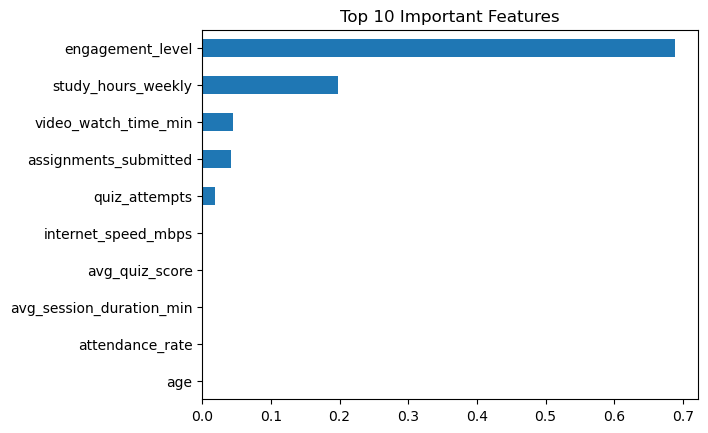
    


# 🚀 Step 6: Build Recommendation System


```python
def recommend(level):
    if level == 0:
        return "Low engagement → Increase study hours and login frequency."
    elif level == 1:
        return "Medium engagement → Maintain consistency and improve quiz performance."
    else:
        return "High engagement → Excellent! Continue your learning pattern."

# Test
sample_pred = model.predict(X_test.iloc[:1])
print(recommend(sample_pred[0]))
```

    Medium engagement → Maintain consistency and improve quiz performance.
    

# Let's build a Deep Learning Layer Model

#### Why ANN (instead of LSTM here)?

👉 Your data is:

Tabular ✔
Not sequential ❌

So:

ANN = correct model choice (not LSTM)

## Make sure engagement_level has correct input


```python
df['engagement_level'] = pd.qcut(
    df['engagement_score'],
    q=3,
    labels=[0, 1, 2]
)

# 🔥 VERY IMPORTANT FIX
df['engagement_level'] = df['engagement_level'].astype(int)

print(df['engagement_level'].value_counts())
```

    engagement_level
    2    16667
    0    16667
    1    16666
    Name: count, dtype: int64
    

# Feature Selection


```python
X = df.drop([
    'engagement_score',
    'engagement_level',
    'student_id',
    'final_grade',
    'dropout'
], axis=1)

y = df['engagement_level']
```

# Encode Categorical Features


```python
X = pd.get_dummies(X, drop_first=True)
```

### 🚀 Step 1: Normalize the Data (VERY IMPORTANT)
ANN needs scaled inputs 👇


```python
from sklearn.preprocessing import StandardScaler

scaler = StandardScaler()
X_scaled = scaler.fit_transform(X)
```

### ✂️ Step 2: Stratified Train/Test Split


```python
from sklearn.model_selection import train_test_split

X_train, X_test, y_train, y_test = train_test_split(
    X_scaled,
    y,
    test_size=0.2,
    random_state=42,
    stratify=y   # ⭐ CRITICAL
)

print("y_train:\n", y_train.value_counts())
print("y_test:\n", y_test.value_counts())
```

    y_train:
     engagement_level
    2    13334
    1    13333
    0    13333
    Name: count, dtype: int64
    y_test:
     engagement_level
    0    3334
    1    3333
    2    3333
    Name: count, dtype: int64
    

### 🧠 Step 3: Build ANN Model


```python
from tensorflow.keras.models import Sequential
from tensorflow.keras.layers import Dense, Dropout, Input

model = Sequential()

model.add(Input(shape=(X_train.shape[1],)))

model.add(Dense(128, activation='relu'))
model.add(Dropout(0.3))

model.add(Dense(64, activation='relu'))
model.add(Dropout(0.3))

model.add(Dense(32, activation='relu'))

model.add(Dense(3, activation='softmax'))

model.compile(
    optimizer='adam',
    loss='sparse_categorical_crossentropy',
    metrics=['accuracy']
)

model.summary()
```


<pre style="white-space:pre;overflow-x:auto;line-height:normal;font-family:Menlo,'DejaVu Sans Mono',consolas,'Courier New',monospace"><span style="font-weight: bold">Model: "sequential_5"</span>
</pre>


<pre style="white-space:pre;overflow-x:auto;line-height:normal;font-family:Menlo,'DejaVu Sans Mono',consolas,'Courier New',monospace">┏━━━━━━━━━━━━━━━━━━━━━━━━━━━━━━━━━━━━━━┳━━━━━━━━━━━━━━━━━━━━━━━━━━━━━┳━━━━━━━━━━━━━━━━━┓
┃<span style="font-weight: bold"> Layer (type)                         </span>┃<span style="font-weight: bold"> Output Shape                </span>┃<span style="font-weight: bold">         Param # </span>┃
┡━━━━━━━━━━━━━━━━━━━━━━━━━━━━━━━━━━━━━━╇━━━━━━━━━━━━━━━━━━━━━━━━━━━━━╇━━━━━━━━━━━━━━━━━┩
│ dense_20 (<span style="color: #0087ff; text-decoration-color: #0087ff">Dense</span>)                     │ (<span style="color: #00d7ff; text-decoration-color: #00d7ff">None</span>, <span style="color: #00af00; text-decoration-color: #00af00">128</span>)                 │           <span style="color: #00af00; text-decoration-color: #00af00">2,560</span> │
├──────────────────────────────────────┼─────────────────────────────┼─────────────────┤
│ dropout_10 (<span style="color: #0087ff; text-decoration-color: #0087ff">Dropout</span>)                 │ (<span style="color: #00d7ff; text-decoration-color: #00d7ff">None</span>, <span style="color: #00af00; text-decoration-color: #00af00">128</span>)                 │               <span style="color: #00af00; text-decoration-color: #00af00">0</span> │
├──────────────────────────────────────┼─────────────────────────────┼─────────────────┤
│ dense_21 (<span style="color: #0087ff; text-decoration-color: #0087ff">Dense</span>)                     │ (<span style="color: #00d7ff; text-decoration-color: #00d7ff">None</span>, <span style="color: #00af00; text-decoration-color: #00af00">64</span>)                  │           <span style="color: #00af00; text-decoration-color: #00af00">8,256</span> │
├──────────────────────────────────────┼─────────────────────────────┼─────────────────┤
│ dropout_11 (<span style="color: #0087ff; text-decoration-color: #0087ff">Dropout</span>)                 │ (<span style="color: #00d7ff; text-decoration-color: #00d7ff">None</span>, <span style="color: #00af00; text-decoration-color: #00af00">64</span>)                  │               <span style="color: #00af00; text-decoration-color: #00af00">0</span> │
├──────────────────────────────────────┼─────────────────────────────┼─────────────────┤
│ dense_22 (<span style="color: #0087ff; text-decoration-color: #0087ff">Dense</span>)                     │ (<span style="color: #00d7ff; text-decoration-color: #00d7ff">None</span>, <span style="color: #00af00; text-decoration-color: #00af00">32</span>)                  │           <span style="color: #00af00; text-decoration-color: #00af00">2,080</span> │
├──────────────────────────────────────┼─────────────────────────────┼─────────────────┤
│ dense_23 (<span style="color: #0087ff; text-decoration-color: #0087ff">Dense</span>)                     │ (<span style="color: #00d7ff; text-decoration-color: #00d7ff">None</span>, <span style="color: #00af00; text-decoration-color: #00af00">3</span>)                   │              <span style="color: #00af00; text-decoration-color: #00af00">99</span> │
└──────────────────────────────────────┴─────────────────────────────┴─────────────────┘
</pre>


<pre style="white-space:pre;overflow-x:auto;line-height:normal;font-family:Menlo,'DejaVu Sans Mono',consolas,'Courier New',monospace"><span style="font-weight: bold"> Total params: </span><span style="color: #00af00; text-decoration-color: #00af00">12,995</span> (50.76 KB)
</pre>


<pre style="white-space:pre;overflow-x:auto;line-height:normal;font-family:Menlo,'DejaVu Sans Mono',consolas,'Courier New',monospace"><span style="font-weight: bold"> Trainable params: </span><span style="color: #00af00; text-decoration-color: #00af00">12,995</span> (50.76 KB)
</pre>


<pre style="white-space:pre;overflow-x:auto;line-height:normal;font-family:Menlo,'DejaVu Sans Mono',consolas,'Courier New',monospace"><span style="font-weight: bold"> Non-trainable params: </span><span style="color: #00af00; text-decoration-color: #00af00">0</span> (0.00 B)
</pre>


### 🚀 Step 5: Train Model


```python
from tensorflow.keras.callbacks import EarlyStopping

early_stop = EarlyStopping(
    monitor='val_loss',
    patience=5,
    restore_best_weights=True
)

history = model.fit(
    X_train, y_train,
    epochs=30,
    batch_size=32,
    validation_data=(X_test, y_test),
    callbacks=[early_stop],
    class_weight=class_weights   # optional
)
```

    Epoch 1/30
    1250/1250 ━━━━━━━━━━━━━━━━━━━━ 6s 3ms/step - accuracy: 0.8731 - loss: 0.2790 - val_accuracy: 0.9655 - val_loss: 0.0927
    Epoch 2/30
    1250/1250 ━━━━━━━━━━━━━━━━━━━━ 3s 3ms/step - accuracy: 0.9441 - loss: 0.1280 - val_accuracy: 0.9755 - val_loss: 0.0663
    Epoch 3/30
    1250/1250 ━━━━━━━━━━━━━━━━━━━━ 3s 2ms/step - accuracy: 0.9585 - loss: 0.0995 - val_accuracy: 0.9792 - val_loss: 0.0542
    Epoch 4/30
    1250/1250 ━━━━━━━━━━━━━━━━━━━━ 3s 2ms/step - accuracy: 0.9658 - loss: 0.0815 - val_accuracy: 0.9833 - val_loss: 0.0445
    Epoch 5/30
    1250/1250 ━━━━━━━━━━━━━━━━━━━━ 3s 2ms/step - accuracy: 0.9705 - loss: 0.0725 - val_accuracy: 0.9821 - val_loss: 0.0419
    Epoch 6/30
    1250/1250 ━━━━━━━━━━━━━━━━━━━━ 3s 2ms/step - accuracy: 0.9734 - loss: 0.0630 - val_accuracy: 0.9810 - val_loss: 0.0417
    Epoch 7/30
    1250/1250 ━━━━━━━━━━━━━━━━━━━━ 3s 3ms/step - accuracy: 0.9757 - loss: 0.0591 - val_accuracy: 0.9820 - val_loss: 0.0431
    Epoch 8/30
    1250/1250 ━━━━━━━━━━━━━━━━━━━━ 3s 3ms/step - accuracy: 0.9768 - loss: 0.0565 - val_accuracy: 0.9858 - val_loss: 0.0325
    Epoch 9/30
    1250/1250 ━━━━━━━━━━━━━━━━━━━━ 3s 3ms/step - accuracy: 0.9779 - loss: 0.0521 - val_accuracy: 0.9848 - val_loss: 0.0379
    Epoch 10/30
    1250/1250 ━━━━━━━━━━━━━━━━━━━━ 3s 2ms/step - accuracy: 0.9796 - loss: 0.0493 - val_accuracy: 0.9821 - val_loss: 0.0394
    Epoch 11/30
    1250/1250 ━━━━━━━━━━━━━━━━━━━━ 3s 2ms/step - accuracy: 0.9800 - loss: 0.0490 - val_accuracy: 0.9845 - val_loss: 0.0346
    Epoch 12/30
    1250/1250 ━━━━━━━━━━━━━━━━━━━━ 3s 2ms/step - accuracy: 0.9803 - loss: 0.0482 - val_accuracy: 0.9845 - val_loss: 0.0371
    Epoch 13/30
    1250/1250 ━━━━━━━━━━━━━━━━━━━━ 3s 2ms/step - accuracy: 0.9807 - loss: 0.0466 - val_accuracy: 0.9883 - val_loss: 0.0321
    Epoch 14/30
    1250/1250 ━━━━━━━━━━━━━━━━━━━━ 3s 3ms/step - accuracy: 0.9822 - loss: 0.0449 - val_accuracy: 0.9846 - val_loss: 0.0328
    Epoch 15/30
    1250/1250 ━━━━━━━━━━━━━━━━━━━━ 4s 3ms/step - accuracy: 0.9829 - loss: 0.0431 - val_accuracy: 0.9868 - val_loss: 0.0316
    Epoch 16/30
    1250/1250 ━━━━━━━━━━━━━━━━━━━━ 3s 2ms/step - accuracy: 0.9830 - loss: 0.0418 - val_accuracy: 0.9879 - val_loss: 0.0266
    Epoch 17/30
    1250/1250 ━━━━━━━━━━━━━━━━━━━━ 3s 3ms/step - accuracy: 0.9829 - loss: 0.0423 - val_accuracy: 0.9873 - val_loss: 0.0280
    Epoch 18/30
    1250/1250 ━━━━━━━━━━━━━━━━━━━━ 3s 2ms/step - accuracy: 0.9831 - loss: 0.0405 - val_accuracy: 0.9868 - val_loss: 0.0335
    Epoch 19/30
    1250/1250 ━━━━━━━━━━━━━━━━━━━━ 3s 2ms/step - accuracy: 0.9838 - loss: 0.0394 - val_accuracy: 0.9875 - val_loss: 0.0316
    Epoch 20/30
    1250/1250 ━━━━━━━━━━━━━━━━━━━━ 3s 2ms/step - accuracy: 0.9839 - loss: 0.0390 - val_accuracy: 0.9887 - val_loss: 0.0279
    Epoch 21/30
    1250/1250 ━━━━━━━━━━━━━━━━━━━━ 3s 3ms/step - accuracy: 0.9845 - loss: 0.0389 - val_accuracy: 0.9857 - val_loss: 0.0322
    

# 🔍 Step 6: Predict


```python
import numpy as np

y_pred_probs = model.predict(X_test)
y_pred_classes = np.argmax(y_pred_probs, axis=1)

print("Unique predictions:", np.unique(y_pred_classes))
```

    313/313 ━━━━━━━━━━━━━━━━━━━━ 1s 2ms/step
    Unique predictions: [0 1 2]
    

# 📊 Step 7: Evaluate Model


```python
from sklearn.metrics import classification_report, confusion_matrix, accuracy_score

print("Accuracy:", accuracy_score(y_test, y_pred_classes))

print("\nClassification Report:\n")
print(classification_report(y_test, y_pred_classes))

print("\nConfusion Matrix:\n")
print(confusion_matrix(y_test, y_pred_classes))
```

    Accuracy: 0.9879
    
    Classification Report:
    
                  precision    recall  f1-score   support
    
               0       0.99      0.99      0.99      3334
               1       0.98      0.99      0.98      3333
               2       1.00      0.99      0.99      3333
    
        accuracy                           0.99     10000
       macro avg       0.99      0.99      0.99     10000
    weighted avg       0.99      0.99      0.99     10000
    
    
    Confusion Matrix:
    
    [[3301   33    0]
     [  26 3292   15]
     [   0   47 3286]]
    

# Training Curves (VERY IMPORTANT FOR Research)


```python
import matplotlib.pyplot as plt

# Accuracy
plt.plot(history.history['accuracy'])
plt.plot(history.history['val_accuracy'])
plt.title('Model Accuracy')
plt.xlabel('Epoch')
plt.ylabel('Accuracy')
plt.legend(['Train', 'Validation'])
plt.show()

# Loss
plt.plot(history.history['loss'])
plt.plot(history.history['val_loss'])
plt.title('Model Loss')
plt.xlabel('Epoch')
plt.ylabel('Loss')
plt.legend(['Train', 'Validation'])
plt.show()
```


    
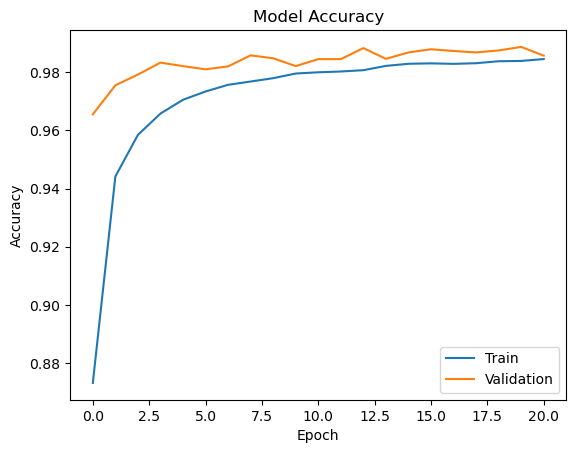
    


    
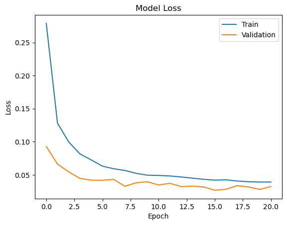
    


# More Visulaization:

### 📊 1. Confusion Matrix Heatmap


```python
import seaborn as sns
import matplotlib.pyplot as plt
from sklearn.metrics import confusion_matrix

cm = confusion_matrix(y_test, y_pred_classes)

sns.heatmap(cm, annot=True, fmt='d', cmap='Blues')
plt.xlabel("Predicted")
plt.ylabel("Actual")
plt.title("Confusion Matrix Heatmap")
plt.show()
```


    
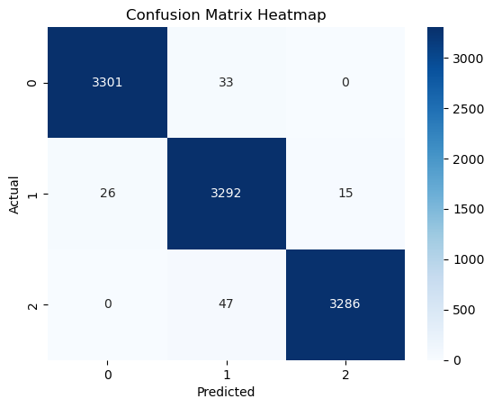
    


### 📈 2. ROC Curve (Multi-class)


```python
from sklearn.metrics import roc_curve, auc
from sklearn.preprocessing import label_binarize

y_test_bin = label_binarize(y_test, classes=[0,1,2])

for i in range(3):
    fpr, tpr, _ = roc_curve(y_test_bin[:, i], y_pred_probs[:, i])
    plt.plot(fpr, tpr, label=f"Class {i} (AUC = {auc(fpr,tpr):.2f})")

plt.plot([0,1], [0,1], 'k--')
plt.xlabel("False Positive Rate")
plt.ylabel("True Positive Rate")
plt.title("ROC Curve (Multi-class)")
plt.legend()
plt.show()
```


    
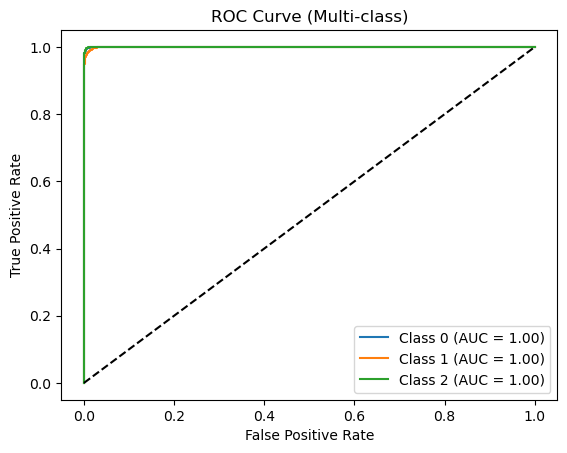
    


### 📉 3. Precision-Recall Curve


```python
from sklearn.metrics import precision_recall_curve

for i in range(3):
    precision, recall, _ = precision_recall_curve(y_test_bin[:, i], y_pred_probs[:, i])
    plt.plot(recall, precision, label=f"Class {i}")

plt.xlabel("Recall")
plt.ylabel("Precision")
plt.title("Precision-Recall Curve")
plt.legend()
plt.show()
```


    
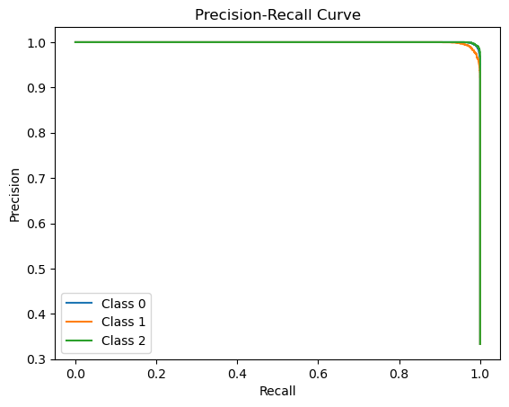
    


### 🔍 4. Feature Importance (from RandomForest)

Need to define RandomForest at first


```python
from sklearn.ensemble import RandomForestClassifier

rf_model = RandomForestClassifier(
    n_estimators=200,
    max_depth=10,
    random_state=42
)

rf_model.fit(X_train, y_train)
```


<style>#sk-container-id-6 {
  /* Definition of color scheme common for light and dark mode */
  --sklearn-color-text: #000;
  --sklearn-color-text-muted: #666;
  --sklearn-color-line: gray;
  /* Definition of color scheme for unfitted estimators */
  --sklearn-color-unfitted-level-0: #fff5e6;
  --sklearn-color-unfitted-level-1: #f6e4d2;
  --sklearn-color-unfitted-level-2: #ffe0b3;
  --sklearn-color-unfitted-level-3: chocolate;
  /* Definition of color scheme for fitted estimators */
  --sklearn-color-fitted-level-0: #f0f8ff;
  --sklearn-color-fitted-level-1: #d4ebff;
  --sklearn-color-fitted-level-2: #b3dbfd;
  --sklearn-color-fitted-level-3: cornflowerblue;
}

#sk-container-id-6.light {
  /* Specific color for light theme */
  --sklearn-color-text-on-default-background: black;
  --sklearn-color-background: white;
  --sklearn-color-border-box: black;
  --sklearn-color-icon: #696969;
}

#sk-container-id-6.dark {
  --sklearn-color-text-on-default-background: white;
  --sklearn-color-background: #111;
  --sklearn-color-border-box: white;
  --sklearn-color-icon: #878787;
}

#sk-container-id-6 {
  color: var(--sklearn-color-text);
}

#sk-container-id-6 pre {
  padding: 0;
}

#sk-container-id-6 input.sk-hidden--visually {
  border: 0;
  clip: rect(1px 1px 1px 1px);
  clip: rect(1px, 1px, 1px, 1px);
  height: 1px;
  margin: -1px;
  overflow: hidden;
  padding: 0;
  position: absolute;
  width: 1px;
}

#sk-container-id-6 div.sk-dashed-wrapped {
  border: 1px dashed var(--sklearn-color-line);
  margin: 0 0.4em 0.5em 0.4em;
  box-sizing: border-box;
  padding-bottom: 0.4em;
  background-color: var(--sklearn-color-background);
}

#sk-container-id-6 div.sk-container {
  /* jupyter's `normalize.less` sets `[hidden] { display: none; }`
     but bootstrap.min.css set `[hidden] { display: none !important; }`
     so we also need the `!important` here to be able to override the
     default hidden behavior on the sphinx rendered scikit-learn.org.
     See: https://github.com/scikit-learn/scikit-learn/issues/21755 */
  display: inline-block !important;
  position: relative;
}

#sk-container-id-6 div.sk-text-repr-fallback {
  display: none;
}

div.sk-parallel-item,
div.sk-serial,
div.sk-item {
  /* draw centered vertical line to link estimators */
  background-image: linear-gradient(var(--sklearn-color-text-on-default-background), var(--sklearn-color-text-on-default-background));
  background-size: 2px 100%;
  background-repeat: no-repeat;
  background-position: center center;
}

/* Parallel-specific style estimator block */

#sk-container-id-6 div.sk-parallel-item::after {
  content: "";
  width: 100%;
  border-bottom: 2px solid var(--sklearn-color-text-on-default-background);
  flex-grow: 1;
}

#sk-container-id-6 div.sk-parallel {
  display: flex;
  align-items: stretch;
  justify-content: center;
  background-color: var(--sklearn-color-background);
  position: relative;
}

#sk-container-id-6 div.sk-parallel-item {
  display: flex;
  flex-direction: column;
}

#sk-container-id-6 div.sk-parallel-item:first-child::after {
  align-self: flex-end;
  width: 50%;
}

#sk-container-id-6 div.sk-parallel-item:last-child::after {
  align-self: flex-start;
  width: 50%;
}

#sk-container-id-6 div.sk-parallel-item:only-child::after {
  width: 0;
}

/* Serial-specific style estimator block */

#sk-container-id-6 div.sk-serial {
  display: flex;
  flex-direction: column;
  align-items: center;
  background-color: var(--sklearn-color-background);
  padding-right: 1em;
  padding-left: 1em;
}


/* Toggleable style: style used for estimator/Pipeline/ColumnTransformer box that is
clickable and can be expanded/collapsed.
- Pipeline and ColumnTransformer use this feature and define the default style
- Estimators will overwrite some part of the style using the `sk-estimator` class
*/

/* Pipeline and ColumnTransformer style (default) */

#sk-container-id-6 div.sk-toggleable {
  /* Default theme specific background. It is overwritten whether we have a
  specific estimator or a Pipeline/ColumnTransformer */
  background-color: var(--sklearn-color-background);
}

/* Toggleable label */
#sk-container-id-6 label.sk-toggleable__label {
  cursor: pointer;
  display: flex;
  width: 100%;
  margin-bottom: 0;
  padding: 0.5em;
  box-sizing: border-box;
  text-align: center;
  align-items: center;
  justify-content: center;
  gap: 0.5em;
}

#sk-container-id-6 label.sk-toggleable__label .caption {
  font-size: 0.6rem;
  font-weight: lighter;
  color: var(--sklearn-color-text-muted);
}

#sk-container-id-6 label.sk-toggleable__label-arrow:before {
  /* Arrow on the left of the label */
  content: "▸";
  float: left;
  margin-right: 0.25em;
  color: var(--sklearn-color-icon);
}

#sk-container-id-6 label.sk-toggleable__label-arrow:hover:before {
  color: var(--sklearn-color-text);
}

/* Toggleable content - dropdown */

#sk-container-id-6 div.sk-toggleable__content {
  display: none;
  text-align: left;
  /* unfitted */
  background-color: var(--sklearn-color-unfitted-level-0);
}

#sk-container-id-6 div.sk-toggleable__content.fitted {
  /* fitted */
  background-color: var(--sklearn-color-fitted-level-0);
}

#sk-container-id-6 div.sk-toggleable__content pre {
  margin: 0.2em;
  border-radius: 0.25em;
  color: var(--sklearn-color-text);
  /* unfitted */
  background-color: var(--sklearn-color-unfitted-level-0);
}

#sk-container-id-6 div.sk-toggleable__content.fitted pre {
  /* unfitted */
  background-color: var(--sklearn-color-fitted-level-0);
}

#sk-container-id-6 input.sk-toggleable__control:checked~div.sk-toggleable__content {
  /* Expand drop-down */
  display: block;
  width: 100%;
  overflow: visible;
}

#sk-container-id-6 input.sk-toggleable__control:checked~label.sk-toggleable__label-arrow:before {
  content: "▾";
}

/* Pipeline/ColumnTransformer-specific style */

#sk-container-id-6 div.sk-label input.sk-toggleable__control:checked~label.sk-toggleable__label {
  color: var(--sklearn-color-text);
  background-color: var(--sklearn-color-unfitted-level-2);
}

#sk-container-id-6 div.sk-label.fitted input.sk-toggleable__control:checked~label.sk-toggleable__label {
  background-color: var(--sklearn-color-fitted-level-2);
}

/* Estimator-specific style */

/* Colorize estimator box */
#sk-container-id-6 div.sk-estimator input.sk-toggleable__control:checked~label.sk-toggleable__label {
  /* unfitted */
  background-color: var(--sklearn-color-unfitted-level-2);
}

#sk-container-id-6 div.sk-estimator.fitted input.sk-toggleable__control:checked~label.sk-toggleable__label {
  /* fitted */
  background-color: var(--sklearn-color-fitted-level-2);
}

#sk-container-id-6 div.sk-label label.sk-toggleable__label,
#sk-container-id-6 div.sk-label label {
  /* The background is the default theme color */
  color: var(--sklearn-color-text-on-default-background);
}

/* On hover, darken the color of the background */
#sk-container-id-6 div.sk-label:hover label.sk-toggleable__label {
  color: var(--sklearn-color-text);
  background-color: var(--sklearn-color-unfitted-level-2);
}

/* Label box, darken color on hover, fitted */
#sk-container-id-6 div.sk-label.fitted:hover label.sk-toggleable__label.fitted {
  color: var(--sklearn-color-text);
  background-color: var(--sklearn-color-fitted-level-2);
}

/* Estimator label */

#sk-container-id-6 div.sk-label label {
  font-family: monospace;
  font-weight: bold;
  line-height: 1.2em;
}

#sk-container-id-6 div.sk-label-container {
  text-align: center;
}

/* Estimator-specific */
#sk-container-id-6 div.sk-estimator {
  font-family: monospace;
  border: 1px dotted var(--sklearn-color-border-box);
  border-radius: 0.25em;
  box-sizing: border-box;
  margin-bottom: 0.5em;
  /* unfitted */
  background-color: var(--sklearn-color-unfitted-level-0);
}

#sk-container-id-6 div.sk-estimator.fitted {
  /* fitted */
  background-color: var(--sklearn-color-fitted-level-0);
}

/* on hover */
#sk-container-id-6 div.sk-estimator:hover {
  /* unfitted */
  background-color: var(--sklearn-color-unfitted-level-2);
}

#sk-container-id-6 div.sk-estimator.fitted:hover {
  /* fitted */
  background-color: var(--sklearn-color-fitted-level-2);
}

/* Specification for estimator info (e.g. "i" and "?") */

/* Common style for "i" and "?" */

.sk-estimator-doc-link,
a:link.sk-estimator-doc-link,
a:visited.sk-estimator-doc-link {
  float: right;
  font-size: smaller;
  line-height: 1em;
  font-family: monospace;
  background-color: var(--sklearn-color-unfitted-level-0);
  border-radius: 1em;
  height: 1em;
  width: 1em;
  text-decoration: none !important;
  margin-left: 0.5em;
  text-align: center;
  /* unfitted */
  border: var(--sklearn-color-unfitted-level-3) 1pt solid;
  color: var(--sklearn-color-unfitted-level-3);
}

.sk-estimator-doc-link.fitted,
a:link.sk-estimator-doc-link.fitted,
a:visited.sk-estimator-doc-link.fitted {
  /* fitted */
  background-color: var(--sklearn-color-fitted-level-0);
  border: var(--sklearn-color-fitted-level-3) 1pt solid;
  color: var(--sklearn-color-fitted-level-3);
}

/* On hover */
div.sk-estimator:hover .sk-estimator-doc-link:hover,
.sk-estimator-doc-link:hover,
div.sk-label-container:hover .sk-estimator-doc-link:hover,
.sk-estimator-doc-link:hover {
  /* unfitted */
  background-color: var(--sklearn-color-unfitted-level-3);
  border: var(--sklearn-color-fitted-level-0) 1pt solid;
  color: var(--sklearn-color-unfitted-level-0);
  text-decoration: none;
}

div.sk-estimator.fitted:hover .sk-estimator-doc-link.fitted:hover,
.sk-estimator-doc-link.fitted:hover,
div.sk-label-container:hover .sk-estimator-doc-link.fitted:hover,
.sk-estimator-doc-link.fitted:hover {
  /* fitted */
  background-color: var(--sklearn-color-fitted-level-3);
  border: var(--sklearn-color-fitted-level-0) 1pt solid;
  color: var(--sklearn-color-fitted-level-0);
  text-decoration: none;
}

/* Span, style for the box shown on hovering the info icon */
.sk-estimator-doc-link span {
  display: none;
  z-index: 9999;
  position: relative;
  font-weight: normal;
  right: .2ex;
  padding: .5ex;
  margin: .5ex;
  width: min-content;
  min-width: 20ex;
  max-width: 50ex;
  color: var(--sklearn-color-text);
  box-shadow: 2pt 2pt 4pt #999;
  /* unfitted */
  background: var(--sklearn-color-unfitted-level-0);
  border: .5pt solid var(--sklearn-color-unfitted-level-3);
}

.sk-estimator-doc-link.fitted span {
  /* fitted */
  background: var(--sklearn-color-fitted-level-0);
  border: var(--sklearn-color-fitted-level-3);
}

.sk-estimator-doc-link:hover span {
  display: block;
}

/* "?"-specific style due to the `<a>` HTML tag */

#sk-container-id-6 a.estimator_doc_link {
  float: right;
  font-size: 1rem;
  line-height: 1em;
  font-family: monospace;
  background-color: var(--sklearn-color-unfitted-level-0);
  border-radius: 1rem;
  height: 1rem;
  width: 1rem;
  text-decoration: none;
  /* unfitted */
  color: var(--sklearn-color-unfitted-level-1);
  border: var(--sklearn-color-unfitted-level-1) 1pt solid;
}

#sk-container-id-6 a.estimator_doc_link.fitted {
  /* fitted */
  background-color: var(--sklearn-color-fitted-level-0);
  border: var(--sklearn-color-fitted-level-1) 1pt solid;
  color: var(--sklearn-color-fitted-level-1);
}

/* On hover */
#sk-container-id-6 a.estimator_doc_link:hover {
  /* unfitted */
  background-color: var(--sklearn-color-unfitted-level-3);
  color: var(--sklearn-color-background);
  text-decoration: none;
}

#sk-container-id-6 a.estimator_doc_link.fitted:hover {
  /* fitted */
  background-color: var(--sklearn-color-fitted-level-3);
}

.estimator-table {
    font-family: monospace;
}

.estimator-table summary {
    padding: .5rem;
    cursor: pointer;
}

.estimator-table summary::marker {
    font-size: 0.7rem;
}

.estimator-table details[open] {
    padding-left: 0.1rem;
    padding-right: 0.1rem;
    padding-bottom: 0.3rem;
}

.estimator-table .parameters-table {
    margin-left: auto !important;
    margin-right: auto !important;
    margin-top: 0;
}

.estimator-table .parameters-table tr:nth-child(odd) {
    background-color: #fff;
}

.estimator-table .parameters-table tr:nth-child(even) {
    background-color: #f6f6f6;
}

.estimator-table .parameters-table tr:hover {
    background-color: #e0e0e0;
}

.estimator-table table td {
    border: 1px solid rgba(106, 105, 104, 0.232);
}

/*
    `table td`is set in notebook with right text-align.
    We need to overwrite it.
*/
.estimator-table table td.param {
    text-align: left;
    position: relative;
    padding: 0;
}

.user-set td {
    color:rgb(255, 94, 0);
    text-align: left !important;
}

.user-set td.value {
    color:rgb(255, 94, 0);
    background-color: transparent;
}

.default td {
    color: black;
    text-align: left !important;
}

.user-set td i,
.default td i {
    color: black;
}

/*
    Styles for parameter documentation links
    We need styling for visited so jupyter doesn't overwrite it
*/
a.param-doc-link,
a.param-doc-link:link,
a.param-doc-link:visited {
    text-decoration: underline dashed;
    text-underline-offset: .3em;
    color: inherit;
    display: block;
    padding: .5em;
}

/* "hack" to make the entire area of the cell containing the link clickable */
a.param-doc-link::before {
    position: absolute;
    content: "";
    inset: 0;
}

.param-doc-description {
    display: none;
    position: absolute;
    z-index: 9999;
    left: 0;
    padding: .5ex;
    margin-left: 1.5em;
    color: var(--sklearn-color-text);
    box-shadow: .3em .3em .4em #999;
    width: max-content;
    text-align: left;
    max-height: 10em;
    overflow-y: auto;

    /* unfitted */
    background: var(--sklearn-color-unfitted-level-0);
    border: thin solid var(--sklearn-color-unfitted-level-3);
}

/* Fitted state for parameter tooltips */
.fitted .param-doc-description {
    /* fitted */
    background: var(--sklearn-color-fitted-level-0);
    border: thin solid var(--sklearn-color-fitted-level-3);
}

.param-doc-link:hover .param-doc-description {
    display: block;
}

.copy-paste-icon {
    background-image: url(data:image/svg+xml;base64,PHN2ZyB4bWxucz0iaHR0cDovL3d3dy53My5vcmcvMjAwMC9zdmciIHZpZXdCb3g9IjAgMCA0NDggNTEyIj48IS0tIUZvbnQgQXdlc29tZSBGcmVlIDYuNy4yIGJ5IEBmb250YXdlc29tZSAtIGh0dHBzOi8vZm9udGF3ZXNvbWUuY29tIExpY2Vuc2UgLSBodHRwczovL2ZvbnRhd2Vzb21lLmNvbS9saWNlbnNlL2ZyZWUgQ29weXJpZ2h0IDIwMjUgRm9udGljb25zLCBJbmMuLS0+PHBhdGggZD0iTTIwOCAwTDMzMi4xIDBjMTIuNyAwIDI0LjkgNS4xIDMzLjkgMTQuMWw2Ny45IDY3LjljOSA5IDE0LjEgMjEuMiAxNC4xIDMzLjlMNDQ4IDMzNmMwIDI2LjUtMjEuNSA0OC00OCA0OGwtMTkyIDBjLTI2LjUgMC00OC0yMS41LTQ4LTQ4bDAtMjg4YzAtMjYuNSAyMS41LTQ4IDQ4LTQ4ek00OCAxMjhsODAgMCAwIDY0LTY0IDAgMCAyNTYgMTkyIDAgMC0zMiA2NCAwIDAgNDhjMCAyNi41LTIxLjUgNDgtNDggNDhMNDggNTEyYy0yNi41IDAtNDgtMjEuNS00OC00OEwwIDE3NmMwLTI2LjUgMjEuNS00OCA0OC00OHoiLz48L3N2Zz4=);
    background-repeat: no-repeat;
    background-size: 14px 14px;
    background-position: 0;
    display: inline-block;
    width: 14px;
    height: 14px;
    cursor: pointer;
}
</style><body><div id="sk-container-id-6" class="sk-top-container"><div class="sk-text-repr-fallback"><pre>RandomForestClassifier(max_depth=10, n_estimators=200, random_state=42)</pre><b>In a Jupyter environment, please rerun this cell to show the HTML representation or trust the notebook. <br />On GitHub, the HTML representation is unable to render, please try loading this page with nbviewer.org.</b></div><div class="sk-container" hidden><div class="sk-item"><div class="sk-estimator fitted sk-toggleable"><input class="sk-toggleable__control sk-hidden--visually" id="sk-estimator-id-6" type="checkbox" checked><label for="sk-estimator-id-6" class="sk-toggleable__label fitted sk-toggleable__label-arrow"><div><div>RandomForestClassifier</div></div><div><a class="sk-estimator-doc-link fitted" rel="noreferrer" target="_blank" href="https://scikit-learn.org/1.8/modules/generated/sklearn.ensemble.RandomForestClassifier.html">?<span>Documentation for RandomForestClassifier</span></a><span class="sk-estimator-doc-link fitted">i<span>Fitted</span></span></div></label><div class="sk-toggleable__content fitted" data-param-prefix="">
        <div class="estimator-table">
            <details>
                <summary>Parameters</summary>
                <table class="parameters-table">
                  <tbody>

        <tr class="user-set">
            <td><i class="copy-paste-icon"
                 onclick="copyToClipboard('n_estimators',
                          this.parentElement.nextElementSibling)"
            ></i></td>
            <td class="param">
        <a class="param-doc-link"
            rel="noreferrer" target="_blank" href="https://scikit-learn.org/1.8/modules/generated/sklearn.ensemble.RandomForestClassifier.html#:~:text=n_estimators,-int%2C%20default%3D100">
            n_estimators
            <span class="param-doc-description">n_estimators: int, default=100<br><br>The number of trees in the forest.<br><br>.. versionchanged:: 0.22<br>   The default value of ``n_estimators`` changed from 10 to 100<br>   in 0.22.</span>
        </a>
    </td>
            <td class="value">200</td>
        </tr>


        <tr class="default">
            <td><i class="copy-paste-icon"
                 onclick="copyToClipboard('criterion',
                          this.parentElement.nextElementSibling)"
            ></i></td>
            <td class="param">
        <a class="param-doc-link"
            rel="noreferrer" target="_blank" href="https://scikit-learn.org/1.8/modules/generated/sklearn.ensemble.RandomForestClassifier.html#:~:text=criterion,-%7B%22gini%22%2C%20%22entropy%22%2C%20%22log_loss%22%7D%2C%20default%3D%22gini%22">
            criterion
            <span class="param-doc-description">criterion: {"gini", "entropy", "log_loss"}, default="gini"<br><br>The function to measure the quality of a split. Supported criteria are<br>"gini" for the Gini impurity and "log_loss" and "entropy" both for the<br>Shannon information gain, see :ref:`tree_mathematical_formulation`.<br>Note: This parameter is tree-specific.</span>
        </a>
    </td>
            <td class="value">&#x27;gini&#x27;</td>
        </tr>


        <tr class="user-set">
            <td><i class="copy-paste-icon"
                 onclick="copyToClipboard('max_depth',
                          this.parentElement.nextElementSibling)"
            ></i></td>
            <td class="param">
        <a class="param-doc-link"
            rel="noreferrer" target="_blank" href="https://scikit-learn.org/1.8/modules/generated/sklearn.ensemble.RandomForestClassifier.html#:~:text=max_depth,-int%2C%20default%3DNone">
            max_depth
            <span class="param-doc-description">max_depth: int, default=None<br><br>The maximum depth of the tree. If None, then nodes are expanded until<br>all leaves are pure or until all leaves contain less than<br>min_samples_split samples.</span>
        </a>
    </td>
            <td class="value">10</td>
        </tr>


        <tr class="default">
            <td><i class="copy-paste-icon"
                 onclick="copyToClipboard('min_samples_split',
                          this.parentElement.nextElementSibling)"
            ></i></td>
            <td class="param">
        <a class="param-doc-link"
            rel="noreferrer" target="_blank" href="https://scikit-learn.org/1.8/modules/generated/sklearn.ensemble.RandomForestClassifier.html#:~:text=min_samples_split,-int%20or%20float%2C%20default%3D2">
            min_samples_split
            <span class="param-doc-description">min_samples_split: int or float, default=2<br><br>The minimum number of samples required to split an internal node:<br><br>- If int, then consider `min_samples_split` as the minimum number.<br>- If float, then `min_samples_split` is a fraction and<br>  `ceil(min_samples_split * n_samples)` are the minimum<br>  number of samples for each split.<br><br>.. versionchanged:: 0.18<br>   Added float values for fractions.</span>
        </a>
    </td>
            <td class="value">2</td>
        </tr>


        <tr class="default">
            <td><i class="copy-paste-icon"
                 onclick="copyToClipboard('min_samples_leaf',
                          this.parentElement.nextElementSibling)"
            ></i></td>
            <td class="param">
        <a class="param-doc-link"
            rel="noreferrer" target="_blank" href="https://scikit-learn.org/1.8/modules/generated/sklearn.ensemble.RandomForestClassifier.html#:~:text=min_samples_leaf,-int%20or%20float%2C%20default%3D1">
            min_samples_leaf
            <span class="param-doc-description">min_samples_leaf: int or float, default=1<br><br>The minimum number of samples required to be at a leaf node.<br>A split point at any depth will only be considered if it leaves at<br>least ``min_samples_leaf`` training samples in each of the left and<br>right branches.  This may have the effect of smoothing the model,<br>especially in regression.<br><br>- If int, then consider `min_samples_leaf` as the minimum number.<br>- If float, then `min_samples_leaf` is a fraction and<br>  `ceil(min_samples_leaf * n_samples)` are the minimum<br>  number of samples for each node.<br><br>.. versionchanged:: 0.18<br>   Added float values for fractions.</span>
        </a>
    </td>
            <td class="value">1</td>
        </tr>


        <tr class="default">
            <td><i class="copy-paste-icon"
                 onclick="copyToClipboard('min_weight_fraction_leaf',
                          this.parentElement.nextElementSibling)"
            ></i></td>
            <td class="param">
        <a class="param-doc-link"
            rel="noreferrer" target="_blank" href="https://scikit-learn.org/1.8/modules/generated/sklearn.ensemble.RandomForestClassifier.html#:~:text=min_weight_fraction_leaf,-float%2C%20default%3D0.0">
            min_weight_fraction_leaf
            <span class="param-doc-description">min_weight_fraction_leaf: float, default=0.0<br><br>The minimum weighted fraction of the sum total of weights (of all<br>the input samples) required to be at a leaf node. Samples have<br>equal weight when sample_weight is not provided.</span>
        </a>
    </td>
            <td class="value">0.0</td>
        </tr>


        <tr class="default">
            <td><i class="copy-paste-icon"
                 onclick="copyToClipboard('max_features',
                          this.parentElement.nextElementSibling)"
            ></i></td>
            <td class="param">
        <a class="param-doc-link"
            rel="noreferrer" target="_blank" href="https://scikit-learn.org/1.8/modules/generated/sklearn.ensemble.RandomForestClassifier.html#:~:text=max_features,-%7B%22sqrt%22%2C%20%22log2%22%2C%20None%7D%2C%20int%20or%20float%2C%20default%3D%22sqrt%22">
            max_features
            <span class="param-doc-description">max_features: {"sqrt", "log2", None}, int or float, default="sqrt"<br><br>The number of features to consider when looking for the best split:<br><br>- If int, then consider `max_features` features at each split.<br>- If float, then `max_features` is a fraction and<br>  `max(1, int(max_features * n_features_in_))` features are considered at each<br>  split.<br>- If "sqrt", then `max_features=sqrt(n_features)`.<br>- If "log2", then `max_features=log2(n_features)`.<br>- If None, then `max_features=n_features`.<br><br>.. versionchanged:: 1.1<br>    The default of `max_features` changed from `"auto"` to `"sqrt"`.<br><br>Note: the search for a split does not stop until at least one<br>valid partition of the node samples is found, even if it requires to<br>effectively inspect more than ``max_features`` features.</span>
        </a>
    </td>
            <td class="value">&#x27;sqrt&#x27;</td>
        </tr>


        <tr class="default">
            <td><i class="copy-paste-icon"
                 onclick="copyToClipboard('max_leaf_nodes',
                          this.parentElement.nextElementSibling)"
            ></i></td>
            <td class="param">
        <a class="param-doc-link"
            rel="noreferrer" target="_blank" href="https://scikit-learn.org/1.8/modules/generated/sklearn.ensemble.RandomForestClassifier.html#:~:text=max_leaf_nodes,-int%2C%20default%3DNone">
            max_leaf_nodes
            <span class="param-doc-description">max_leaf_nodes: int, default=None<br><br>Grow trees with ``max_leaf_nodes`` in best-first fashion.<br>Best nodes are defined as relative reduction in impurity.<br>If None then unlimited number of leaf nodes.</span>
        </a>
    </td>
            <td class="value">None</td>
        </tr>


        <tr class="default">
            <td><i class="copy-paste-icon"
                 onclick="copyToClipboard('min_impurity_decrease',
                          this.parentElement.nextElementSibling)"
            ></i></td>
            <td class="param">
        <a class="param-doc-link"
            rel="noreferrer" target="_blank" href="https://scikit-learn.org/1.8/modules/generated/sklearn.ensemble.RandomForestClassifier.html#:~:text=min_impurity_decrease,-float%2C%20default%3D0.0">
            min_impurity_decrease
            <span class="param-doc-description">min_impurity_decrease: float, default=0.0<br><br>A node will be split if this split induces a decrease of the impurity<br>greater than or equal to this value.<br><br>The weighted impurity decrease equation is the following::<br><br>    N_t / N * (impurity - N_t_R / N_t * right_impurity<br>                        - N_t_L / N_t * left_impurity)<br><br>where ``N`` is the total number of samples, ``N_t`` is the number of<br>samples at the current node, ``N_t_L`` is the number of samples in the<br>left child, and ``N_t_R`` is the number of samples in the right child.<br><br>``N``, ``N_t``, ``N_t_R`` and ``N_t_L`` all refer to the weighted sum,<br>if ``sample_weight`` is passed.<br><br>.. versionadded:: 0.19</span>
        </a>
    </td>
            <td class="value">0.0</td>
        </tr>


        <tr class="default">
            <td><i class="copy-paste-icon"
                 onclick="copyToClipboard('bootstrap',
                          this.parentElement.nextElementSibling)"
            ></i></td>
            <td class="param">
        <a class="param-doc-link"
            rel="noreferrer" target="_blank" href="https://scikit-learn.org/1.8/modules/generated/sklearn.ensemble.RandomForestClassifier.html#:~:text=bootstrap,-bool%2C%20default%3DTrue">
            bootstrap
            <span class="param-doc-description">bootstrap: bool, default=True<br><br>Whether bootstrap samples are used when building trees. If False, the<br>whole dataset is used to build each tree.</span>
        </a>
    </td>
            <td class="value">True</td>
        </tr>


        <tr class="default">
            <td><i class="copy-paste-icon"
                 onclick="copyToClipboard('oob_score',
                          this.parentElement.nextElementSibling)"
            ></i></td>
            <td class="param">
        <a class="param-doc-link"
            rel="noreferrer" target="_blank" href="https://scikit-learn.org/1.8/modules/generated/sklearn.ensemble.RandomForestClassifier.html#:~:text=oob_score,-bool%20or%20callable%2C%20default%3DFalse">
            oob_score
            <span class="param-doc-description">oob_score: bool or callable, default=False<br><br>Whether to use out-of-bag samples to estimate the generalization score.<br>By default, :func:`~sklearn.metrics.accuracy_score` is used.<br>Provide a callable with signature `metric(y_true, y_pred)` to use a<br>custom metric. Only available if `bootstrap=True`.<br><br>For an illustration of out-of-bag (OOB) error estimation, see the example<br>:ref:`sphx_glr_auto_examples_ensemble_plot_ensemble_oob.py`.</span>
        </a>
    </td>
            <td class="value">False</td>
        </tr>


        <tr class="default">
            <td><i class="copy-paste-icon"
                 onclick="copyToClipboard('n_jobs',
                          this.parentElement.nextElementSibling)"
            ></i></td>
            <td class="param">
        <a class="param-doc-link"
            rel="noreferrer" target="_blank" href="https://scikit-learn.org/1.8/modules/generated/sklearn.ensemble.RandomForestClassifier.html#:~:text=n_jobs,-int%2C%20default%3DNone">
            n_jobs
            <span class="param-doc-description">n_jobs: int, default=None<br><br>The number of jobs to run in parallel. :meth:`fit`, :meth:`predict`,<br>:meth:`decision_path` and :meth:`apply` are all parallelized over the<br>trees. ``None`` means 1 unless in a :obj:`joblib.parallel_backend`<br>context. ``-1`` means using all processors. See :term:`Glossary<br><n_jobs>` for more details.</span>
        </a>
    </td>
            <td class="value">None</td>
        </tr>


        <tr class="user-set">
            <td><i class="copy-paste-icon"
                 onclick="copyToClipboard('random_state',
                          this.parentElement.nextElementSibling)"
            ></i></td>
            <td class="param">
        <a class="param-doc-link"
            rel="noreferrer" target="_blank" href="https://scikit-learn.org/1.8/modules/generated/sklearn.ensemble.RandomForestClassifier.html#:~:text=random_state,-int%2C%20RandomState%20instance%20or%20None%2C%20default%3DNone">
            random_state
            <span class="param-doc-description">random_state: int, RandomState instance or None, default=None<br><br>Controls both the randomness of the bootstrapping of the samples used<br>when building trees (if ``bootstrap=True``) and the sampling of the<br>features to consider when looking for the best split at each node<br>(if ``max_features < n_features``).<br>See :term:`Glossary <random_state>` for details.</span>
        </a>
    </td>
            <td class="value">42</td>
        </tr>


        <tr class="default">
            <td><i class="copy-paste-icon"
                 onclick="copyToClipboard('verbose',
                          this.parentElement.nextElementSibling)"
            ></i></td>
            <td class="param">
        <a class="param-doc-link"
            rel="noreferrer" target="_blank" href="https://scikit-learn.org/1.8/modules/generated/sklearn.ensemble.RandomForestClassifier.html#:~:text=verbose,-int%2C%20default%3D0">
            verbose
            <span class="param-doc-description">verbose: int, default=0<br><br>Controls the verbosity when fitting and predicting.</span>
        </a>
    </td>
            <td class="value">0</td>
        </tr>


        <tr class="default">
            <td><i class="copy-paste-icon"
                 onclick="copyToClipboard('warm_start',
                          this.parentElement.nextElementSibling)"
            ></i></td>
            <td class="param">
        <a class="param-doc-link"
            rel="noreferrer" target="_blank" href="https://scikit-learn.org/1.8/modules/generated/sklearn.ensemble.RandomForestClassifier.html#:~:text=warm_start,-bool%2C%20default%3DFalse">
            warm_start
            <span class="param-doc-description">warm_start: bool, default=False<br><br>When set to ``True``, reuse the solution of the previous call to fit<br>and add more estimators to the ensemble, otherwise, just fit a whole<br>new forest. See :term:`Glossary <warm_start>` and<br>:ref:`tree_ensemble_warm_start` for details.</span>
        </a>
    </td>
            <td class="value">False</td>
        </tr>


        <tr class="default">
            <td><i class="copy-paste-icon"
                 onclick="copyToClipboard('class_weight',
                          this.parentElement.nextElementSibling)"
            ></i></td>
            <td class="param">
        <a class="param-doc-link"
            rel="noreferrer" target="_blank" href="https://scikit-learn.org/1.8/modules/generated/sklearn.ensemble.RandomForestClassifier.html#:~:text=class_weight,-%7B%22balanced%22%2C%20%22balanced_subsample%22%7D%2C%20dict%20or%20list%20of%20dicts%2C%20%20%20%20%20%20%20%20%20%20%20%20%20default%3DNone">
            class_weight
            <span class="param-doc-description">class_weight: {"balanced", "balanced_subsample"}, dict or list of dicts,             default=None<br><br>Weights associated with classes in the form ``{class_label: weight}``.<br>If not given, all classes are supposed to have weight one. For<br>multi-output problems, a list of dicts can be provided in the same<br>order as the columns of y.<br><br>Note that for multioutput (including multilabel) weights should be<br>defined for each class of every column in its own dict. For example,<br>for four-class multilabel classification weights should be<br>[{0: 1, 1: 1}, {0: 1, 1: 5}, {0: 1, 1: 1}, {0: 1, 1: 1}] instead of<br>[{1:1}, {2:5}, {3:1}, {4:1}].<br><br>The "balanced" mode uses the values of y to automatically adjust<br>weights inversely proportional to class frequencies in the input data<br>as ``n_samples / (n_classes * np.bincount(y))``<br><br>The "balanced_subsample" mode is the same as "balanced" except that<br>weights are computed based on the bootstrap sample for every tree<br>grown.<br><br>For multi-output, the weights of each column of y will be multiplied.<br><br>Note that these weights will be multiplied with sample_weight (passed<br>through the fit method) if sample_weight is specified.</span>
        </a>
    </td>
            <td class="value">None</td>
        </tr>


        <tr class="default">
            <td><i class="copy-paste-icon"
                 onclick="copyToClipboard('ccp_alpha',
                          this.parentElement.nextElementSibling)"
            ></i></td>
            <td class="param">
        <a class="param-doc-link"
            rel="noreferrer" target="_blank" href="https://scikit-learn.org/1.8/modules/generated/sklearn.ensemble.RandomForestClassifier.html#:~:text=ccp_alpha,-non-negative%20float%2C%20default%3D0.0">
            ccp_alpha
            <span class="param-doc-description">ccp_alpha: non-negative float, default=0.0<br><br>Complexity parameter used for Minimal Cost-Complexity Pruning. The<br>subtree with the largest cost complexity that is smaller than<br>``ccp_alpha`` will be chosen. By default, no pruning is performed. See<br>:ref:`minimal_cost_complexity_pruning` for details. See<br>:ref:`sphx_glr_auto_examples_tree_plot_cost_complexity_pruning.py`<br>for an example of such pruning.<br><br>.. versionadded:: 0.22</span>
        </a>
    </td>
            <td class="value">0.0</td>
        </tr>


        <tr class="default">
            <td><i class="copy-paste-icon"
                 onclick="copyToClipboard('max_samples',
                          this.parentElement.nextElementSibling)"
            ></i></td>
            <td class="param">
        <a class="param-doc-link"
            rel="noreferrer" target="_blank" href="https://scikit-learn.org/1.8/modules/generated/sklearn.ensemble.RandomForestClassifier.html#:~:text=max_samples,-int%20or%20float%2C%20default%3DNone">
            max_samples
            <span class="param-doc-description">max_samples: int or float, default=None<br><br>If bootstrap is True, the number of samples to draw from X<br>to train each base estimator.<br><br>- If None (default), then draw `X.shape[0]` samples.<br>- If int, then draw `max_samples` samples.<br>- If float, then draw `max(round(n_samples * max_samples), 1)` samples. Thus,<br>  `max_samples` should be in the interval `(0.0, 1.0]`.<br><br>.. versionadded:: 0.22</span>
        </a>
    </td>
            <td class="value">None</td>
        </tr>


        <tr class="default">
            <td><i class="copy-paste-icon"
                 onclick="copyToClipboard('monotonic_cst',
                          this.parentElement.nextElementSibling)"
            ></i></td>
            <td class="param">
        <a class="param-doc-link"
            rel="noreferrer" target="_blank" href="https://scikit-learn.org/1.8/modules/generated/sklearn.ensemble.RandomForestClassifier.html#:~:text=monotonic_cst,-array-like%20of%20int%20of%20shape%20%28n_features%29%2C%20default%3DNone">
            monotonic_cst
            <span class="param-doc-description">monotonic_cst: array-like of int of shape (n_features), default=None<br><br>Indicates the monotonicity constraint to enforce on each feature.<br>  - 1: monotonic increase<br>  - 0: no constraint<br>  - -1: monotonic decrease<br><br>If monotonic_cst is None, no constraints are applied.<br><br>Monotonicity constraints are not supported for:<br>  - multiclass classifications (i.e. when `n_classes > 2`),<br>  - multioutput classifications (i.e. when `n_outputs_ > 1`),<br>  - classifications trained on data with missing values.<br><br>The constraints hold over the probability of the positive class.<br><br>Read more in the :ref:`User Guide <monotonic_cst_gbdt>`.<br><br>.. versionadded:: 1.4</span>
        </a>
    </td>
            <td class="value">None</td>
        </tr>

                  </tbody>
                </table>
            </details>
        </div>
    </div></div></div></div></div><script>function copyToClipboard(text, element) {
    // Get the parameter prefix from the closest toggleable content
    const toggleableContent = element.closest('.sk-toggleable__content');
    const paramPrefix = toggleableContent ? toggleableContent.dataset.paramPrefix : '';
    const fullParamName = paramPrefix ? `${paramPrefix}${text}` : text;

    const originalStyle = element.style;
    const computedStyle = window.getComputedStyle(element);
    const originalWidth = computedStyle.width;
    const originalHTML = element.innerHTML.replace('Copied!', '');

    navigator.clipboard.writeText(fullParamName)
        .then(() => {
            element.style.width = originalWidth;
            element.style.color = 'green';
            element.innerHTML = "Copied!";

            setTimeout(() => {
                element.innerHTML = originalHTML;
                element.style = originalStyle;
            }, 2000);
        })
        .catch(err => {
            console.error('Failed to copy:', err);
            element.style.color = 'red';
            element.innerHTML = "Failed!";
            setTimeout(() => {
                element.innerHTML = originalHTML;
                element.style = originalStyle;
            }, 2000);
        });
    return false;
}

document.querySelectorAll('.copy-paste-icon').forEach(function(element) {
    const toggleableContent = element.closest('.sk-toggleable__content');
    const paramPrefix = toggleableContent ? toggleableContent.dataset.paramPrefix : '';
    const paramName = element.parentElement.nextElementSibling
        .textContent.trim().split(' ')[0];
    const fullParamName = paramPrefix ? `${paramPrefix}${paramName}` : paramName;

    element.setAttribute('title', fullParamName);
});


/**
 * Adapted from Skrub
 * https://github.com/skrub-data/skrub/blob/403466d1d5d4dc76a7ef569b3f8228db59a31dc3/skrub/_reporting/_data/templates/report.js#L789
 * @returns "light" or "dark"
 */
function detectTheme(element) {
    const body = document.querySelector('body');

    // Check VSCode theme
    const themeKindAttr = body.getAttribute('data-vscode-theme-kind');
    const themeNameAttr = body.getAttribute('data-vscode-theme-name');

    if (themeKindAttr && themeNameAttr) {
        const themeKind = themeKindAttr.toLowerCase();
        const themeName = themeNameAttr.toLowerCase();

        if (themeKind.includes("dark") || themeName.includes("dark")) {
            return "dark";
        }
        if (themeKind.includes("light") || themeName.includes("light")) {
            return "light";
        }
    }

    // Check Jupyter theme
    if (body.getAttribute('data-jp-theme-light') === 'false') {
        return 'dark';
    } else if (body.getAttribute('data-jp-theme-light') === 'true') {
        return 'light';
    }

    // Guess based on a parent element's color
    const color = window.getComputedStyle(element.parentNode, null).getPropertyValue('color');
    const match = color.match(/^rgb\s*\(\s*(\d+)\s*,\s*(\d+)\s*,\s*(\d+)\s*\)\s*$/i);
    if (match) {
        const [r, g, b] = [
            parseFloat(match[1]),
            parseFloat(match[2]),
            parseFloat(match[3])
        ];

        // https://en.wikipedia.org/wiki/HSL_and_HSV#Lightness
        const luma = 0.299 * r + 0.587 * g + 0.114 * b;

        if (luma > 180) {
            // If the text is very bright we have a dark theme
            return 'dark';
        }
        if (luma < 75) {
            // If the text is very dark we have a light theme
            return 'light';
        }
        // Otherwise fall back to the next heuristic.
    }

    // Fallback to system preference
    return window.matchMedia('(prefers-color-scheme: dark)').matches ? 'dark' : 'light';
}


function forceTheme(elementId) {
    const estimatorElement = document.querySelector(`#${elementId}`);
    if (estimatorElement === null) {
        console.error(`Element with id ${elementId} not found.`);
    } else {
        const theme = detectTheme(estimatorElement);
        estimatorElement.classList.add(theme);
    }
}

forceTheme('sk-container-id-6');</script></body>


```python
import pandas as pd

rf_importance = pd.Series(rf_model.feature_importances_, index=X.columns)
rf_importance.sort_values(ascending=False).head(10).plot(kind='barh')

plt.title("Top 10 Important Features")
plt.gca().invert_yaxis()
plt.show()
```


    
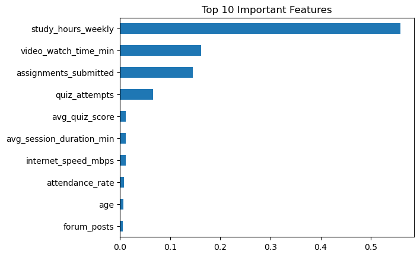
    


### 📊 5. Prediction Distribution


```python
import pandas as pd

pd.Series(y_pred_classes).value_counts().plot(kind='bar')
plt.title("Prediction Distribution")
plt.xlabel("Class")
plt.ylabel("Count")
plt.show()
```


    
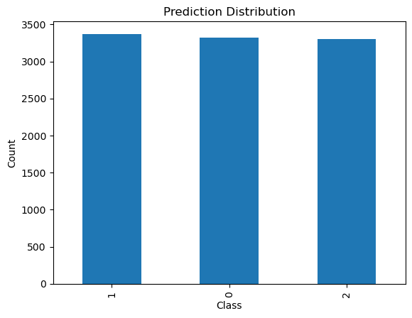
    


### 📉 6. True vs Predicted Comparison


```python
plt.plot(y_test.values[:100], label='Actual')
plt.plot(y_pred_classes[:100], label='Predicted')
plt.legend()
plt.title("Actual vs Predicted (First 100 Samples)")
plt.show()
```


    
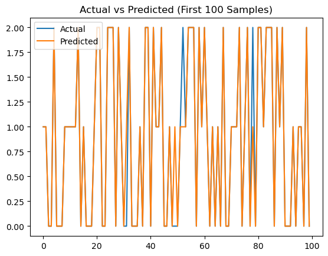
    


### 📊 7. Correlation Heatmap (Before Modeling)


```python
import seaborn as sns

corr = df.corr(numeric_only=True)

sns.heatmap(corr, cmap='coolwarm')
plt.title("Feature Correlation Matrix")
plt.show()
```


    
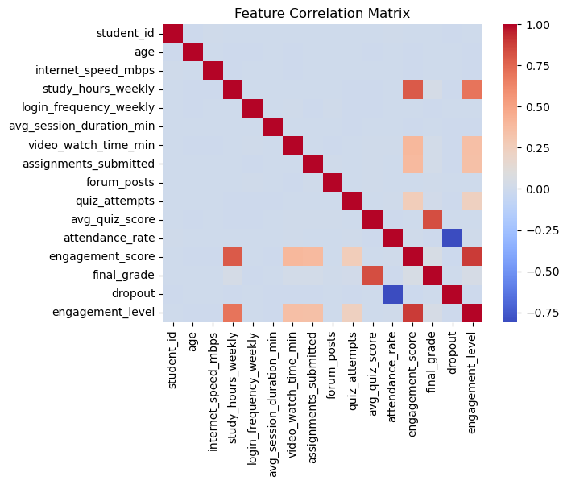
    


### 📉 8. Learning Curve (Advanced 🔥)
👉 Detect overfitting


```python
from sklearn.model_selection import learning_curve

train_sizes, train_scores, test_scores = learning_curve(
    rf_model, X, y, cv=5
)

plt.plot(train_sizes, train_scores.mean(axis=1), label='Train')
plt.plot(train_sizes, test_scores.mean(axis=1), label='Validation')
plt.legend()
plt.title("Learning Curve")
plt.show()
```


    
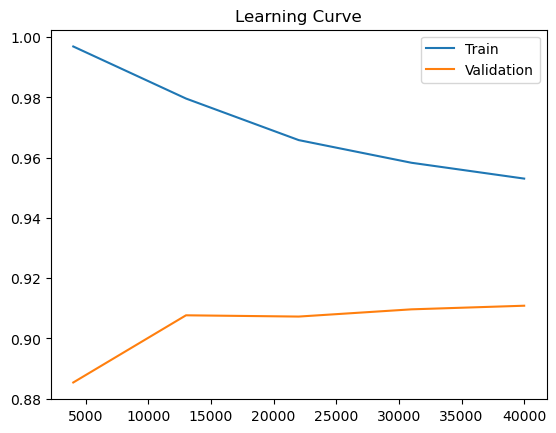
    


### 📊 9. Class-wise Accuracy Visualization


```python
import numpy as np

cm = confusion_matrix(y_test, y_pred_classes)

class_acc = cm.diagonal() / cm.sum(axis=1)

plt.bar(['Low','Medium','High'], class_acc)
plt.title("Class-wise Accuracy")
plt.ylabel("Accuracy")
plt.show()
```


    
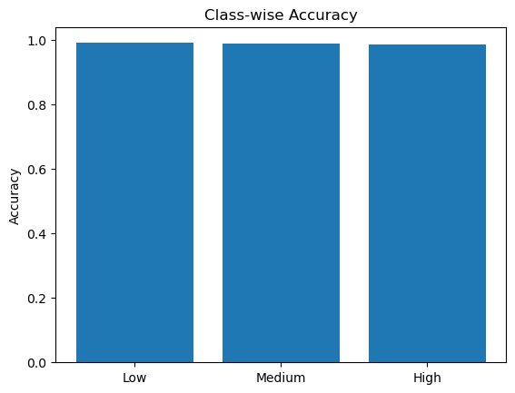
    


jupyter nbconvert --to markdown online-learning-engagement.ipynb


```python

```
