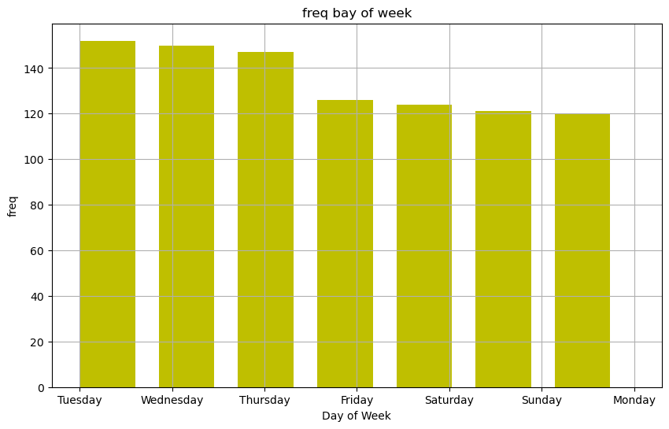
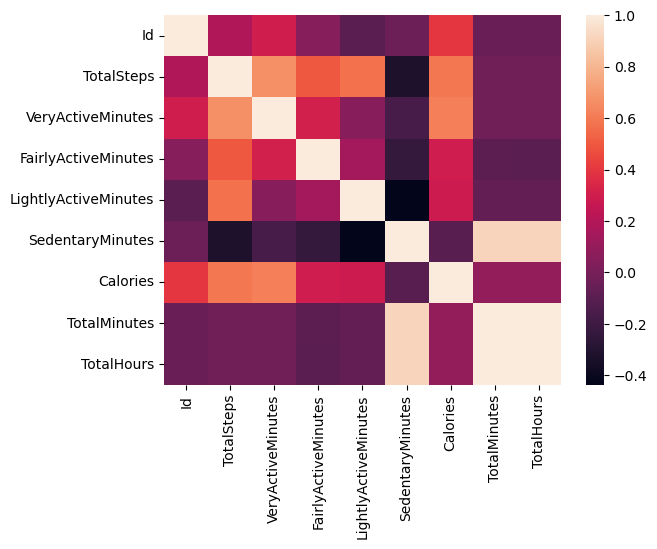
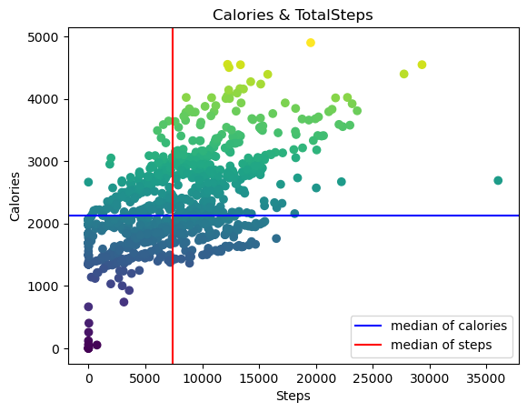
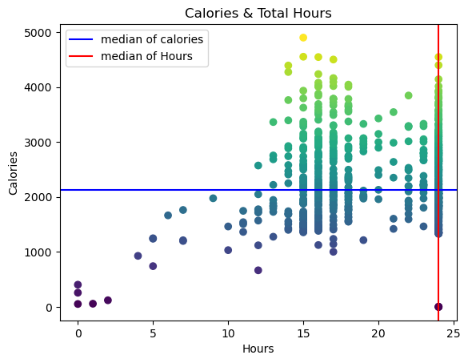
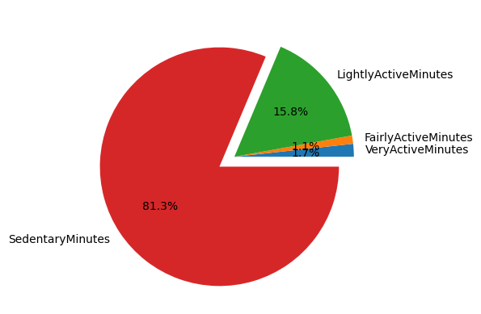
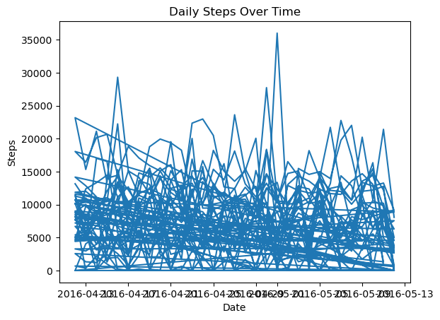
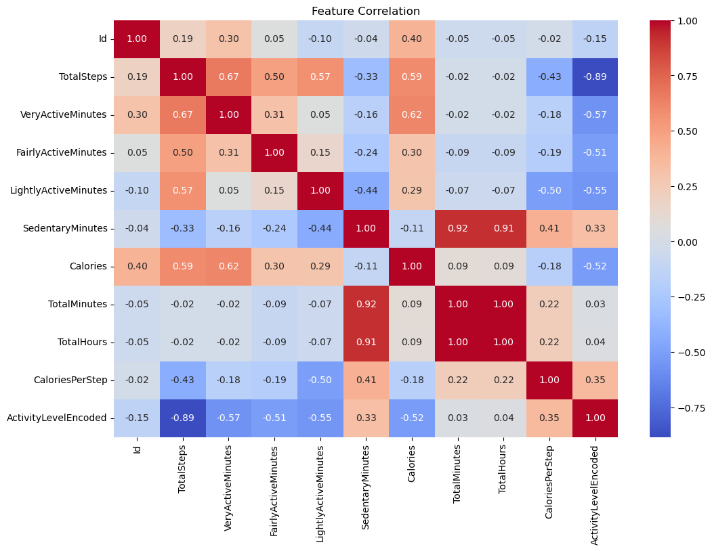
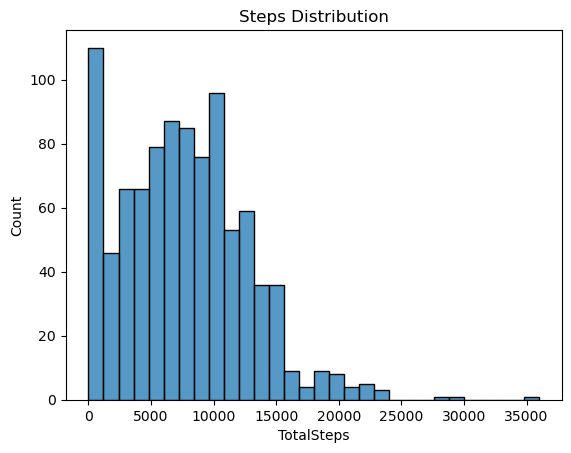

# Importing Necessary Libraries


```python
%pip install plotly
```

    Requirement already satisfied: plotly in D:\InstallationPath\anaconda\envs\ml_env\Lib\site-packages (6.7.0)
    Requirement already satisfied: narwhals>=1.15.1 in D:\InstallationPath\anaconda\envs\ml_env\Lib\site-packages (from plotly) (2.19.0)
    Requirement already satisfied: packaging in D:\InstallationPath\anaconda\envs\ml_env\Lib\site-packages (from plotly) (26.0)
    Note: you may need to restart the kernel to use updated packages.
    


```python
import pandas as pd
import numpy as np
import datetime as dt
import matplotlib.pyplot as plt
import seaborn as sns
import plotly.express as px

import warnings
warnings.filterwarnings('ignore')
```


```python
data = pd.read_csv('D:/PhD research/qualificationExams/2026/selectedTopics2/anaconda/dataset/fitbit/mturkfitbit_export_4.12.16-5.12.16/Fitabase Data 4.12.16-5.12.16/dailyActivity_merged.csv')
```

# Explore Data🔎 and Data Cleaning 🧹


```python
data.head()
```


<div>

<table border="1" class="dataframe">
  <thead>
    <tr style="text-align: right;">
      <th></th>
      <th>Id</th>
      <th>ActivityDate</th>
      <th>TotalSteps</th>
      <th>TotalDistance</th>
      <th>TrackerDistance</th>
      <th>LoggedActivitiesDistance</th>
      <th>VeryActiveDistance</th>
      <th>ModeratelyActiveDistance</th>
      <th>LightActiveDistance</th>
      <th>SedentaryActiveDistance</th>
      <th>VeryActiveMinutes</th>
      <th>FairlyActiveMinutes</th>
      <th>LightlyActiveMinutes</th>
      <th>SedentaryMinutes</th>
      <th>Calories</th>
    </tr>
  </thead>
  <tbody>
    <tr>
      <th>0</th>
      <td>1503960366</td>
      <td>4/12/2016</td>
      <td>13162</td>
      <td>8.50</td>
      <td>8.50</td>
      <td>0.0</td>
      <td>1.88</td>
      <td>0.55</td>
      <td>6.06</td>
      <td>0.0</td>
      <td>25</td>
      <td>13</td>
      <td>328</td>
      <td>728</td>
      <td>1985</td>
    </tr>
    <tr>
      <th>1</th>
      <td>1503960366</td>
      <td>4/13/2016</td>
      <td>10735</td>
      <td>6.97</td>
      <td>6.97</td>
      <td>0.0</td>
      <td>1.57</td>
      <td>0.69</td>
      <td>4.71</td>
      <td>0.0</td>
      <td>21</td>
      <td>19</td>
      <td>217</td>
      <td>776</td>
      <td>1797</td>
    </tr>
    <tr>
      <th>2</th>
      <td>1503960366</td>
      <td>4/14/2016</td>
      <td>10460</td>
      <td>6.74</td>
      <td>6.74</td>
      <td>0.0</td>
      <td>2.44</td>
      <td>0.40</td>
      <td>3.91</td>
      <td>0.0</td>
      <td>30</td>
      <td>11</td>
      <td>181</td>
      <td>1218</td>
      <td>1776</td>
    </tr>
    <tr>
      <th>3</th>
      <td>1503960366</td>
      <td>4/15/2016</td>
      <td>9762</td>
      <td>6.28</td>
      <td>6.28</td>
      <td>0.0</td>
      <td>2.14</td>
      <td>1.26</td>
      <td>2.83</td>
      <td>0.0</td>
      <td>29</td>
      <td>34</td>
      <td>209</td>
      <td>726</td>
      <td>1745</td>
    </tr>
    <tr>
      <th>4</th>
      <td>1503960366</td>
      <td>4/16/2016</td>
      <td>12669</td>
      <td>8.16</td>
      <td>8.16</td>
      <td>0.0</td>
      <td>2.71</td>
      <td>0.41</td>
      <td>5.04</td>
      <td>0.0</td>
      <td>36</td>
      <td>10</td>
      <td>221</td>
      <td>773</td>
      <td>1863</td>
    </tr>
  </tbody>
</table>
</div>


```python
data.shape
```


    (940, 15)


```python
data.Id.nunique()
```


    33


```python
cols =['Id','ActivityDate','TotalSteps','VeryActiveMinutes','FairlyActiveMinutes','LightlyActiveMinutes','SedentaryMinutes','Calories']

df = data[cols]
```


```python
df
```


<div>

<table border="1" class="dataframe">
  <thead>
    <tr style="text-align: right;">
      <th></th>
      <th>Id</th>
      <th>ActivityDate</th>
      <th>TotalSteps</th>
      <th>VeryActiveMinutes</th>
      <th>FairlyActiveMinutes</th>
      <th>LightlyActiveMinutes</th>
      <th>SedentaryMinutes</th>
      <th>Calories</th>
    </tr>
  </thead>
  <tbody>
    <tr>
      <th>0</th>
      <td>1503960366</td>
      <td>4/12/2016</td>
      <td>13162</td>
      <td>25</td>
      <td>13</td>
      <td>328</td>
      <td>728</td>
      <td>1985</td>
    </tr>
    <tr>
      <th>1</th>
      <td>1503960366</td>
      <td>4/13/2016</td>
      <td>10735</td>
      <td>21</td>
      <td>19</td>
      <td>217</td>
      <td>776</td>
      <td>1797</td>
    </tr>
    <tr>
      <th>2</th>
      <td>1503960366</td>
      <td>4/14/2016</td>
      <td>10460</td>
      <td>30</td>
      <td>11</td>
      <td>181</td>
      <td>1218</td>
      <td>1776</td>
    </tr>
    <tr>
      <th>3</th>
      <td>1503960366</td>
      <td>4/15/2016</td>
      <td>9762</td>
      <td>29</td>
      <td>34</td>
      <td>209</td>
      <td>726</td>
      <td>1745</td>
    </tr>
    <tr>
      <th>4</th>
      <td>1503960366</td>
      <td>4/16/2016</td>
      <td>12669</td>
      <td>36</td>
      <td>10</td>
      <td>221</td>
      <td>773</td>
      <td>1863</td>
    </tr>
    <tr>
      <th>...</th>
      <td>...</td>
      <td>...</td>
      <td>...</td>
      <td>...</td>
      <td>...</td>
      <td>...</td>
      <td>...</td>
      <td>...</td>
    </tr>
    <tr>
      <th>935</th>
      <td>8877689391</td>
      <td>5/8/2016</td>
      <td>10686</td>
      <td>17</td>
      <td>4</td>
      <td>245</td>
      <td>1174</td>
      <td>2847</td>
    </tr>
    <tr>
      <th>936</th>
      <td>8877689391</td>
      <td>5/9/2016</td>
      <td>20226</td>
      <td>73</td>
      <td>19</td>
      <td>217</td>
      <td>1131</td>
      <td>3710</td>
    </tr>
    <tr>
      <th>937</th>
      <td>8877689391</td>
      <td>5/10/2016</td>
      <td>10733</td>
      <td>18</td>
      <td>11</td>
      <td>224</td>
      <td>1187</td>
      <td>2832</td>
    </tr>
    <tr>
      <th>938</th>
      <td>8877689391</td>
      <td>5/11/2016</td>
      <td>21420</td>
      <td>88</td>
      <td>12</td>
      <td>213</td>
      <td>1127</td>
      <td>3832</td>
    </tr>
    <tr>
      <th>939</th>
      <td>8877689391</td>
      <td>5/12/2016</td>
      <td>8064</td>
      <td>23</td>
      <td>1</td>
      <td>137</td>
      <td>770</td>
      <td>1849</td>
    </tr>
  </tbody>
</table>
<p>940 rows × 8 columns</p>
</div>


```python
df.rename(columns={'ActivityDate':'Data'},inplace=True)
```


```python
df
```


<div>
<style scoped>
    .dataframe tbody tr th:only-of-type {
        vertical-align: middle;
    }

    .dataframe tbody tr th {
        vertical-align: top;
    }

    .dataframe thead th {
        text-align: right;
    }
</style>
<table border="1" class="dataframe">
  <thead>
    <tr style="text-align: right;">
      <th></th>
      <th>Id</th>
      <th>Data</th>
      <th>TotalSteps</th>
      <th>VeryActiveMinutes</th>
      <th>FairlyActiveMinutes</th>
      <th>LightlyActiveMinutes</th>
      <th>SedentaryMinutes</th>
      <th>Calories</th>
    </tr>
  </thead>
  <tbody>
    <tr>
      <th>0</th>
      <td>1503960366</td>
      <td>4/12/2016</td>
      <td>13162</td>
      <td>25</td>
      <td>13</td>
      <td>328</td>
      <td>728</td>
      <td>1985</td>
    </tr>
    <tr>
      <th>1</th>
      <td>1503960366</td>
      <td>4/13/2016</td>
      <td>10735</td>
      <td>21</td>
      <td>19</td>
      <td>217</td>
      <td>776</td>
      <td>1797</td>
    </tr>
    <tr>
      <th>2</th>
      <td>1503960366</td>
      <td>4/14/2016</td>
      <td>10460</td>
      <td>30</td>
      <td>11</td>
      <td>181</td>
      <td>1218</td>
      <td>1776</td>
    </tr>
    <tr>
      <th>3</th>
      <td>1503960366</td>
      <td>4/15/2016</td>
      <td>9762</td>
      <td>29</td>
      <td>34</td>
      <td>209</td>
      <td>726</td>
      <td>1745</td>
    </tr>
    <tr>
      <th>4</th>
      <td>1503960366</td>
      <td>4/16/2016</td>
      <td>12669</td>
      <td>36</td>
      <td>10</td>
      <td>221</td>
      <td>773</td>
      <td>1863</td>
    </tr>
    <tr>
      <th>...</th>
      <td>...</td>
      <td>...</td>
      <td>...</td>
      <td>...</td>
      <td>...</td>
      <td>...</td>
      <td>...</td>
      <td>...</td>
    </tr>
    <tr>
      <th>935</th>
      <td>8877689391</td>
      <td>5/8/2016</td>
      <td>10686</td>
      <td>17</td>
      <td>4</td>
      <td>245</td>
      <td>1174</td>
      <td>2847</td>
    </tr>
    <tr>
      <th>936</th>
      <td>8877689391</td>
      <td>5/9/2016</td>
      <td>20226</td>
      <td>73</td>
      <td>19</td>
      <td>217</td>
      <td>1131</td>
      <td>3710</td>
    </tr>
    <tr>
      <th>937</th>
      <td>8877689391</td>
      <td>5/10/2016</td>
      <td>10733</td>
      <td>18</td>
      <td>11</td>
      <td>224</td>
      <td>1187</td>
      <td>2832</td>
    </tr>
    <tr>
      <th>938</th>
      <td>8877689391</td>
      <td>5/11/2016</td>
      <td>21420</td>
      <td>88</td>
      <td>12</td>
      <td>213</td>
      <td>1127</td>
      <td>3832</td>
    </tr>
    <tr>
      <th>939</th>
      <td>8877689391</td>
      <td>5/12/2016</td>
      <td>8064</td>
      <td>23</td>
      <td>1</td>
      <td>137</td>
      <td>770</td>
      <td>1849</td>
    </tr>
  </tbody>
</table>
<p>940 rows × 8 columns</p>
</div>


```python
df['TotalMinutes']=df.VeryActiveMinutes + df.FairlyActiveMinutes + df.LightlyActiveMinutes + df.SedentaryMinutes
```


```python
df
```


<div>
<style scoped>
    .dataframe tbody tr th:only-of-type {
        vertical-align: middle;
    }

    .dataframe tbody tr th {
        vertical-align: top;
    }

    .dataframe thead th {
        text-align: right;
    }
</style>
<table border="1" class="dataframe">
  <thead>
    <tr style="text-align: right;">
      <th></th>
      <th>Id</th>
      <th>Data</th>
      <th>TotalSteps</th>
      <th>VeryActiveMinutes</th>
      <th>FairlyActiveMinutes</th>
      <th>LightlyActiveMinutes</th>
      <th>SedentaryMinutes</th>
      <th>Calories</th>
      <th>TotalMinutes</th>
    </tr>
  </thead>
  <tbody>
    <tr>
      <th>0</th>
      <td>1503960366</td>
      <td>4/12/2016</td>
      <td>13162</td>
      <td>25</td>
      <td>13</td>
      <td>328</td>
      <td>728</td>
      <td>1985</td>
      <td>1094</td>
    </tr>
    <tr>
      <th>1</th>
      <td>1503960366</td>
      <td>4/13/2016</td>
      <td>10735</td>
      <td>21</td>
      <td>19</td>
      <td>217</td>
      <td>776</td>
      <td>1797</td>
      <td>1033</td>
    </tr>
    <tr>
      <th>2</th>
      <td>1503960366</td>
      <td>4/14/2016</td>
      <td>10460</td>
      <td>30</td>
      <td>11</td>
      <td>181</td>
      <td>1218</td>
      <td>1776</td>
      <td>1440</td>
    </tr>
    <tr>
      <th>3</th>
      <td>1503960366</td>
      <td>4/15/2016</td>
      <td>9762</td>
      <td>29</td>
      <td>34</td>
      <td>209</td>
      <td>726</td>
      <td>1745</td>
      <td>998</td>
    </tr>
    <tr>
      <th>4</th>
      <td>1503960366</td>
      <td>4/16/2016</td>
      <td>12669</td>
      <td>36</td>
      <td>10</td>
      <td>221</td>
      <td>773</td>
      <td>1863</td>
      <td>1040</td>
    </tr>
    <tr>
      <th>...</th>
      <td>...</td>
      <td>...</td>
      <td>...</td>
      <td>...</td>
      <td>...</td>
      <td>...</td>
      <td>...</td>
      <td>...</td>
      <td>...</td>
    </tr>
    <tr>
      <th>935</th>
      <td>8877689391</td>
      <td>5/8/2016</td>
      <td>10686</td>
      <td>17</td>
      <td>4</td>
      <td>245</td>
      <td>1174</td>
      <td>2847</td>
      <td>1440</td>
    </tr>
    <tr>
      <th>936</th>
      <td>8877689391</td>
      <td>5/9/2016</td>
      <td>20226</td>
      <td>73</td>
      <td>19</td>
      <td>217</td>
      <td>1131</td>
      <td>3710</td>
      <td>1440</td>
    </tr>
    <tr>
      <th>937</th>
      <td>8877689391</td>
      <td>5/10/2016</td>
      <td>10733</td>
      <td>18</td>
      <td>11</td>
      <td>224</td>
      <td>1187</td>
      <td>2832</td>
      <td>1440</td>
    </tr>
    <tr>
      <th>938</th>
      <td>8877689391</td>
      <td>5/11/2016</td>
      <td>21420</td>
      <td>88</td>
      <td>12</td>
      <td>213</td>
      <td>1127</td>
      <td>3832</td>
      <td>1440</td>
    </tr>
    <tr>
      <th>939</th>
      <td>8877689391</td>
      <td>5/12/2016</td>
      <td>8064</td>
      <td>23</td>
      <td>1</td>
      <td>137</td>
      <td>770</td>
      <td>1849</td>
      <td>931</td>
    </tr>
  </tbody>
</table>
<p>940 rows × 9 columns</p>
</div>


```python
df['TotalHours']=round(df.TotalMinutes / 60)
```


```python
df
```


<div>
<style scoped>
    .dataframe tbody tr th:only-of-type {
        vertical-align: middle;
    }

    .dataframe tbody tr th {
        vertical-align: top;
    }

    .dataframe thead th {
        text-align: right;
    }
</style>
<table border="1" class="dataframe">
  <thead>
    <tr style="text-align: right;">
      <th></th>
      <th>Id</th>
      <th>Data</th>
      <th>TotalSteps</th>
      <th>VeryActiveMinutes</th>
      <th>FairlyActiveMinutes</th>
      <th>LightlyActiveMinutes</th>
      <th>SedentaryMinutes</th>
      <th>Calories</th>
      <th>TotalMinutes</th>
      <th>TotalHours</th>
    </tr>
  </thead>
  <tbody>
    <tr>
      <th>0</th>
      <td>1503960366</td>
      <td>4/12/2016</td>
      <td>13162</td>
      <td>25</td>
      <td>13</td>
      <td>328</td>
      <td>728</td>
      <td>1985</td>
      <td>1094</td>
      <td>18.0</td>
    </tr>
    <tr>
      <th>1</th>
      <td>1503960366</td>
      <td>4/13/2016</td>
      <td>10735</td>
      <td>21</td>
      <td>19</td>
      <td>217</td>
      <td>776</td>
      <td>1797</td>
      <td>1033</td>
      <td>17.0</td>
    </tr>
    <tr>
      <th>2</th>
      <td>1503960366</td>
      <td>4/14/2016</td>
      <td>10460</td>
      <td>30</td>
      <td>11</td>
      <td>181</td>
      <td>1218</td>
      <td>1776</td>
      <td>1440</td>
      <td>24.0</td>
    </tr>
    <tr>
      <th>3</th>
      <td>1503960366</td>
      <td>4/15/2016</td>
      <td>9762</td>
      <td>29</td>
      <td>34</td>
      <td>209</td>
      <td>726</td>
      <td>1745</td>
      <td>998</td>
      <td>17.0</td>
    </tr>
    <tr>
      <th>4</th>
      <td>1503960366</td>
      <td>4/16/2016</td>
      <td>12669</td>
      <td>36</td>
      <td>10</td>
      <td>221</td>
      <td>773</td>
      <td>1863</td>
      <td>1040</td>
      <td>17.0</td>
    </tr>
    <tr>
      <th>...</th>
      <td>...</td>
      <td>...</td>
      <td>...</td>
      <td>...</td>
      <td>...</td>
      <td>...</td>
      <td>...</td>
      <td>...</td>
      <td>...</td>
      <td>...</td>
    </tr>
    <tr>
      <th>935</th>
      <td>8877689391</td>
      <td>5/8/2016</td>
      <td>10686</td>
      <td>17</td>
      <td>4</td>
      <td>245</td>
      <td>1174</td>
      <td>2847</td>
      <td>1440</td>
      <td>24.0</td>
    </tr>
    <tr>
      <th>936</th>
      <td>8877689391</td>
      <td>5/9/2016</td>
      <td>20226</td>
      <td>73</td>
      <td>19</td>
      <td>217</td>
      <td>1131</td>
      <td>3710</td>
      <td>1440</td>
      <td>24.0</td>
    </tr>
    <tr>
      <th>937</th>
      <td>8877689391</td>
      <td>5/10/2016</td>
      <td>10733</td>
      <td>18</td>
      <td>11</td>
      <td>224</td>
      <td>1187</td>
      <td>2832</td>
      <td>1440</td>
      <td>24.0</td>
    </tr>
    <tr>
      <th>938</th>
      <td>8877689391</td>
      <td>5/11/2016</td>
      <td>21420</td>
      <td>88</td>
      <td>12</td>
      <td>213</td>
      <td>1127</td>
      <td>3832</td>
      <td>1440</td>
      <td>24.0</td>
    </tr>
    <tr>
      <th>939</th>
      <td>8877689391</td>
      <td>5/12/2016</td>
      <td>8064</td>
      <td>23</td>
      <td>1</td>
      <td>137</td>
      <td>770</td>
      <td>1849</td>
      <td>931</td>
      <td>16.0</td>
    </tr>
  </tbody>
</table>
<p>940 rows × 10 columns</p>
</div>


```python
df.info()
```

    <class 'pandas.DataFrame'>
    RangeIndex: 940 entries, 0 to 939
    Data columns (total 10 columns):
     #   Column                Non-Null Count  Dtype  
    ---  ------                --------------  -----  
     0   Id                    940 non-null    int64  
     1   Data                  940 non-null    str    
     2   TotalSteps            940 non-null    int64  
     3   VeryActiveMinutes     940 non-null    int64  
     4   FairlyActiveMinutes   940 non-null    int64  
     5   LightlyActiveMinutes  940 non-null    int64  
     6   SedentaryMinutes      940 non-null    int64  
     7   Calories              940 non-null    int64  
     8   TotalMinutes          940 non-null    int64  
     9   TotalHours            940 non-null    float64
    dtypes: float64(1), int64(8), str(1)
    memory usage: 73.6 KB
    


```python
df.Data=pd.to_datetime(df.Data)
df.Data.dtypes
```


    dtype('<M8[us]')


```python
df.info()
```

    <class 'pandas.DataFrame'>
    RangeIndex: 940 entries, 0 to 939
    Data columns (total 10 columns):
     #   Column                Non-Null Count  Dtype         
    ---  ------                --------------  -----         
     0   Id                    940 non-null    int64         
     1   Data                  940 non-null    datetime64[us]
     2   TotalSteps            940 non-null    int64         
     3   VeryActiveMinutes     940 non-null    int64         
     4   FairlyActiveMinutes   940 non-null    int64         
     5   LightlyActiveMinutes  940 non-null    int64         
     6   SedentaryMinutes      940 non-null    int64         
     7   Calories              940 non-null    int64         
     8   TotalMinutes          940 non-null    int64         
     9   TotalHours            940 non-null    float64       
    dtypes: datetime64[us](1), float64(1), int64(8)
    memory usage: 73.6 KB
    


```python
df['DayOfWeek'] = df.Data.dt.day_name()
```


```python
df
```


<div>
<style scoped>
    .dataframe tbody tr th:only-of-type {
        vertical-align: middle;
    }

    .dataframe tbody tr th {
        vertical-align: top;
    }

    .dataframe thead th {
        text-align: right;
    }
</style>
<table border="1" class="dataframe">
  <thead>
    <tr style="text-align: right;">
      <th></th>
      <th>Id</th>
      <th>Data</th>
      <th>TotalSteps</th>
      <th>VeryActiveMinutes</th>
      <th>FairlyActiveMinutes</th>
      <th>LightlyActiveMinutes</th>
      <th>SedentaryMinutes</th>
      <th>Calories</th>
      <th>TotalMinutes</th>
      <th>TotalHours</th>
      <th>DayOfWeek</th>
    </tr>
  </thead>
  <tbody>
    <tr>
      <th>0</th>
      <td>1503960366</td>
      <td>2016-04-12</td>
      <td>13162</td>
      <td>25</td>
      <td>13</td>
      <td>328</td>
      <td>728</td>
      <td>1985</td>
      <td>1094</td>
      <td>18.0</td>
      <td>Tuesday</td>
    </tr>
    <tr>
      <th>1</th>
      <td>1503960366</td>
      <td>2016-04-13</td>
      <td>10735</td>
      <td>21</td>
      <td>19</td>
      <td>217</td>
      <td>776</td>
      <td>1797</td>
      <td>1033</td>
      <td>17.0</td>
      <td>Wednesday</td>
    </tr>
    <tr>
      <th>2</th>
      <td>1503960366</td>
      <td>2016-04-14</td>
      <td>10460</td>
      <td>30</td>
      <td>11</td>
      <td>181</td>
      <td>1218</td>
      <td>1776</td>
      <td>1440</td>
      <td>24.0</td>
      <td>Thursday</td>
    </tr>
    <tr>
      <th>3</th>
      <td>1503960366</td>
      <td>2016-04-15</td>
      <td>9762</td>
      <td>29</td>
      <td>34</td>
      <td>209</td>
      <td>726</td>
      <td>1745</td>
      <td>998</td>
      <td>17.0</td>
      <td>Friday</td>
    </tr>
    <tr>
      <th>4</th>
      <td>1503960366</td>
      <td>2016-04-16</td>
      <td>12669</td>
      <td>36</td>
      <td>10</td>
      <td>221</td>
      <td>773</td>
      <td>1863</td>
      <td>1040</td>
      <td>17.0</td>
      <td>Saturday</td>
    </tr>
    <tr>
      <th>...</th>
      <td>...</td>
      <td>...</td>
      <td>...</td>
      <td>...</td>
      <td>...</td>
      <td>...</td>
      <td>...</td>
      <td>...</td>
      <td>...</td>
      <td>...</td>
      <td>...</td>
    </tr>
    <tr>
      <th>935</th>
      <td>8877689391</td>
      <td>2016-05-08</td>
      <td>10686</td>
      <td>17</td>
      <td>4</td>
      <td>245</td>
      <td>1174</td>
      <td>2847</td>
      <td>1440</td>
      <td>24.0</td>
      <td>Sunday</td>
    </tr>
    <tr>
      <th>936</th>
      <td>8877689391</td>
      <td>2016-05-09</td>
      <td>20226</td>
      <td>73</td>
      <td>19</td>
      <td>217</td>
      <td>1131</td>
      <td>3710</td>
      <td>1440</td>
      <td>24.0</td>
      <td>Monday</td>
    </tr>
    <tr>
      <th>937</th>
      <td>8877689391</td>
      <td>2016-05-10</td>
      <td>10733</td>
      <td>18</td>
      <td>11</td>
      <td>224</td>
      <td>1187</td>
      <td>2832</td>
      <td>1440</td>
      <td>24.0</td>
      <td>Tuesday</td>
    </tr>
    <tr>
      <th>938</th>
      <td>8877689391</td>
      <td>2016-05-11</td>
      <td>21420</td>
      <td>88</td>
      <td>12</td>
      <td>213</td>
      <td>1127</td>
      <td>3832</td>
      <td>1440</td>
      <td>24.0</td>
      <td>Wednesday</td>
    </tr>
    <tr>
      <th>939</th>
      <td>8877689391</td>
      <td>2016-05-12</td>
      <td>8064</td>
      <td>23</td>
      <td>1</td>
      <td>137</td>
      <td>770</td>
      <td>1849</td>
      <td>931</td>
      <td>16.0</td>
      <td>Thursday</td>
    </tr>
  </tbody>
</table>
<p>940 rows × 11 columns</p>
</div>


```python
# Check missing values
print(df.isnull().sum())
```

    Id                      0
    Data                    0
    TotalSteps              0
    VeryActiveMinutes       0
    FairlyActiveMinutes     0
    LightlyActiveMinutes    0
    SedentaryMinutes        0
    Calories                0
    TotalMinutes            0
    TotalHours              0
    DayOfWeek               0
    dtype: int64
    


```python
df.isna().sum()
```


    Id                      0
    Data                    0
    TotalSteps              0
    VeryActiveMinutes       0
    FairlyActiveMinutes     0
    LightlyActiveMinutes    0
    SedentaryMinutes        0
    Calories                0
    TotalMinutes            0
    TotalHours              0
    DayOfWeek               0
    dtype: int64


```python
df.duplicated().sum()
```


    np.int64(0)


# analyst data


```python
df.describe()
```


<div>
<style scoped>
    .dataframe tbody tr th:only-of-type {
        vertical-align: middle;
    }

    .dataframe tbody tr th {
        vertical-align: top;
    }

    .dataframe thead th {
        text-align: right;
    }
</style>
<table border="1" class="dataframe">
  <thead>
    <tr style="text-align: right;">
      <th></th>
      <th>Id</th>
      <th>Data</th>
      <th>TotalSteps</th>
      <th>VeryActiveMinutes</th>
      <th>FairlyActiveMinutes</th>
      <th>LightlyActiveMinutes</th>
      <th>SedentaryMinutes</th>
      <th>Calories</th>
      <th>TotalMinutes</th>
      <th>TotalHours</th>
    </tr>
  </thead>
  <tbody>
    <tr>
      <th>count</th>
      <td>9.400000e+02</td>
      <td>940</td>
      <td>940.000000</td>
      <td>940.000000</td>
      <td>940.000000</td>
      <td>940.000000</td>
      <td>940.000000</td>
      <td>940.000000</td>
      <td>940.000000</td>
      <td>940.000000</td>
    </tr>
    <tr>
      <th>mean</th>
      <td>4.855407e+09</td>
      <td>2016-04-26 06:53:37.021276</td>
      <td>7637.910638</td>
      <td>21.164894</td>
      <td>13.564894</td>
      <td>192.812766</td>
      <td>991.210638</td>
      <td>2303.609574</td>
      <td>1218.753191</td>
      <td>20.313830</td>
    </tr>
    <tr>
      <th>min</th>
      <td>1.503960e+09</td>
      <td>2016-04-12 00:00:00</td>
      <td>0.000000</td>
      <td>0.000000</td>
      <td>0.000000</td>
      <td>0.000000</td>
      <td>0.000000</td>
      <td>0.000000</td>
      <td>2.000000</td>
      <td>0.000000</td>
    </tr>
    <tr>
      <th>25%</th>
      <td>2.320127e+09</td>
      <td>2016-04-19 00:00:00</td>
      <td>3789.750000</td>
      <td>0.000000</td>
      <td>0.000000</td>
      <td>127.000000</td>
      <td>729.750000</td>
      <td>1828.500000</td>
      <td>989.750000</td>
      <td>16.000000</td>
    </tr>
    <tr>
      <th>50%</th>
      <td>4.445115e+09</td>
      <td>2016-04-26 00:00:00</td>
      <td>7405.500000</td>
      <td>4.000000</td>
      <td>6.000000</td>
      <td>199.000000</td>
      <td>1057.500000</td>
      <td>2134.000000</td>
      <td>1440.000000</td>
      <td>24.000000</td>
    </tr>
    <tr>
      <th>75%</th>
      <td>6.962181e+09</td>
      <td>2016-05-04 00:00:00</td>
      <td>10727.000000</td>
      <td>32.000000</td>
      <td>19.000000</td>
      <td>264.000000</td>
      <td>1229.500000</td>
      <td>2793.250000</td>
      <td>1440.000000</td>
      <td>24.000000</td>
    </tr>
    <tr>
      <th>max</th>
      <td>8.877689e+09</td>
      <td>2016-05-12 00:00:00</td>
      <td>36019.000000</td>
      <td>210.000000</td>
      <td>143.000000</td>
      <td>518.000000</td>
      <td>1440.000000</td>
      <td>4900.000000</td>
      <td>1440.000000</td>
      <td>24.000000</td>
    </tr>
    <tr>
      <th>std</th>
      <td>2.424805e+09</td>
      <td>NaN</td>
      <td>5087.150742</td>
      <td>32.844803</td>
      <td>19.987404</td>
      <td>109.174700</td>
      <td>301.267437</td>
      <td>718.166862</td>
      <td>265.931767</td>
      <td>4.437283</td>
    </tr>
  </tbody>
</table>
</div>


```python
plt.figure(figsize=((10,6)))
plt.hist(df.DayOfWeek,color='y',bins=7,width =.6,align='mid')

plt.xlabel('Day of Week')
plt.ylabel('freq')
plt.title('freq bay of week')

plt.grid()
plt.show()
```


    

    


```python
mask = df.drop(['DayOfWeek','Data'],axis=1)
```


```python
mask.corr()
```


<div>
<style scoped>
    .dataframe tbody tr th:only-of-type {
        vertical-align: middle;
    }

    .dataframe tbody tr th {
        vertical-align: top;
    }

    .dataframe thead th {
        text-align: right;
    }
</style>
<table border="1" class="dataframe">
  <thead>
    <tr style="text-align: right;">
      <th></th>
      <th>Id</th>
      <th>TotalSteps</th>
      <th>VeryActiveMinutes</th>
      <th>FairlyActiveMinutes</th>
      <th>LightlyActiveMinutes</th>
      <th>SedentaryMinutes</th>
      <th>Calories</th>
      <th>TotalMinutes</th>
      <th>TotalHours</th>
    </tr>
  </thead>
  <tbody>
    <tr>
      <th>Id</th>
      <td>1.000000</td>
      <td>0.185721</td>
      <td>0.303608</td>
      <td>0.051158</td>
      <td>-0.098754</td>
      <td>-0.043319</td>
      <td>0.396671</td>
      <td>-0.048274</td>
      <td>-0.048140</td>
    </tr>
    <tr>
      <th>TotalSteps</th>
      <td>0.185721</td>
      <td>1.000000</td>
      <td>0.667079</td>
      <td>0.498693</td>
      <td>0.569600</td>
      <td>-0.327484</td>
      <td>0.591568</td>
      <td>-0.017285</td>
      <td>-0.018152</td>
    </tr>
    <tr>
      <th>VeryActiveMinutes</th>
      <td>0.303608</td>
      <td>0.667079</td>
      <td>1.000000</td>
      <td>0.312420</td>
      <td>0.051926</td>
      <td>-0.164671</td>
      <td>0.615838</td>
      <td>-0.018244</td>
      <td>-0.021064</td>
    </tr>
    <tr>
      <th>FairlyActiveMinutes</th>
      <td>0.051158</td>
      <td>0.498693</td>
      <td>0.312420</td>
      <td>1.000000</td>
      <td>0.148820</td>
      <td>-0.237446</td>
      <td>0.297623</td>
      <td>-0.094155</td>
      <td>-0.094941</td>
    </tr>
    <tr>
      <th>LightlyActiveMinutes</th>
      <td>-0.098754</td>
      <td>0.569600</td>
      <td>0.051926</td>
      <td>0.148820</td>
      <td>1.000000</td>
      <td>-0.437104</td>
      <td>0.286718</td>
      <td>-0.067049</td>
      <td>-0.066640</td>
    </tr>
    <tr>
      <th>SedentaryMinutes</th>
      <td>-0.043319</td>
      <td>-0.327484</td>
      <td>-0.164671</td>
      <td>-0.237446</td>
      <td>-0.437104</td>
      <td>1.000000</td>
      <td>-0.106973</td>
      <td>0.915243</td>
      <td>0.914539</td>
    </tr>
    <tr>
      <th>Calories</th>
      <td>0.396671</td>
      <td>0.591568</td>
      <td>0.615838</td>
      <td>0.297623</td>
      <td>0.286718</td>
      <td>-0.106973</td>
      <td>1.000000</td>
      <td>0.094951</td>
      <td>0.093314</td>
    </tr>
    <tr>
      <th>TotalMinutes</th>
      <td>-0.048274</td>
      <td>-0.017285</td>
      <td>-0.018244</td>
      <td>-0.094155</td>
      <td>-0.067049</td>
      <td>0.915243</td>
      <td>0.094951</td>
      <td>1.000000</td>
      <td>0.998963</td>
    </tr>
    <tr>
      <th>TotalHours</th>
      <td>-0.048140</td>
      <td>-0.018152</td>
      <td>-0.021064</td>
      <td>-0.094941</td>
      <td>-0.066640</td>
      <td>0.914539</td>
      <td>0.093314</td>
      <td>0.998963</td>
      <td>1.000000</td>
    </tr>
  </tbody>
</table>
</div>


```python
sns.heatmap(mask.corr())
```


    <Axes: >


    

    


```python
plt.scatter(mask.TotalSteps,mask.Calories,c=mask.Calories )

median_steps = 7405
median_calories = 2134

plt.axhline(median_calories,color = 'b',label = 'median of calories')
plt.axvline(median_steps,color = 'r',label = 'median of steps')

plt.xlabel('Steps')
plt.ylabel('Calories')
plt.title('Calories & TotalSteps')

plt.legend()
plt.show()
```


    

    


```python
plt.scatter(mask.TotalHours,mask.Calories,c=mask.Calories )

median_Hours = 24
median_calories = 2134

plt.axhline(median_calories,color = 'b',label = 'median of calories')
plt.axvline(median_Hours,color = 'r',label = 'median of Hours')

plt.xlabel('Hours')
plt.ylabel('Calories')
plt.title('Calories & Total Hours')

plt.legend()
plt.show()
```


    

    


```python
minutes = [df.VeryActiveMinutes.sum(),df.FairlyActiveMinutes.sum(),
           df.LightlyActiveMinutes.sum(),df.SedentaryMinutes.sum()
          ]
labels = ['VeryActiveMinutes','FairlyActiveMinutes','LightlyActiveMinutes','SedentaryMinutes']

plt.pie(minutes,labels=labels,autopct='%1.1f%%',explode=[0,0,0,0.15])

plt.show()
```


    

    


#  Let's Create activity level classification


```python
def classify_activity(steps):
    if steps < 5000:
        return "Sedentary"
    elif steps < 10000:
        return "Moderate"
    else:
        return "Active"

df['ActivityLevel'] = df['TotalSteps'].apply(classify_activity)

# Sleep efficiency proxy (example)
df['CaloriesPerStep'] = df['Calories'] / (df['TotalSteps'] + 1)
```


```python
from sklearn.preprocessing import LabelEncoder

le = LabelEncoder()
df['ActivityLevelEncoded'] = le.fit_transform(df['ActivityLevel'])
```


```python
X = df[['TotalSteps', 'Calories', 'VeryActiveMinutes', 'SedentaryMinutes']]
y = df['ActivityLevelEncoded']
```


```python
from sklearn.model_selection import train_test_split

X_train, X_test, y_train, y_test = train_test_split(
    X, y, test_size=0.2, random_state=42
)
```


```python
from sklearn.ensemble import RandomForestClassifier

model = RandomForestClassifier(n_estimators=100)
model.fit(X_train, y_train)
```


<style>#sk-container-id-1 {
  /* Definition of color scheme common for light and dark mode */
  --sklearn-color-text: #000;
  --sklearn-color-text-muted: #666;
  --sklearn-color-line: gray;
  /* Definition of color scheme for unfitted estimators */
  --sklearn-color-unfitted-level-0: #fff5e6;
  --sklearn-color-unfitted-level-1: #f6e4d2;
  --sklearn-color-unfitted-level-2: #ffe0b3;
  --sklearn-color-unfitted-level-3: chocolate;
  /* Definition of color scheme for fitted estimators */
  --sklearn-color-fitted-level-0: #f0f8ff;
  --sklearn-color-fitted-level-1: #d4ebff;
  --sklearn-color-fitted-level-2: #b3dbfd;
  --sklearn-color-fitted-level-3: cornflowerblue;
}

#sk-container-id-1.light {
  /* Specific color for light theme */
  --sklearn-color-text-on-default-background: black;
  --sklearn-color-background: white;
  --sklearn-color-border-box: black;
  --sklearn-color-icon: #696969;
}

#sk-container-id-1.dark {
  --sklearn-color-text-on-default-background: white;
  --sklearn-color-background: #111;
  --sklearn-color-border-box: white;
  --sklearn-color-icon: #878787;
}

#sk-container-id-1 {
  color: var(--sklearn-color-text);
}

#sk-container-id-1 pre {
  padding: 0;
}

#sk-container-id-1 input.sk-hidden--visually {
  border: 0;
  clip: rect(1px 1px 1px 1px);
  clip: rect(1px, 1px, 1px, 1px);
  height: 1px;
  margin: -1px;
  overflow: hidden;
  padding: 0;
  position: absolute;
  width: 1px;
}

#sk-container-id-1 div.sk-dashed-wrapped {
  border: 1px dashed var(--sklearn-color-line);
  margin: 0 0.4em 0.5em 0.4em;
  box-sizing: border-box;
  padding-bottom: 0.4em;
  background-color: var(--sklearn-color-background);
}

#sk-container-id-1 div.sk-container {
  /* jupyter's `normalize.less` sets `[hidden] { display: none; }`
     but bootstrap.min.css set `[hidden] { display: none !important; }`
     so we also need the `!important` here to be able to override the
     default hidden behavior on the sphinx rendered scikit-learn.org.
     See: https://github.com/scikit-learn/scikit-learn/issues/21755 */
  display: inline-block !important;
  position: relative;
}

#sk-container-id-1 div.sk-text-repr-fallback {
  display: none;
}

div.sk-parallel-item,
div.sk-serial,
div.sk-item {
  /* draw centered vertical line to link estimators */
  background-image: linear-gradient(var(--sklearn-color-text-on-default-background), var(--sklearn-color-text-on-default-background));
  background-size: 2px 100%;
  background-repeat: no-repeat;
  background-position: center center;
}

/* Parallel-specific style estimator block */

#sk-container-id-1 div.sk-parallel-item::after {
  content: "";
  width: 100%;
  border-bottom: 2px solid var(--sklearn-color-text-on-default-background);
  flex-grow: 1;
}

#sk-container-id-1 div.sk-parallel {
  display: flex;
  align-items: stretch;
  justify-content: center;
  background-color: var(--sklearn-color-background);
  position: relative;
}

#sk-container-id-1 div.sk-parallel-item {
  display: flex;
  flex-direction: column;
}

#sk-container-id-1 div.sk-parallel-item:first-child::after {
  align-self: flex-end;
  width: 50%;
}

#sk-container-id-1 div.sk-parallel-item:last-child::after {
  align-self: flex-start;
  width: 50%;
}

#sk-container-id-1 div.sk-parallel-item:only-child::after {
  width: 0;
}

/* Serial-specific style estimator block */

#sk-container-id-1 div.sk-serial {
  display: flex;
  flex-direction: column;
  align-items: center;
  background-color: var(--sklearn-color-background);
  padding-right: 1em;
  padding-left: 1em;
}


/* Toggleable style: style used for estimator/Pipeline/ColumnTransformer box that is
clickable and can be expanded/collapsed.
- Pipeline and ColumnTransformer use this feature and define the default style
- Estimators will overwrite some part of the style using the `sk-estimator` class
*/

/* Pipeline and ColumnTransformer style (default) */

#sk-container-id-1 div.sk-toggleable {
  /* Default theme specific background. It is overwritten whether we have a
  specific estimator or a Pipeline/ColumnTransformer */
  background-color: var(--sklearn-color-background);
}

/* Toggleable label */
#sk-container-id-1 label.sk-toggleable__label {
  cursor: pointer;
  display: flex;
  width: 100%;
  margin-bottom: 0;
  padding: 0.5em;
  box-sizing: border-box;
  text-align: center;
  align-items: center;
  justify-content: center;
  gap: 0.5em;
}

#sk-container-id-1 label.sk-toggleable__label .caption {
  font-size: 0.6rem;
  font-weight: lighter;
  color: var(--sklearn-color-text-muted);
}

#sk-container-id-1 label.sk-toggleable__label-arrow:before {
  /* Arrow on the left of the label */
  content: "▸";
  float: left;
  margin-right: 0.25em;
  color: var(--sklearn-color-icon);
}

#sk-container-id-1 label.sk-toggleable__label-arrow:hover:before {
  color: var(--sklearn-color-text);
}

/* Toggleable content - dropdown */

#sk-container-id-1 div.sk-toggleable__content {
  display: none;
  text-align: left;
  /* unfitted */
  background-color: var(--sklearn-color-unfitted-level-0);
}

#sk-container-id-1 div.sk-toggleable__content.fitted {
  /* fitted */
  background-color: var(--sklearn-color-fitted-level-0);
}

#sk-container-id-1 div.sk-toggleable__content pre {
  margin: 0.2em;
  border-radius: 0.25em;
  color: var(--sklearn-color-text);
  /* unfitted */
  background-color: var(--sklearn-color-unfitted-level-0);
}

#sk-container-id-1 div.sk-toggleable__content.fitted pre {
  /* unfitted */
  background-color: var(--sklearn-color-fitted-level-0);
}

#sk-container-id-1 input.sk-toggleable__control:checked~div.sk-toggleable__content {
  /* Expand drop-down */
  display: block;
  width: 100%;
  overflow: visible;
}

#sk-container-id-1 input.sk-toggleable__control:checked~label.sk-toggleable__label-arrow:before {
  content: "▾";
}

/* Pipeline/ColumnTransformer-specific style */

#sk-container-id-1 div.sk-label input.sk-toggleable__control:checked~label.sk-toggleable__label {
  color: var(--sklearn-color-text);
  background-color: var(--sklearn-color-unfitted-level-2);
}

#sk-container-id-1 div.sk-label.fitted input.sk-toggleable__control:checked~label.sk-toggleable__label {
  background-color: var(--sklearn-color-fitted-level-2);
}

/* Estimator-specific style */

/* Colorize estimator box */
#sk-container-id-1 div.sk-estimator input.sk-toggleable__control:checked~label.sk-toggleable__label {
  /* unfitted */
  background-color: var(--sklearn-color-unfitted-level-2);
}

#sk-container-id-1 div.sk-estimator.fitted input.sk-toggleable__control:checked~label.sk-toggleable__label {
  /* fitted */
  background-color: var(--sklearn-color-fitted-level-2);
}

#sk-container-id-1 div.sk-label label.sk-toggleable__label,
#sk-container-id-1 div.sk-label label {
  /* The background is the default theme color */
  color: var(--sklearn-color-text-on-default-background);
}

/* On hover, darken the color of the background */
#sk-container-id-1 div.sk-label:hover label.sk-toggleable__label {
  color: var(--sklearn-color-text);
  background-color: var(--sklearn-color-unfitted-level-2);
}

/* Label box, darken color on hover, fitted */
#sk-container-id-1 div.sk-label.fitted:hover label.sk-toggleable__label.fitted {
  color: var(--sklearn-color-text);
  background-color: var(--sklearn-color-fitted-level-2);
}

/* Estimator label */

#sk-container-id-1 div.sk-label label {
  font-family: monospace;
  font-weight: bold;
  line-height: 1.2em;
}

#sk-container-id-1 div.sk-label-container {
  text-align: center;
}

/* Estimator-specific */
#sk-container-id-1 div.sk-estimator {
  font-family: monospace;
  border: 1px dotted var(--sklearn-color-border-box);
  border-radius: 0.25em;
  box-sizing: border-box;
  margin-bottom: 0.5em;
  /* unfitted */
  background-color: var(--sklearn-color-unfitted-level-0);
}

#sk-container-id-1 div.sk-estimator.fitted {
  /* fitted */
  background-color: var(--sklearn-color-fitted-level-0);
}

/* on hover */
#sk-container-id-1 div.sk-estimator:hover {
  /* unfitted */
  background-color: var(--sklearn-color-unfitted-level-2);
}

#sk-container-id-1 div.sk-estimator.fitted:hover {
  /* fitted */
  background-color: var(--sklearn-color-fitted-level-2);
}

/* Specification for estimator info (e.g. "i" and "?") */

/* Common style for "i" and "?" */

.sk-estimator-doc-link,
a:link.sk-estimator-doc-link,
a:visited.sk-estimator-doc-link {
  float: right;
  font-size: smaller;
  line-height: 1em;
  font-family: monospace;
  background-color: var(--sklearn-color-unfitted-level-0);
  border-radius: 1em;
  height: 1em;
  width: 1em;
  text-decoration: none !important;
  margin-left: 0.5em;
  text-align: center;
  /* unfitted */
  border: var(--sklearn-color-unfitted-level-3) 1pt solid;
  color: var(--sklearn-color-unfitted-level-3);
}

.sk-estimator-doc-link.fitted,
a:link.sk-estimator-doc-link.fitted,
a:visited.sk-estimator-doc-link.fitted {
  /* fitted */
  background-color: var(--sklearn-color-fitted-level-0);
  border: var(--sklearn-color-fitted-level-3) 1pt solid;
  color: var(--sklearn-color-fitted-level-3);
}

/* On hover */
div.sk-estimator:hover .sk-estimator-doc-link:hover,
.sk-estimator-doc-link:hover,
div.sk-label-container:hover .sk-estimator-doc-link:hover,
.sk-estimator-doc-link:hover {
  /* unfitted */
  background-color: var(--sklearn-color-unfitted-level-3);
  border: var(--sklearn-color-fitted-level-0) 1pt solid;
  color: var(--sklearn-color-unfitted-level-0);
  text-decoration: none;
}

div.sk-estimator.fitted:hover .sk-estimator-doc-link.fitted:hover,
.sk-estimator-doc-link.fitted:hover,
div.sk-label-container:hover .sk-estimator-doc-link.fitted:hover,
.sk-estimator-doc-link.fitted:hover {
  /* fitted */
  background-color: var(--sklearn-color-fitted-level-3);
  border: var(--sklearn-color-fitted-level-0) 1pt solid;
  color: var(--sklearn-color-fitted-level-0);
  text-decoration: none;
}

/* Span, style for the box shown on hovering the info icon */
.sk-estimator-doc-link span {
  display: none;
  z-index: 9999;
  position: relative;
  font-weight: normal;
  right: .2ex;
  padding: .5ex;
  margin: .5ex;
  width: min-content;
  min-width: 20ex;
  max-width: 50ex;
  color: var(--sklearn-color-text);
  box-shadow: 2pt 2pt 4pt #999;
  /* unfitted */
  background: var(--sklearn-color-unfitted-level-0);
  border: .5pt solid var(--sklearn-color-unfitted-level-3);
}

.sk-estimator-doc-link.fitted span {
  /* fitted */
  background: var(--sklearn-color-fitted-level-0);
  border: var(--sklearn-color-fitted-level-3);
}

.sk-estimator-doc-link:hover span {
  display: block;
}

/* "?"-specific style due to the `<a>` HTML tag */

#sk-container-id-1 a.estimator_doc_link {
  float: right;
  font-size: 1rem;
  line-height: 1em;
  font-family: monospace;
  background-color: var(--sklearn-color-unfitted-level-0);
  border-radius: 1rem;
  height: 1rem;
  width: 1rem;
  text-decoration: none;
  /* unfitted */
  color: var(--sklearn-color-unfitted-level-1);
  border: var(--sklearn-color-unfitted-level-1) 1pt solid;
}

#sk-container-id-1 a.estimator_doc_link.fitted {
  /* fitted */
  background-color: var(--sklearn-color-fitted-level-0);
  border: var(--sklearn-color-fitted-level-1) 1pt solid;
  color: var(--sklearn-color-fitted-level-1);
}

/* On hover */
#sk-container-id-1 a.estimator_doc_link:hover {
  /* unfitted */
  background-color: var(--sklearn-color-unfitted-level-3);
  color: var(--sklearn-color-background);
  text-decoration: none;
}

#sk-container-id-1 a.estimator_doc_link.fitted:hover {
  /* fitted */
  background-color: var(--sklearn-color-fitted-level-3);
}

.estimator-table {
    font-family: monospace;
}

.estimator-table summary {
    padding: .5rem;
    cursor: pointer;
}

.estimator-table summary::marker {
    font-size: 0.7rem;
}

.estimator-table details[open] {
    padding-left: 0.1rem;
    padding-right: 0.1rem;
    padding-bottom: 0.3rem;
}

.estimator-table .parameters-table {
    margin-left: auto !important;
    margin-right: auto !important;
    margin-top: 0;
}

.estimator-table .parameters-table tr:nth-child(odd) {
    background-color: #fff;
}

.estimator-table .parameters-table tr:nth-child(even) {
    background-color: #f6f6f6;
}

.estimator-table .parameters-table tr:hover {
    background-color: #e0e0e0;
}

.estimator-table table td {
    border: 1px solid rgba(106, 105, 104, 0.232);
}

/*
    `table td`is set in notebook with right text-align.
    We need to overwrite it.
*/
.estimator-table table td.param {
    text-align: left;
    position: relative;
    padding: 0;
}

.user-set td {
    color:rgb(255, 94, 0);
    text-align: left !important;
}

.user-set td.value {
    color:rgb(255, 94, 0);
    background-color: transparent;
}

.default td {
    color: black;
    text-align: left !important;
}

.user-set td i,
.default td i {
    color: black;
}

/*
    Styles for parameter documentation links
    We need styling for visited so jupyter doesn't overwrite it
*/
a.param-doc-link,
a.param-doc-link:link,
a.param-doc-link:visited {
    text-decoration: underline dashed;
    text-underline-offset: .3em;
    color: inherit;
    display: block;
    padding: .5em;
}

/* "hack" to make the entire area of the cell containing the link clickable */
a.param-doc-link::before {
    position: absolute;
    content: "";
    inset: 0;
}

.param-doc-description {
    display: none;
    position: absolute;
    z-index: 9999;
    left: 0;
    padding: .5ex;
    margin-left: 1.5em;
    color: var(--sklearn-color-text);
    box-shadow: .3em .3em .4em #999;
    width: max-content;
    text-align: left;
    max-height: 10em;
    overflow-y: auto;

    /* unfitted */
    background: var(--sklearn-color-unfitted-level-0);
    border: thin solid var(--sklearn-color-unfitted-level-3);
}

/* Fitted state for parameter tooltips */
.fitted .param-doc-description {
    /* fitted */
    background: var(--sklearn-color-fitted-level-0);
    border: thin solid var(--sklearn-color-fitted-level-3);
}

.param-doc-link:hover .param-doc-description {
    display: block;
}

.copy-paste-icon {
    background-image: url(data:image/svg+xml;base64,PHN2ZyB4bWxucz0iaHR0cDovL3d3dy53My5vcmcvMjAwMC9zdmciIHZpZXdCb3g9IjAgMCA0NDggNTEyIj48IS0tIUZvbnQgQXdlc29tZSBGcmVlIDYuNy4yIGJ5IEBmb250YXdlc29tZSAtIGh0dHBzOi8vZm9udGF3ZXNvbWUuY29tIExpY2Vuc2UgLSBodHRwczovL2ZvbnRhd2Vzb21lLmNvbS9saWNlbnNlL2ZyZWUgQ29weXJpZ2h0IDIwMjUgRm9udGljb25zLCBJbmMuLS0+PHBhdGggZD0iTTIwOCAwTDMzMi4xIDBjMTIuNyAwIDI0LjkgNS4xIDMzLjkgMTQuMWw2Ny45IDY3LjljOSA5IDE0LjEgMjEuMiAxNC4xIDMzLjlMNDQ4IDMzNmMwIDI2LjUtMjEuNSA0OC00OCA0OGwtMTkyIDBjLTI2LjUgMC00OC0yMS41LTQ4LTQ4bDAtMjg4YzAtMjYuNSAyMS41LTQ4IDQ4LTQ4ek00OCAxMjhsODAgMCAwIDY0LTY0IDAgMCAyNTYgMTkyIDAgMC0zMiA2NCAwIDAgNDhjMCAyNi41LTIxLjUgNDgtNDggNDhMNDggNTEyYy0yNi41IDAtNDgtMjEuNS00OC00OEwwIDE3NmMwLTI2LjUgMjEuNS00OCA0OC00OHoiLz48L3N2Zz4=);
    background-repeat: no-repeat;
    background-size: 14px 14px;
    background-position: 0;
    display: inline-block;
    width: 14px;
    height: 14px;
    cursor: pointer;
}
</style><body><div id="sk-container-id-1" class="sk-top-container"><div class="sk-text-repr-fallback"><pre>RandomForestClassifier()</pre><b>In a Jupyter environment, please rerun this cell to show the HTML representation or trust the notebook. <br />On GitHub, the HTML representation is unable to render, please try loading this page with nbviewer.org.</b></div><div class="sk-container" hidden><div class="sk-item"><div class="sk-estimator fitted sk-toggleable"><input class="sk-toggleable__control sk-hidden--visually" id="sk-estimator-id-1" type="checkbox" checked><label for="sk-estimator-id-1" class="sk-toggleable__label fitted sk-toggleable__label-arrow"><div><div>RandomForestClassifier</div></div><div><a class="sk-estimator-doc-link fitted" rel="noreferrer" target="_blank" href="https://scikit-learn.org/1.8/modules/generated/sklearn.ensemble.RandomForestClassifier.html">?<span>Documentation for RandomForestClassifier</span></a><span class="sk-estimator-doc-link fitted">i<span>Fitted</span></span></div></label><div class="sk-toggleable__content fitted" data-param-prefix="">
        <div class="estimator-table">
            <details>
                <summary>Parameters</summary>
                <table class="parameters-table">
                  <tbody>

        <tr class="default">
            <td><i class="copy-paste-icon"
                 onclick="copyToClipboard('n_estimators',
                          this.parentElement.nextElementSibling)"
            ></i></td>
            <td class="param">
        <a class="param-doc-link"
            rel="noreferrer" target="_blank" href="https://scikit-learn.org/1.8/modules/generated/sklearn.ensemble.RandomForestClassifier.html#:~:text=n_estimators,-int%2C%20default%3D100">
            n_estimators
            <span class="param-doc-description">n_estimators: int, default=100<br><br>The number of trees in the forest.<br><br>.. versionchanged:: 0.22<br>   The default value of ``n_estimators`` changed from 10 to 100<br>   in 0.22.</span>
        </a>
    </td>
            <td class="value">100</td>
        </tr>


        <tr class="default">
            <td><i class="copy-paste-icon"
                 onclick="copyToClipboard('criterion',
                          this.parentElement.nextElementSibling)"
            ></i></td>
            <td class="param">
        <a class="param-doc-link"
            rel="noreferrer" target="_blank" href="https://scikit-learn.org/1.8/modules/generated/sklearn.ensemble.RandomForestClassifier.html#:~:text=criterion,-%7B%22gini%22%2C%20%22entropy%22%2C%20%22log_loss%22%7D%2C%20default%3D%22gini%22">
            criterion
            <span class="param-doc-description">criterion: {"gini", "entropy", "log_loss"}, default="gini"<br><br>The function to measure the quality of a split. Supported criteria are<br>"gini" for the Gini impurity and "log_loss" and "entropy" both for the<br>Shannon information gain, see :ref:`tree_mathematical_formulation`.<br>Note: This parameter is tree-specific.</span>
        </a>
    </td>
            <td class="value">&#x27;gini&#x27;</td>
        </tr>


        <tr class="default">
            <td><i class="copy-paste-icon"
                 onclick="copyToClipboard('max_depth',
                          this.parentElement.nextElementSibling)"
            ></i></td>
            <td class="param">
        <a class="param-doc-link"
            rel="noreferrer" target="_blank" href="https://scikit-learn.org/1.8/modules/generated/sklearn.ensemble.RandomForestClassifier.html#:~:text=max_depth,-int%2C%20default%3DNone">
            max_depth
            <span class="param-doc-description">max_depth: int, default=None<br><br>The maximum depth of the tree. If None, then nodes are expanded until<br>all leaves are pure or until all leaves contain less than<br>min_samples_split samples.</span>
        </a>
    </td>
            <td class="value">None</td>
        </tr>


        <tr class="default">
            <td><i class="copy-paste-icon"
                 onclick="copyToClipboard('min_samples_split',
                          this.parentElement.nextElementSibling)"
            ></i></td>
            <td class="param">
        <a class="param-doc-link"
            rel="noreferrer" target="_blank" href="https://scikit-learn.org/1.8/modules/generated/sklearn.ensemble.RandomForestClassifier.html#:~:text=min_samples_split,-int%20or%20float%2C%20default%3D2">
            min_samples_split
            <span class="param-doc-description">min_samples_split: int or float, default=2<br><br>The minimum number of samples required to split an internal node:<br><br>- If int, then consider `min_samples_split` as the minimum number.<br>- If float, then `min_samples_split` is a fraction and<br>  `ceil(min_samples_split * n_samples)` are the minimum<br>  number of samples for each split.<br><br>.. versionchanged:: 0.18<br>   Added float values for fractions.</span>
        </a>
    </td>
            <td class="value">2</td>
        </tr>


        <tr class="default">
            <td><i class="copy-paste-icon"
                 onclick="copyToClipboard('min_samples_leaf',
                          this.parentElement.nextElementSibling)"
            ></i></td>
            <td class="param">
        <a class="param-doc-link"
            rel="noreferrer" target="_blank" href="https://scikit-learn.org/1.8/modules/generated/sklearn.ensemble.RandomForestClassifier.html#:~:text=min_samples_leaf,-int%20or%20float%2C%20default%3D1">
            min_samples_leaf
            <span class="param-doc-description">min_samples_leaf: int or float, default=1<br><br>The minimum number of samples required to be at a leaf node.<br>A split point at any depth will only be considered if it leaves at<br>least ``min_samples_leaf`` training samples in each of the left and<br>right branches.  This may have the effect of smoothing the model,<br>especially in regression.<br><br>- If int, then consider `min_samples_leaf` as the minimum number.<br>- If float, then `min_samples_leaf` is a fraction and<br>  `ceil(min_samples_leaf * n_samples)` are the minimum<br>  number of samples for each node.<br><br>.. versionchanged:: 0.18<br>   Added float values for fractions.</span>
        </a>
    </td>
            <td class="value">1</td>
        </tr>


        <tr class="default">
            <td><i class="copy-paste-icon"
                 onclick="copyToClipboard('min_weight_fraction_leaf',
                          this.parentElement.nextElementSibling)"
            ></i></td>
            <td class="param">
        <a class="param-doc-link"
            rel="noreferrer" target="_blank" href="https://scikit-learn.org/1.8/modules/generated/sklearn.ensemble.RandomForestClassifier.html#:~:text=min_weight_fraction_leaf,-float%2C%20default%3D0.0">
            min_weight_fraction_leaf
            <span class="param-doc-description">min_weight_fraction_leaf: float, default=0.0<br><br>The minimum weighted fraction of the sum total of weights (of all<br>the input samples) required to be at a leaf node. Samples have<br>equal weight when sample_weight is not provided.</span>
        </a>
    </td>
            <td class="value">0.0</td>
        </tr>


        <tr class="default">
            <td><i class="copy-paste-icon"
                 onclick="copyToClipboard('max_features',
                          this.parentElement.nextElementSibling)"
            ></i></td>
            <td class="param">
        <a class="param-doc-link"
            rel="noreferrer" target="_blank" href="https://scikit-learn.org/1.8/modules/generated/sklearn.ensemble.RandomForestClassifier.html#:~:text=max_features,-%7B%22sqrt%22%2C%20%22log2%22%2C%20None%7D%2C%20int%20or%20float%2C%20default%3D%22sqrt%22">
            max_features
            <span class="param-doc-description">max_features: {"sqrt", "log2", None}, int or float, default="sqrt"<br><br>The number of features to consider when looking for the best split:<br><br>- If int, then consider `max_features` features at each split.<br>- If float, then `max_features` is a fraction and<br>  `max(1, int(max_features * n_features_in_))` features are considered at each<br>  split.<br>- If "sqrt", then `max_features=sqrt(n_features)`.<br>- If "log2", then `max_features=log2(n_features)`.<br>- If None, then `max_features=n_features`.<br><br>.. versionchanged:: 1.1<br>    The default of `max_features` changed from `"auto"` to `"sqrt"`.<br><br>Note: the search for a split does not stop until at least one<br>valid partition of the node samples is found, even if it requires to<br>effectively inspect more than ``max_features`` features.</span>
        </a>
    </td>
            <td class="value">&#x27;sqrt&#x27;</td>
        </tr>


        <tr class="default">
            <td><i class="copy-paste-icon"
                 onclick="copyToClipboard('max_leaf_nodes',
                          this.parentElement.nextElementSibling)"
            ></i></td>
            <td class="param">
        <a class="param-doc-link"
            rel="noreferrer" target="_blank" href="https://scikit-learn.org/1.8/modules/generated/sklearn.ensemble.RandomForestClassifier.html#:~:text=max_leaf_nodes,-int%2C%20default%3DNone">
            max_leaf_nodes
            <span class="param-doc-description">max_leaf_nodes: int, default=None<br><br>Grow trees with ``max_leaf_nodes`` in best-first fashion.<br>Best nodes are defined as relative reduction in impurity.<br>If None then unlimited number of leaf nodes.</span>
        </a>
    </td>
            <td class="value">None</td>
        </tr>


        <tr class="default">
            <td><i class="copy-paste-icon"
                 onclick="copyToClipboard('min_impurity_decrease',
                          this.parentElement.nextElementSibling)"
            ></i></td>
            <td class="param">
        <a class="param-doc-link"
            rel="noreferrer" target="_blank" href="https://scikit-learn.org/1.8/modules/generated/sklearn.ensemble.RandomForestClassifier.html#:~:text=min_impurity_decrease,-float%2C%20default%3D0.0">
            min_impurity_decrease
            <span class="param-doc-description">min_impurity_decrease: float, default=0.0<br><br>A node will be split if this split induces a decrease of the impurity<br>greater than or equal to this value.<br><br>The weighted impurity decrease equation is the following::<br><br>    N_t / N * (impurity - N_t_R / N_t * right_impurity<br>                        - N_t_L / N_t * left_impurity)<br><br>where ``N`` is the total number of samples, ``N_t`` is the number of<br>samples at the current node, ``N_t_L`` is the number of samples in the<br>left child, and ``N_t_R`` is the number of samples in the right child.<br><br>``N``, ``N_t``, ``N_t_R`` and ``N_t_L`` all refer to the weighted sum,<br>if ``sample_weight`` is passed.<br><br>.. versionadded:: 0.19</span>
        </a>
    </td>
            <td class="value">0.0</td>
        </tr>


        <tr class="default">
            <td><i class="copy-paste-icon"
                 onclick="copyToClipboard('bootstrap',
                          this.parentElement.nextElementSibling)"
            ></i></td>
            <td class="param">
        <a class="param-doc-link"
            rel="noreferrer" target="_blank" href="https://scikit-learn.org/1.8/modules/generated/sklearn.ensemble.RandomForestClassifier.html#:~:text=bootstrap,-bool%2C%20default%3DTrue">
            bootstrap
            <span class="param-doc-description">bootstrap: bool, default=True<br><br>Whether bootstrap samples are used when building trees. If False, the<br>whole dataset is used to build each tree.</span>
        </a>
    </td>
            <td class="value">True</td>
        </tr>


        <tr class="default">
            <td><i class="copy-paste-icon"
                 onclick="copyToClipboard('oob_score',
                          this.parentElement.nextElementSibling)"
            ></i></td>
            <td class="param">
        <a class="param-doc-link"
            rel="noreferrer" target="_blank" href="https://scikit-learn.org/1.8/modules/generated/sklearn.ensemble.RandomForestClassifier.html#:~:text=oob_score,-bool%20or%20callable%2C%20default%3DFalse">
            oob_score
            <span class="param-doc-description">oob_score: bool or callable, default=False<br><br>Whether to use out-of-bag samples to estimate the generalization score.<br>By default, :func:`~sklearn.metrics.accuracy_score` is used.<br>Provide a callable with signature `metric(y_true, y_pred)` to use a<br>custom metric. Only available if `bootstrap=True`.<br><br>For an illustration of out-of-bag (OOB) error estimation, see the example<br>:ref:`sphx_glr_auto_examples_ensemble_plot_ensemble_oob.py`.</span>
        </a>
    </td>
            <td class="value">False</td>
        </tr>


        <tr class="default">
            <td><i class="copy-paste-icon"
                 onclick="copyToClipboard('n_jobs',
                          this.parentElement.nextElementSibling)"
            ></i></td>
            <td class="param">
        <a class="param-doc-link"
            rel="noreferrer" target="_blank" href="https://scikit-learn.org/1.8/modules/generated/sklearn.ensemble.RandomForestClassifier.html#:~:text=n_jobs,-int%2C%20default%3DNone">
            n_jobs
            <span class="param-doc-description">n_jobs: int, default=None<br><br>The number of jobs to run in parallel. :meth:`fit`, :meth:`predict`,<br>:meth:`decision_path` and :meth:`apply` are all parallelized over the<br>trees. ``None`` means 1 unless in a :obj:`joblib.parallel_backend`<br>context. ``-1`` means using all processors. See :term:`Glossary<br><n_jobs>` for more details.</span>
        </a>
    </td>
            <td class="value">None</td>
        </tr>


        <tr class="default">
            <td><i class="copy-paste-icon"
                 onclick="copyToClipboard('random_state',
                          this.parentElement.nextElementSibling)"
            ></i></td>
            <td class="param">
        <a class="param-doc-link"
            rel="noreferrer" target="_blank" href="https://scikit-learn.org/1.8/modules/generated/sklearn.ensemble.RandomForestClassifier.html#:~:text=random_state,-int%2C%20RandomState%20instance%20or%20None%2C%20default%3DNone">
            random_state
            <span class="param-doc-description">random_state: int, RandomState instance or None, default=None<br><br>Controls both the randomness of the bootstrapping of the samples used<br>when building trees (if ``bootstrap=True``) and the sampling of the<br>features to consider when looking for the best split at each node<br>(if ``max_features < n_features``).<br>See :term:`Glossary <random_state>` for details.</span>
        </a>
    </td>
            <td class="value">None</td>
        </tr>


        <tr class="default">
            <td><i class="copy-paste-icon"
                 onclick="copyToClipboard('verbose',
                          this.parentElement.nextElementSibling)"
            ></i></td>
            <td class="param">
        <a class="param-doc-link"
            rel="noreferrer" target="_blank" href="https://scikit-learn.org/1.8/modules/generated/sklearn.ensemble.RandomForestClassifier.html#:~:text=verbose,-int%2C%20default%3D0">
            verbose
            <span class="param-doc-description">verbose: int, default=0<br><br>Controls the verbosity when fitting and predicting.</span>
        </a>
    </td>
            <td class="value">0</td>
        </tr>


        <tr class="default">
            <td><i class="copy-paste-icon"
                 onclick="copyToClipboard('warm_start',
                          this.parentElement.nextElementSibling)"
            ></i></td>
            <td class="param">
        <a class="param-doc-link"
            rel="noreferrer" target="_blank" href="https://scikit-learn.org/1.8/modules/generated/sklearn.ensemble.RandomForestClassifier.html#:~:text=warm_start,-bool%2C%20default%3DFalse">
            warm_start
            <span class="param-doc-description">warm_start: bool, default=False<br><br>When set to ``True``, reuse the solution of the previous call to fit<br>and add more estimators to the ensemble, otherwise, just fit a whole<br>new forest. See :term:`Glossary <warm_start>` and<br>:ref:`tree_ensemble_warm_start` for details.</span>
        </a>
    </td>
            <td class="value">False</td>
        </tr>


        <tr class="default">
            <td><i class="copy-paste-icon"
                 onclick="copyToClipboard('class_weight',
                          this.parentElement.nextElementSibling)"
            ></i></td>
            <td class="param">
        <a class="param-doc-link"
            rel="noreferrer" target="_blank" href="https://scikit-learn.org/1.8/modules/generated/sklearn.ensemble.RandomForestClassifier.html#:~:text=class_weight,-%7B%22balanced%22%2C%20%22balanced_subsample%22%7D%2C%20dict%20or%20list%20of%20dicts%2C%20%20%20%20%20%20%20%20%20%20%20%20%20default%3DNone">
            class_weight
            <span class="param-doc-description">class_weight: {"balanced", "balanced_subsample"}, dict or list of dicts,             default=None<br><br>Weights associated with classes in the form ``{class_label: weight}``.<br>If not given, all classes are supposed to have weight one. For<br>multi-output problems, a list of dicts can be provided in the same<br>order as the columns of y.<br><br>Note that for multioutput (including multilabel) weights should be<br>defined for each class of every column in its own dict. For example,<br>for four-class multilabel classification weights should be<br>[{0: 1, 1: 1}, {0: 1, 1: 5}, {0: 1, 1: 1}, {0: 1, 1: 1}] instead of<br>[{1:1}, {2:5}, {3:1}, {4:1}].<br><br>The "balanced" mode uses the values of y to automatically adjust<br>weights inversely proportional to class frequencies in the input data<br>as ``n_samples / (n_classes * np.bincount(y))``<br><br>The "balanced_subsample" mode is the same as "balanced" except that<br>weights are computed based on the bootstrap sample for every tree<br>grown.<br><br>For multi-output, the weights of each column of y will be multiplied.<br><br>Note that these weights will be multiplied with sample_weight (passed<br>through the fit method) if sample_weight is specified.</span>
        </a>
    </td>
            <td class="value">None</td>
        </tr>


        <tr class="default">
            <td><i class="copy-paste-icon"
                 onclick="copyToClipboard('ccp_alpha',
                          this.parentElement.nextElementSibling)"
            ></i></td>
            <td class="param">
        <a class="param-doc-link"
            rel="noreferrer" target="_blank" href="https://scikit-learn.org/1.8/modules/generated/sklearn.ensemble.RandomForestClassifier.html#:~:text=ccp_alpha,-non-negative%20float%2C%20default%3D0.0">
            ccp_alpha
            <span class="param-doc-description">ccp_alpha: non-negative float, default=0.0<br><br>Complexity parameter used for Minimal Cost-Complexity Pruning. The<br>subtree with the largest cost complexity that is smaller than<br>``ccp_alpha`` will be chosen. By default, no pruning is performed. See<br>:ref:`minimal_cost_complexity_pruning` for details. See<br>:ref:`sphx_glr_auto_examples_tree_plot_cost_complexity_pruning.py`<br>for an example of such pruning.<br><br>.. versionadded:: 0.22</span>
        </a>
    </td>
            <td class="value">0.0</td>
        </tr>


        <tr class="default">
            <td><i class="copy-paste-icon"
                 onclick="copyToClipboard('max_samples',
                          this.parentElement.nextElementSibling)"
            ></i></td>
            <td class="param">
        <a class="param-doc-link"
            rel="noreferrer" target="_blank" href="https://scikit-learn.org/1.8/modules/generated/sklearn.ensemble.RandomForestClassifier.html#:~:text=max_samples,-int%20or%20float%2C%20default%3DNone">
            max_samples
            <span class="param-doc-description">max_samples: int or float, default=None<br><br>If bootstrap is True, the number of samples to draw from X<br>to train each base estimator.<br><br>- If None (default), then draw `X.shape[0]` samples.<br>- If int, then draw `max_samples` samples.<br>- If float, then draw `max(round(n_samples * max_samples), 1)` samples. Thus,<br>  `max_samples` should be in the interval `(0.0, 1.0]`.<br><br>.. versionadded:: 0.22</span>
        </a>
    </td>
            <td class="value">None</td>
        </tr>


        <tr class="default">
            <td><i class="copy-paste-icon"
                 onclick="copyToClipboard('monotonic_cst',
                          this.parentElement.nextElementSibling)"
            ></i></td>
            <td class="param">
        <a class="param-doc-link"
            rel="noreferrer" target="_blank" href="https://scikit-learn.org/1.8/modules/generated/sklearn.ensemble.RandomForestClassifier.html#:~:text=monotonic_cst,-array-like%20of%20int%20of%20shape%20%28n_features%29%2C%20default%3DNone">
            monotonic_cst
            <span class="param-doc-description">monotonic_cst: array-like of int of shape (n_features), default=None<br><br>Indicates the monotonicity constraint to enforce on each feature.<br>  - 1: monotonic increase<br>  - 0: no constraint<br>  - -1: monotonic decrease<br><br>If monotonic_cst is None, no constraints are applied.<br><br>Monotonicity constraints are not supported for:<br>  - multiclass classifications (i.e. when `n_classes > 2`),<br>  - multioutput classifications (i.e. when `n_outputs_ > 1`),<br>  - classifications trained on data with missing values.<br><br>The constraints hold over the probability of the positive class.<br><br>Read more in the :ref:`User Guide <monotonic_cst_gbdt>`.<br><br>.. versionadded:: 1.4</span>
        </a>
    </td>
            <td class="value">None</td>
        </tr>

                  </tbody>
                </table>
            </details>
        </div>
    </div></div></div></div></div><script>function copyToClipboard(text, element) {
    // Get the parameter prefix from the closest toggleable content
    const toggleableContent = element.closest('.sk-toggleable__content');
    const paramPrefix = toggleableContent ? toggleableContent.dataset.paramPrefix : '';
    const fullParamName = paramPrefix ? `${paramPrefix}${text}` : text;

    const originalStyle = element.style;
    const computedStyle = window.getComputedStyle(element);
    const originalWidth = computedStyle.width;
    const originalHTML = element.innerHTML.replace('Copied!', '');

    navigator.clipboard.writeText(fullParamName)
        .then(() => {
            element.style.width = originalWidth;
            element.style.color = 'green';
            element.innerHTML = "Copied!";

            setTimeout(() => {
                element.innerHTML = originalHTML;
                element.style = originalStyle;
            }, 2000);
        })
        .catch(err => {
            console.error('Failed to copy:', err);
            element.style.color = 'red';
            element.innerHTML = "Failed!";
            setTimeout(() => {
                element.innerHTML = originalHTML;
                element.style = originalStyle;
            }, 2000);
        });
    return false;
}

document.querySelectorAll('.copy-paste-icon').forEach(function(element) {
    const toggleableContent = element.closest('.sk-toggleable__content');
    const paramPrefix = toggleableContent ? toggleableContent.dataset.paramPrefix : '';
    const paramName = element.parentElement.nextElementSibling
        .textContent.trim().split(' ')[0];
    const fullParamName = paramPrefix ? `${paramPrefix}${paramName}` : paramName;

    element.setAttribute('title', fullParamName);
});


/**
 * Adapted from Skrub
 * https://github.com/skrub-data/skrub/blob/403466d1d5d4dc76a7ef569b3f8228db59a31dc3/skrub/_reporting/_data/templates/report.js#L789
 * @returns "light" or "dark"
 */
function detectTheme(element) {
    const body = document.querySelector('body');

    // Check VSCode theme
    const themeKindAttr = body.getAttribute('data-vscode-theme-kind');
    const themeNameAttr = body.getAttribute('data-vscode-theme-name');

    if (themeKindAttr && themeNameAttr) {
        const themeKind = themeKindAttr.toLowerCase();
        const themeName = themeNameAttr.toLowerCase();

        if (themeKind.includes("dark") || themeName.includes("dark")) {
            return "dark";
        }
        if (themeKind.includes("light") || themeName.includes("light")) {
            return "light";
        }
    }

    // Check Jupyter theme
    if (body.getAttribute('data-jp-theme-light') === 'false') {
        return 'dark';
    } else if (body.getAttribute('data-jp-theme-light') === 'true') {
        return 'light';
    }

    // Guess based on a parent element's color
    const color = window.getComputedStyle(element.parentNode, null).getPropertyValue('color');
    const match = color.match(/^rgb\s*\(\s*(\d+)\s*,\s*(\d+)\s*,\s*(\d+)\s*\)\s*$/i);
    if (match) {
        const [r, g, b] = [
            parseFloat(match[1]),
            parseFloat(match[2]),
            parseFloat(match[3])
        ];

        // https://en.wikipedia.org/wiki/HSL_and_HSV#Lightness
        const luma = 0.299 * r + 0.587 * g + 0.114 * b;

        if (luma > 180) {
            // If the text is very bright we have a dark theme
            return 'dark';
        }
        if (luma < 75) {
            // If the text is very dark we have a light theme
            return 'light';
        }
        // Otherwise fall back to the next heuristic.
    }

    // Fallback to system preference
    return window.matchMedia('(prefers-color-scheme: dark)').matches ? 'dark' : 'light';
}


function forceTheme(elementId) {
    const estimatorElement = document.querySelector(`#${elementId}`);
    if (estimatorElement === null) {
        console.error(`Element with id ${elementId} not found.`);
    } else {
        const theme = detectTheme(estimatorElement);
        estimatorElement.classList.add(theme);
    }
}

forceTheme('sk-container-id-1');</script></body>


```python
from sklearn.metrics import accuracy_score, classification_report

y_pred = model.predict(X_test)

print("Accuracy:", accuracy_score(y_test, y_pred))
print(classification_report(y_test, y_pred))
```

    Accuracy: 1.0
                  precision    recall  f1-score   support
    
               0       1.00      1.00      1.00        49
               1       1.00      1.00      1.00        79
               2       1.00      1.00      1.00        60
    
        accuracy                           1.00       188
       macro avg       1.00      1.00      1.00       188
    weighted avg       1.00      1.00      1.00       188
    
    


```python
# Example new user
new_data = [[8000, 2200, 30, 600]]

prediction = model.predict(new_data)
print("Predicted Activity Level:", le.inverse_transform(prediction))
```

    Predicted Activity Level: ['Moderate']
    

# Add Recommendation System (IMPORTANT 🔥)


```python
def recommend(activity_level):
    if activity_level == "Sedentary":
        return "Increase daily steps and reduce sedentary time."
    elif activity_level == "Moderate":
        return "Maintain activity and add light exercise."
    else:
        return "Great job! Maintain your healthy lifestyle."

user_level = le.inverse_transform(prediction)[0]
print(recommend(user_level))
```

    Maintain activity and add light exercise.
    

# 🧠 PART 1 — Deep Learning (LSTM for Time-Series)
## ✅ Why LSTM?

### Lifestyle data = time-series (daily steps, calories over time)
### LSTM captures temporal patterns → much stronger than Random Forest


```python
# Convert date
df['ActivityDate'] = pd.to_datetime(df['Data'])

# Sort by user & time
df = df.sort_values(by=['Id', 'ActivityDate'])
```

# Step 3: Create Sequences (VERY IMPORTANT 🔥)
## We convert data into sequences of 7 days → predict next day lifestyle


```python
sequence_length = 7

features = ['TotalSteps', 'Calories', 'VeryActiveMinutes', 'SedentaryMinutes']

data = df[features].values

X, y = [], []

for i in range(len(data) - sequence_length):
    X.append(data[i:i+sequence_length])
    y.append(data[i+sequence_length][0])  # predict steps

X = np.array(X)
y = np.array(y)

print(X.shape)  # (samples, time_steps, features)
```

    (933, 7, 4)
    

# Step 4: Normalize Data


```python
from sklearn.preprocessing import MinMaxScaler

scaler = MinMaxScaler()
X = scaler.fit_transform(X.reshape(-1, X.shape[-1])).reshape(X.shape)
y = scaler.fit_transform(y.reshape(-1,1))
```


```python
from tensorflow.keras.models import Sequential
from tensorflow.keras.layers import LSTM, Dense, Dropout

model = Sequential()

model.add(LSTM(64, return_sequences=True, input_shape=(X.shape[1], X.shape[2])))
model.add(Dropout(0.2))

model.add(LSTM(32))
model.add(Dropout(0.2))

model.add(Dense(1))  # Predict steps

model.compile(optimizer='adam', loss='mse')
print("Model compiled. Now showing summary:")
model.summary()
```

    Model compiled. Now showing summary:
    


<pre style="white-space:pre;overflow-x:auto;line-height:normal;font-family:Menlo,'DejaVu Sans Mono',consolas,'Courier New',monospace"><span style="font-weight: bold">Model: "sequential_2"</span>
</pre>


<pre style="white-space:pre;overflow-x:auto;line-height:normal;font-family:Menlo,'DejaVu Sans Mono',consolas,'Courier New',monospace">┏━━━━━━━━━━━━━━━━━━━━━━━━━━━━━━━━━━━━━━┳━━━━━━━━━━━━━━━━━━━━━━━━━━━━━┳━━━━━━━━━━━━━━━━━┓
┃<span style="font-weight: bold"> Layer (type)                         </span>┃<span style="font-weight: bold"> Output Shape                </span>┃<span style="font-weight: bold">         Param # </span>┃
┡━━━━━━━━━━━━━━━━━━━━━━━━━━━━━━━━━━━━━━╇━━━━━━━━━━━━━━━━━━━━━━━━━━━━━╇━━━━━━━━━━━━━━━━━┩
│ lstm_4 (<span style="color: #0087ff; text-decoration-color: #0087ff">LSTM</span>)                        │ (<span style="color: #00d7ff; text-decoration-color: #00d7ff">None</span>, <span style="color: #00af00; text-decoration-color: #00af00">7</span>, <span style="color: #00af00; text-decoration-color: #00af00">64</span>)               │          <span style="color: #00af00; text-decoration-color: #00af00">17,664</span> │
├──────────────────────────────────────┼─────────────────────────────┼─────────────────┤
│ dropout_4 (<span style="color: #0087ff; text-decoration-color: #0087ff">Dropout</span>)                  │ (<span style="color: #00d7ff; text-decoration-color: #00d7ff">None</span>, <span style="color: #00af00; text-decoration-color: #00af00">7</span>, <span style="color: #00af00; text-decoration-color: #00af00">64</span>)               │               <span style="color: #00af00; text-decoration-color: #00af00">0</span> │
├──────────────────────────────────────┼─────────────────────────────┼─────────────────┤
│ lstm_5 (<span style="color: #0087ff; text-decoration-color: #0087ff">LSTM</span>)                        │ (<span style="color: #00d7ff; text-decoration-color: #00d7ff">None</span>, <span style="color: #00af00; text-decoration-color: #00af00">32</span>)                  │          <span style="color: #00af00; text-decoration-color: #00af00">12,416</span> │
├──────────────────────────────────────┼─────────────────────────────┼─────────────────┤
│ dropout_5 (<span style="color: #0087ff; text-decoration-color: #0087ff">Dropout</span>)                  │ (<span style="color: #00d7ff; text-decoration-color: #00d7ff">None</span>, <span style="color: #00af00; text-decoration-color: #00af00">32</span>)                  │               <span style="color: #00af00; text-decoration-color: #00af00">0</span> │
├──────────────────────────────────────┼─────────────────────────────┼─────────────────┤
│ dense_2 (<span style="color: #0087ff; text-decoration-color: #0087ff">Dense</span>)                      │ (<span style="color: #00d7ff; text-decoration-color: #00d7ff">None</span>, <span style="color: #00af00; text-decoration-color: #00af00">1</span>)                   │              <span style="color: #00af00; text-decoration-color: #00af00">33</span> │
└──────────────────────────────────────┴─────────────────────────────┴─────────────────┘
</pre>


<pre style="white-space:pre;overflow-x:auto;line-height:normal;font-family:Menlo,'DejaVu Sans Mono',consolas,'Courier New',monospace"><span style="font-weight: bold"> Total params: </span><span style="color: #00af00; text-decoration-color: #00af00">30,113</span> (117.63 KB)
</pre>


<pre style="white-space:pre;overflow-x:auto;line-height:normal;font-family:Menlo,'DejaVu Sans Mono',consolas,'Courier New',monospace"><span style="font-weight: bold"> Trainable params: </span><span style="color: #00af00; text-decoration-color: #00af00">30,113</span> (117.63 KB)
</pre>


<pre style="white-space:pre;overflow-x:auto;line-height:normal;font-family:Menlo,'DejaVu Sans Mono',consolas,'Courier New',monospace"><span style="font-weight: bold"> Non-trainable params: </span><span style="color: #00af00; text-decoration-color: #00af00">0</span> (0.00 B)
</pre>


```python
history = model.fit(
    X, y,
    epochs=20,
    batch_size=32,
    validation_split=0.2
)
```

    Epoch 1/20
    24/24 ━━━━━━━━━━━━━━━━━━━━ 5s 35ms/step - loss: 0.0201 - val_loss: 0.0231
    Epoch 2/20
    24/24 ━━━━━━━━━━━━━━━━━━━━ 0s 11ms/step - loss: 0.0144 - val_loss: 0.0220
    Epoch 3/20
    24/24 ━━━━━━━━━━━━━━━━━━━━ 0s 12ms/step - loss: 0.0131 - val_loss: 0.0230
    Epoch 4/20
    24/24 ━━━━━━━━━━━━━━━━━━━━ 0s 11ms/step - loss: 0.0125 - val_loss: 0.0208
    Epoch 5/20
    24/24 ━━━━━━━━━━━━━━━━━━━━ 0s 12ms/step - loss: 0.0126 - val_loss: 0.0204
    Epoch 6/20
    24/24 ━━━━━━━━━━━━━━━━━━━━ 0s 12ms/step - loss: 0.0121 - val_loss: 0.0211
    Epoch 7/20
    24/24 ━━━━━━━━━━━━━━━━━━━━ 0s 12ms/step - loss: 0.0124 - val_loss: 0.0204
    Epoch 8/20
    24/24 ━━━━━━━━━━━━━━━━━━━━ 0s 11ms/step - loss: 0.0124 - val_loss: 0.0207
    Epoch 9/20
    24/24 ━━━━━━━━━━━━━━━━━━━━ 0s 12ms/step - loss: 0.0123 - val_loss: 0.0207
    Epoch 10/20
    24/24 ━━━━━━━━━━━━━━━━━━━━ 0s 12ms/step - loss: 0.0122 - val_loss: 0.0214
    Epoch 11/20
    24/24 ━━━━━━━━━━━━━━━━━━━━ 0s 12ms/step - loss: 0.0121 - val_loss: 0.0214
    Epoch 12/20
    24/24 ━━━━━━━━━━━━━━━━━━━━ 0s 11ms/step - loss: 0.0116 - val_loss: 0.0197
    Epoch 13/20
    24/24 ━━━━━━━━━━━━━━━━━━━━ 0s 11ms/step - loss: 0.0123 - val_loss: 0.0224
    Epoch 14/20
    24/24 ━━━━━━━━━━━━━━━━━━━━ 0s 11ms/step - loss: 0.0118 - val_loss: 0.0198
    Epoch 15/20
    24/24 ━━━━━━━━━━━━━━━━━━━━ 0s 15ms/step - loss: 0.0116 - val_loss: 0.0211
    Epoch 16/20
    24/24 ━━━━━━━━━━━━━━━━━━━━ 0s 11ms/step - loss: 0.0118 - val_loss: 0.0205
    Epoch 17/20
    24/24 ━━━━━━━━━━━━━━━━━━━━ 0s 11ms/step - loss: 0.0120 - val_loss: 0.0199
    Epoch 18/20
    24/24 ━━━━━━━━━━━━━━━━━━━━ 0s 12ms/step - loss: 0.0119 - val_loss: 0.0238
    Epoch 19/20
    24/24 ━━━━━━━━━━━━━━━━━━━━ 0s 11ms/step - loss: 0.0119 - val_loss: 0.0203
    Epoch 20/20
    24/24 ━━━━━━━━━━━━━━━━━━━━ 0s 11ms/step - loss: 0.0117 - val_loss: 0.0198
    


```python
pred = model.predict(X[-1].reshape(1, sequence_length, len(features)))

predicted_steps = scaler.inverse_transform(pred)
print("Predicted Steps:", predicted_steps)
```

    1/1 ━━━━━━━━━━━━━━━━━━━━ 0s 395ms/step
    Predicted Steps: [[12481.038]]
    

# 📊 PART 2 — Visualization Dashboard

# Using Python (Matplotlib + Seaborn)


```python
import matplotlib.pyplot as plt
import seaborn as sns

# Steps over time
plt.figure()
plt.plot(df['ActivityDate'], df['TotalSteps'])
plt.title("Daily Steps Over Time")
plt.xlabel("Date")
plt.ylabel("Steps")
plt.show()
```


    

    


# Correlation Heatmap


```python
plt.figure(figsize=(12, 8)) # Added size to make it readable
sns.heatmap(df.corr(numeric_only=True), annot=True, cmap='coolwarm', fmt=".2f")
plt.title("Feature Correlation")
plt.show()
```


    

    


# Activity Distribution


```python
plt.figure()
sns.histplot(df['TotalSteps'], bins=30)
plt.title("Steps Distribution")
plt.show()
```


    

    


```python

```
